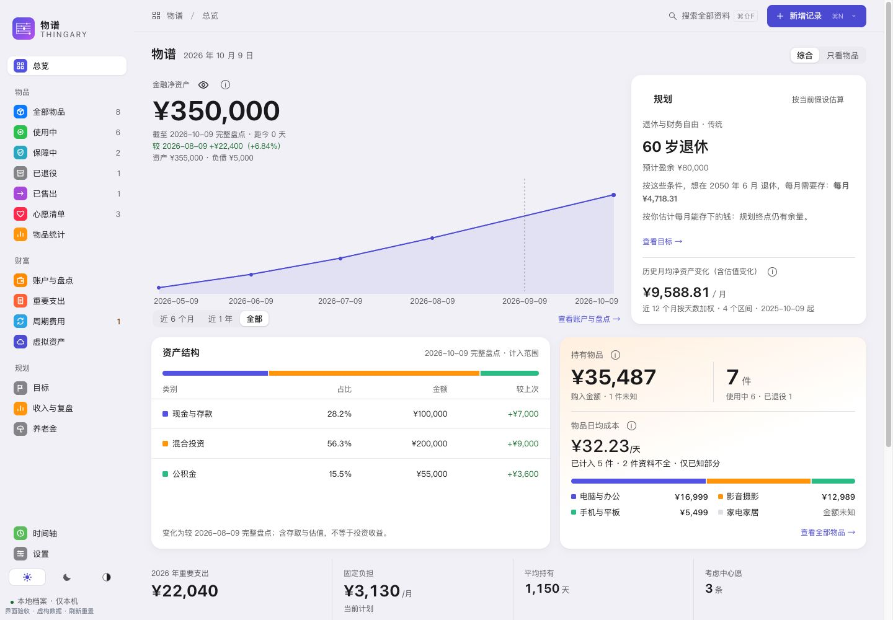
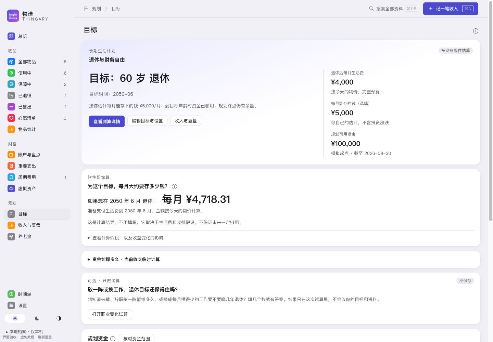
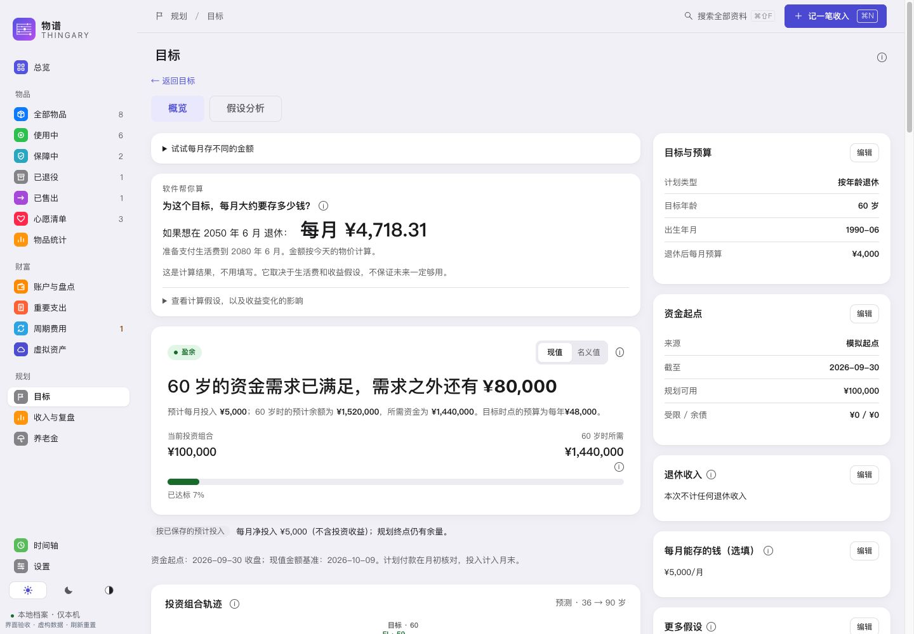
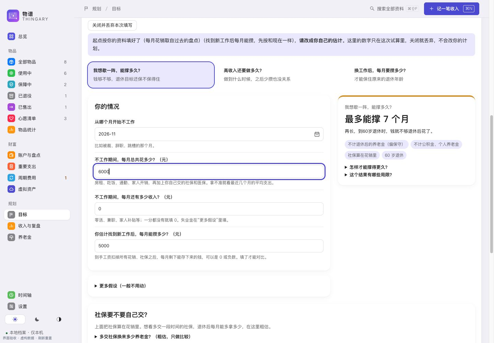
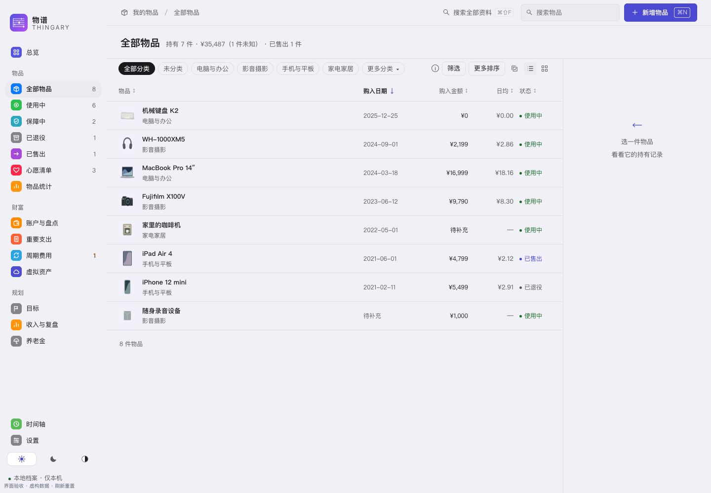
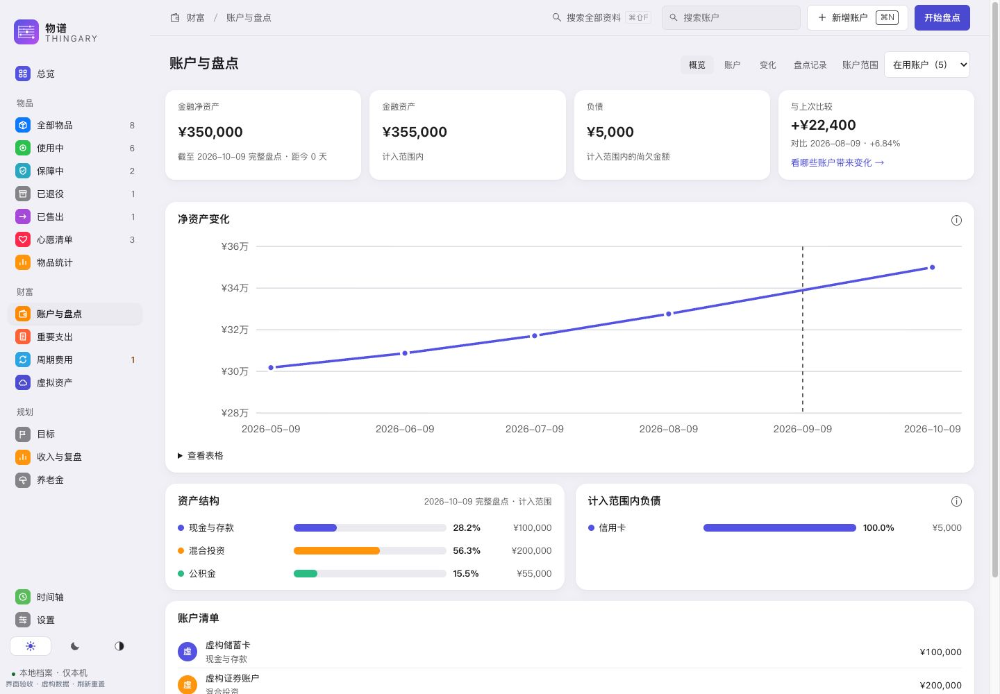
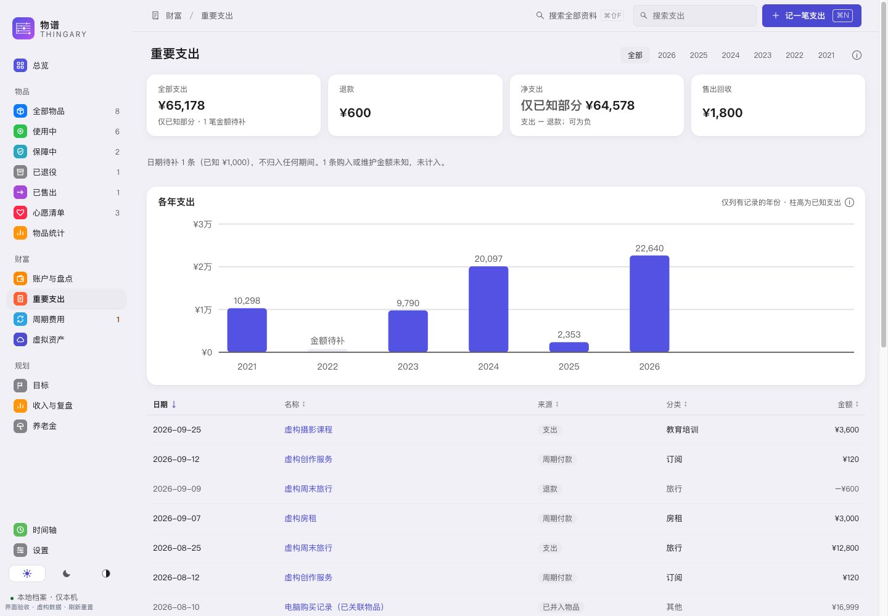
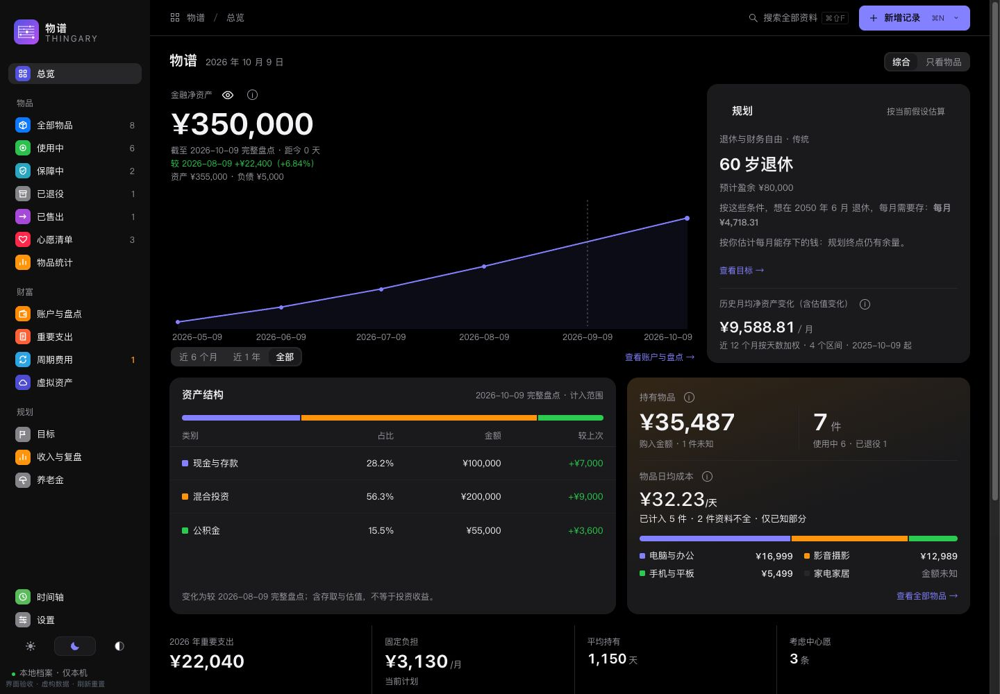

  

<h1 align="center">物谱 · Thingary</h1>

<strong>记录物品，盘点资产，规划未来。</strong>

物谱是一个本地使用的 macOS 应用：为值得留档的物品建立档案，定期核对金融资产与负债，再用明确的预算和资金条件评估退休、财务独立与大额购买计划。无需注册账号，也无需编程或联网使用。

**[下载 0.0.2 公开测试版 · Apple Silicon Mac](https://github.com/CoderJackZhu/Thingary/releases/download/v0.0.2/Thingary-0.0.2-arm64.dmg)** · [图文使用指南](docs/USER_GUIDE.md#download) · [版本说明](https://github.com/CoderJackZhu/Thingary/releases/tag/v0.0.2) · [反馈问题](https://github.com/CoderJackZhu/Thingary/issues)

总览把真实盘点与按条件测算的规划并排展示；截图为已设置计划的虚构示例。

## 开始使用

1. 下载 `.dmg`，打开后将「物谱」拖入「应用程序」。
2. 从「应用程序」打开物谱，先浏览独立的虚构样例。
3. 点「开始记录我的资料」，[记录第一件物品](docs/USER_GUIDE.md#first-record)；需要时再[完成第一次账户盘点](docs/USER_GUIDE.md#first-snapshot)。
4. 录入自己的资料后，[做一次完整备份并异地保存](docs/USER_GUIDE.md#backup)。

当前 **0.0.2 公开测试版** 使用本地临时签名，未经过 Developer ID 签名和 Apple 公证。首次打开可能需要在「系统设置 › 隐私与安全性」选择「仍要打开」；请按[安装与故障排查指南](docs/USER_GUIDE.md#download)操作，无需编译或使用终端。下载页中的 Source code 是源码，不是安装包。

| 支持范围 | 当前情况 |
|---|---|
| 芯片 | 提供 Apple Silicon（M 系列）安装包；暂无 Intel 包 |
| 系统 | 已在 macOS 27 验证；打包最低目标为 macOS 14，其他版本尚未实测 |
| 语言与更新 | 界面为中文；目前需手动下载安装更新 |
| 其他平台 | 暂无 Windows、Linux、手机客户端或跨设备同步 |

本系列处于公开测试阶段，欢迎反馈安装、使用与兼容性问题。此前短暂发布的 2.6.1 与 0.1.0-beta.1 安装包已撤下，最新版本为 0.0.2 Beta，0.0.1 保留为历史发布；已使用者请先完整备份，再按[更新步骤](docs/USER_GUIDE.md#update)手动更换。

本次 0.0.2 Beta 加入退休与财务独立规划、职业变化试算，改进心愿决策、账户盘点和订阅管理。变化与验证边界见[发布说明](docs/releases/v0.0.2.md)。

## 现在可以做什么

| 你想做的事 | 物谱提供的功能 |
|---|---|
| 为贵重物品留档 | 名称、品牌型号、购入日期与金额、照片、备注、维护和保障记录 |
| 回顾持有与处置 | 使用中、退役、售出，日均／按次成本，以及售出保值率 |
| 规划想买的东西 | 记录理由、顾虑和计划日期，确认购入后关联物品档案 |
| 定期核对家底 | 账户与负债快照、金融净资产趋势、两次盘点的账户变化 |
| 评估未来安排 | 退休与财务独立规划、大额计划影响、资金续航与职业变化试算 |
| 回顾重要花费 | 大额支出、退款、周期费用及软件／域名等虚拟资产档案 |
| 找回与带走资料 | 最近删除、完整备份恢复、自动备份、物品 CSV 导入与资料 CSV 导出 |

物谱适合低频记录，例如每月盘点一次账户、补充近期的重要购入。它不提供日常流水记账、行情交易或自动付款。物品购入金额和金融净资产分别展示，不相加，也不重复扣减。辅助模块可在设置中关闭。

## 先看目标，再按需展开测算

在「目标」中用四步确认想要的生活、可用资金、退休预算和收入。先看“每月大约要存多少”；自己预计每月能存的钱可以稍后补，不用为了得到答案先填一大张表。

需要深入时，进入「查看测算详情」核对资产轨迹、逐年快照、退休收入和预算，再做收益、通胀、支出与市场路径分析。实际盘点、模拟起点和未来假设分别说明；缺资料会列出缺项，未知不会当作零。操作见[规划入门](docs/USER_GUIDE.md#planning)。

查看测算详情与职业变化试算

「歇一阵能撑多久」「高收入还要做多久」「换工作后每月要攒多少」可以在目标页临时试算。复用已有计划，再改少量条件；关闭即丢弃，不改保存的目标。默认不计退休后的养老金、公积金和个人养老金，开销中的社保需要自己确认。见[职业试算说明](docs/USER_GUIDE.md#career-trial)。

当前可以设置收益假设并做压力测算，但还没有投资收益归因、实际组合收益率或自动行情。净资产涨幅包含存取、消费和估值变化，不能当成投资收益。金融历史 CSV 导入、正式决策报告、普通储蓄目标与多套命名方案仍待接入，不属于本版可用功能。

查看更多界面：物品、账户、年度支出与深色外观

| 物品与支出 | 账户与总览 |
|---|---|
|  |  |
|  |  |

界面图于 2026-10-09 按 0.0.2 应用代码重新拍摄，来自浏览器预览，全部使用虚构资料，不代表原生验收。应用提供浅色、深色、跟随系统，以及三种界面风格；[截图复现与维护](docs/images/README.md)。

## 资料与隐私

主资料保存在你的 Mac 上，没有账号、服务器或应用网络请求。**资料与备份没有应用级加密**；若主动选用云盘作为额外备份位置，副本由该云盘软件同步。自动备份和主资料同盘，仍应额外保留异地完整备份。

删除应用不会删除资料。更新、换 Mac、资料位置、恢复与当前限制统一见[使用指南](docs/USER_GUIDE.md#update)。反馈时请遮住真实资料，不上传数据库或备份；漏洞请按[安全政策](SECURITY.md)私下报告。

## 文档与参与贡献

- 使用软件：[使用指南](docs/USER_GUIDE.md)，包含安装、入门、模块操作、备份、更新与常见问题。
- 理解计算：[业务规则](docs/PRODUCT_RULES.md)，说明成本、净资产、支出与未知值的口径。
- 参与开发：[贡献指南](CONTRIBUTING.md)、[开发与测试](docs/DEVELOPMENT.md)、[架构说明](docs/ARCHITECTURE.md)。
- 维护项目：[文档职责与维护方式](docs/MAINTAINING.md)、[发布流程](docs/RELEASING.md)、[版本记录](CHANGELOG.md)。

完整文档入口见[文档索引](docs/INDEX.md)。从源码运行需要 Mac、Node.js、Rust 与 Xcode 命令行工具；普通用户直接下载安装包即可。

## 许可

规划模块的早期实现参考了 [Wealthfolio](https://github.com/wealthfolio/wealthfolio) 的公开实现。

代码按 [GPL-3.0-or-later](LICENSE) 授权，第三方依赖许可见 [THIRD_PARTY_LICENSES](THIRD_PARTY_LICENSES.md)。名称「物谱」「Thingary」与应用图标不在 GPL 授权范围内；修改版再发布请采用自己的名称与图标，详见[品牌使用说明](docs/brand/README.md)。
