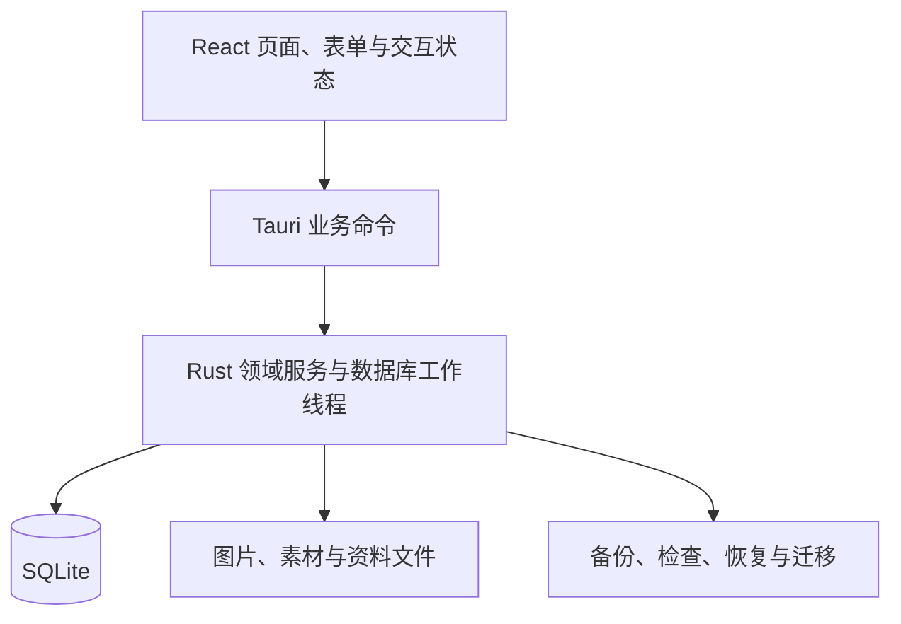

# 架构说明

物谱采用 Tauri 2、React／TypeScript、Rust 和 SQLite，运行于 macOS。前端是本地打包资源，持久化操作经 Tauri 命令进入 Rust；无服务端、Node sidecar、账号系统或网络同步。业务语义见[业务规则](PRODUCT_RULES.md)，开发入口见[开发与测试](DEVELOPMENT.md)。

下一阶段逻辑对象、方案/事实分离、事件与贷款接续、基准和导入事务的目标契约见 [统一规划设计](PLANNING_LIFECYCLE_DESIGN.md)及其专项规格，**分阶段实施中**；当前已接入的资金／事件核对和月账本见下文。命名方案、冻结基准及真实报告 DTO 尚未接入，其物理表、命令与迁移版本仍在实施前确定，不能从设计对象推定数据库已变更。

## 分层与入口

| 位置 | 职责 |
|---|---|
| `src/` | 页面、组件、命令类型、展示格式、样例预览；外观令牌在 `src/theme.css` |
| `src-tauri/src/` | 应用入口、业务命令、数据存储、领域计算、工作线程与恢复协议 |
| `src-tauri/tests/` | 存储／领域集成测试、事务与故障注入、迁移、备份恢复 |
| `src-tauri/examples/` | 隔离的虚构样例导入与验收夹具，不用于正式资料 |
| `src-tauri/materials/`、`src-tauri/icons/` | 随包提供的素材与正式图标 |
| `tests/` | 前端纯逻辑、布局与格式约束；不等同于原生自动化 |
| `scripts/` | 素材生成、离线指南、许可清单、打包与辅助验收 |

前端不直接访问 SQLite。阻塞的数据库与文件工作通过后端工作线程处理；写操作串行化并在事务中维护业务事实与引用。界面刷新和缓存失效必须随业务提交结果更新。

## 身份与资料隔离

正式身份为 `local.thingary.main`，开发预览为 `local.thingary.preview`。它们使用不同资料目录；验收夹具还应有独立身份。浏览器预览只用内存虚构数据，刷新即重置。

恢复和切换资料库时使用资料库身份／generation 约束；旧表单、旧异步响应和旧请求不能落到新资料库。正式目录不是测试夹具，也不能靠修改版本号自动隔离资料。

## 保存、冲突与未知结果

写操作使用请求身份／回执防止重试产生重复事实，编辑使用修订约束避免旧表单覆盖后来更正。成功、明确失败和提交结果未知需要区分：结果未知先查回执，不能直接当失败重做。

用户主动关闭普通表单时不保存草稿；明确失败时保留当前输入以便修正。错误转换为可读提示，必要时关联字段与重试入口；日志避免记录完整表单、序列号、账户资料或图片内容。

## 账户、完整盘点与月度收入历史导入

`FinancialImportDialog.tsx` 在“账户”页更多菜单提供四步界面；`financial-import.ts` 负责列头、动作、分页与请求元数据纯逻辑，金额仍为整数分字符串。`financial_import.rs` 组合纯解析器、真实账户目录与 `wealth.rs` 的 `write_account_tx` / `write_snapshot_tx`，预览只在 SQLite 内存备份的事务副本模拟，提交在个人 Store 的单一事务重新验证后写入。原命令保留 generation、UUID、原指纹、回执和故障点；导入专用历史覆盖与整批最终状态校验不改变普通保存语义。

`financial_import_preview` / `financial_import_commit` 与文件读取、模板、进度、取消、回执查询命令在 `lib.rs` 登记。文件读取经原生受控选择器，UTF-8 严格校验，合计限制 20 MiB / 50000 行；不接收任意前端路径。取消与进度直接读取独立任务注册表，不进入串行 Worker，目录扫描、SQLite 复制及解析检查点均可取消；提交阶段不允许半途取消。

`x10.sql` 将 schema 33 升至 34，新增 `import_external_key`（来源／映射集合／对象类型／外部键复合主键、稳定对象 ID、值指纹、修订与 active/purged 状态）及 `import_receipt`（request_id 主键、请求指纹、批次指纹唯一、成功对象 ID／修订／计数／时间）。仅成功事务持久化回执，失败后同一请求可重试；重复批次返回原回执，同时按稳定对象 ID 只读计算已删除／清除数量；该当前可用性字段不写回持久回执、不改变指纹或 schema。预览与回执区分原事务结果和当前对象可用性，并提供恢复／更换映射集合等下一步。永久清除账户或盘点时映射标墓碑，回执保留，不按同名重绑。两表纳入完整备份、规范 schema 及引用校验；旧备份升级时两表为空。升级恢复日志仅在 `recover_root` 的恢复数据集验证处允许已知旧 schema，通用 `validate_dataset` 仍保持严格。迁移提交前失败回滚版本与两表，原资料、稳定引用和未知值保留。

普通预览关闭不存草稿。未知提交只保留 request_id / generation；恢复清理普通本地工作时保留该元数据。跨 generation 不重提旧输入，可只读检查当前库是否恢复了同一回执；当前库查无回执不能判断原库未提交。导入成功统一失效财富／规划读取，告知起点盘点是否改变，不修改未来投入、假设或冻结基准。

## 图片与文件一致性

用户选中的图片经受控读取、暂存、校验和托管后与记录关联；失败不能静默跳过图片，也不能清理其他记录引用的文件。内置素材使用受控 ID 与随包资源，不接收任意前端资源路径作为可信来源。

删除资料先维护最近删除及其引用。恢复保留对象身份和关联；不能把照片当普通缓存随意清空。未引用原图与恢复保护副本目前不会自动清理，保持这一限制的说明。

## 备份、恢复与迁移

完整备份记录 SQLite 数据及托管文件，并校验格式、版本和内容。恢复先检查、再明确确认，准备新资料集、保护原资料并切换；恢复是整体替换。中断后的恢复不能仅凭 UI 状态推断成功，更不能自动创建空库掩盖损坏。

订阅简化使用 schema 21 的增量迁移：计划增加可空服务起点与覆盖锚点，付款增加可空覆盖区间，并保存之后的价格变化。旧字段不改值，空的新字段继续采用旧排期语义。权益与关联计划在同一事务、同一请求回执中保存，双方修订冲突使整个事务失败。付款确认时固定覆盖期，改计划不重写付款事实。范围补记也使用事务、计划修订和回执防重。

虚拟资产标签与计费使用 schema 22→23→24 的增量迁移（设计见 [VIRTUAL_ASSET_BILLING_DESIGN](VIRTUAL_ASSET_BILLING_DESIGN.md)，已实现并经过独立复审修复，纳入 2026-10-05 重建的 0.0.1 Beta，原生完整交互验收尚未闭环）：schema 22 新增 `label_scopes`、`plan_period_ends`、`virtual_topups`、`virtual_balances` 表，`virtual_assets` 重建以扩展类型 CHECK 并加入计费方式、标签、支付方式与永久有效列，`reminders` 重建以加入 `renewal` 类别，计划增加固定天数与试用列；schema 23 增加 `plan_rules` 生效规则分段表并在事务外暂停外键、事务内重建 `recurring_plans`（放宽结束日期下界到服务开始日，让试用内结束可保存），提交前执行 `foreign_key_check`，失败回滚并恢复连接原外键设置；schema 24 补齐规则的付款锚点、服务开始日和试用历史，持久化独立的自动续费状态。付款候选、范围补记、覆盖期与累计估算共同沿生效规则分段行走：每段有自己的锚点与周期长度，历史期用所属时段规则与价格，调周期、锚点或试用不回写历史事实，特殊到期在链上顺延；待付款金额与预测按服务期开始日的生效价格，预付日期不提前触发下一价格段。迁移只补默认值：旧行按“有计划→订阅、无计划→单次投入”填充计费方式，旧标签补“实物”范围，ID、金额、日期、价格历史、付款与图片保持原义。权益、计划、首次充值与标签引用在一次保存事务和同一请求回执中维护；充值与余额是独立稳定事实，删除恢复遵守父子关系；新表纳入规范 schema 定义校验、领域校验、备份 inspect 摘要与恢复检查。续期提醒沿用既有提醒计划推导：派生计划在每个写入后重算，停止、删除或模块关闭的资产不再出现在待通知计划中，从而撤销未发送通知。

schema 25 为维护记录增加配件类型：事务内重建 CHECK 约束，保留维护 ID、费用、时间、删除标记、审计与图片引用，恢复日期守卫及索引；提交前验证外键，失败回滚并恢复连接原外键设置。旧维护记录保持原义。

schema 26（已随 0.0.2 发布）为提醒增加 `repeat_every_period` 和 `lead_days`，旧行补为单次、提前 3 天，保障与心愿仍只支持单次。虚拟订阅付款入口和每期通知共用当前／未来未记录期推导，沿 `plan_rules`、特殊到期和分段价格读取，不回填历史漏记。paid／skipped 排除对应期；每期通知 ID 由提醒源 ID 与付款日组合，未来 12 个月内的付款期预先安排，写入／启动时沿原生调度补充并撤销不再有效的通知。备份规范 schema 随迁移更新，新版备份不可交给 schema 25 应用恢复。

全局搜索（B 阶段）是 `search.rs` 的只读投影查询：一次查询在同一个读事务内完成九类候选的匹配、固定排序、完整计数与分页，无写入、无独立磁盘索引与新全文检索依赖；模块开关在查询内门控类型与计数，响应回显关键词、类型、偏移与资料库 generation，过期 generation 直接拒绝。账户加入来源类型并按稳定 ID 打开资料表单，盘点结果进入 A 阶段的只读详情。

原生 `search_all` 命令经 Worker 调用；四类固定类别名称参与 SQL 候选匹配，与结果摘要使用同一显示映射，ASCII 大小写折叠保持 UTF-8 字节边界。读取版本采用当前连接的写入计数，仅用于本轮会话检测变化（包括失败写入后的保守失效），不落盘也不充当写入修订；后续分页或重开查询发现版本变化时返回第一页，响应页码与前端同步。前端面板的会话状态（关键词、类型、分页、滚动和读取版本）仅存内存，资料库切换或模块开关即清空并废弃在途响应。查询与来源打开分别使用票据及存活／上下文守卫；关闭、卸载或变更查询后不处理迟到结果；来源打开带并发锁，重试有独立轮次，组合输入结束可靠触发查询。已付与已跳过付款都按原记录及所属计划 ID 校验并打开精确期次。

C 阶段包含待替换物品关系与盘点表单简化（已包含在 0.0.2 Beta 下载包）：schema 28 为 `wishlist_items` 增加可空 `replacement_asset_id`（独立于购入关联的外键）与 `replacement_asset_name` 展示历史；写路径复用 `save_wish_plan` 的事务与回执，新增关系校验目标为在册未删除物品，保留已有软删关系允许编辑其他字段，物品本身不被修改；永久删除物品时先清外键、写入该物品名称作为失效关系展示资料，旧物生命周期不由该关系驱动。空 ID 清除有效关系但保留失效名称，`clear_replacement=true` 才明确清除历史；该可选标记为 false 时不参与序列化，保留已生成 schema 28 回执指纹。无替换操作的旧请求另按 schema 27 的原始字段顺序核对指纹，内容改变仍拒绝复用回执。盘点表单只提供金额输入，填齐所有应盘点账户后保存，用户输入一律提交 `entered`，即使数值等于前值。旧 `missing`／`unchanged` 状态及回执继续兼容读取与恢复；更正时未编辑的旧 `unchanged` 行提交空 amount，后端沿用原记录金额，避免只改备注重写历史余额。旧缺失条目进入更正后需补齐金额。前端不再提供状态按钮或批量确认，无额外 schema 变更。

schema 27（低频整理与心愿决策 A 阶段，已随 0.0.2 发布）为 `wishlist_items` 增加唯一权威的 `decision_state`（考虑中／已购入／不再考虑／历史待核实）、决定备注、购入来源与只读的历史生成关系 `legacy_generated_asset_id`／`legacy_generated_at`，并按旧 `achievement_source` 分类旧行：manual／conversion 且有原关联物品时保持已购入，无关联的合法旧实现转为历史待核实并保留旧日期，savings 与来源不足转为历史待核实并把自动生成物品移入历史关系，物品、金额、照片与审计不删不改；心愿提醒仅考虑中保留，审计表重建以放宽 action CHECK。旧 `status` 列留作兼容投影，v12／v14 成就触发器在新投影下继续成立。攒钱写命令停用（旧回执仍可核对），读取时自动补生成物品的路径退出；显式购入确认、关联已有物品与历史核实走独立原子命令（`convert_wishlist`／`link_wish_asset`／`verify_legacy_wish`），各自携带请求回执与修订校验，历史生成关系与有效购入关联同样阻止永久删除物品。盘点更正中，未编辑的 `unchanged` 条目以空金额保留原值，用户本次重新确认时提交显示金额并校验前次观测；不新增存储字段。核实表单以预填版本为修改基线，只提交有变化的字段，不用提交前重新读取的修订替代基线；关联选择器按搜索条件在后端分页查询，异步响应受当前搜索轮次约束，不截断候选全集。只读盘点详情按稳定 snapshot ID 读取，趋势／比较端点与财富 CSV 附带备注。

schema 33（0.0.2，重要支出年度总览与关联订阅）为整组删除新增 `link_trash_groups`／`link_trash_members`：组状态（deleted／restored／purged）、来源请求 ID 与成员删除前后修订；成员限定虚拟档案与周期计划且不设外键（永久清除后组仅留归属记录），迁移只建结构、不修复任何历史关系。`link.rs` 提供关联读取与操作命令：`link_view` 一次只读快照返回双方、关系状态（linked／asset_trashed／plan_trashed／both_trashed／group_deleted／plan_occupied）、付款摘要与候选；删除／恢复走 `link_delete_preview`→`link_trash` 与 `link_restore_preview`→`link_restore`，预览返回确定性影响摘要（覆盖 generation、动作、双方修订与删除状态、计划下全部付款的 ID／修订／状态、规划引用负载），提交在写事务按同一规则重算并比较——新增付款或更正都会使旧确认失效。共享计费保存 `link_save` 在一个事务携带双方 expected_revision（任一页旧表单冲突）、保持计划分类并按「统一名称」语义同步显示名；`link_create` 给既有计划新增档案不补付款；`link_reconcile` 处理旧停用两种动作与历史归组。旧入口保护：`recurring_plan_save` 拒绝已关联计划的单边写入，`wealth_trash` 对已关联双方要求整组、对组成员要求整组恢复、对双方分别历史删除要求先核对归组，`virtual_save` 拒绝对已关联档案新写旧停用路径；永久删除与清空按组整体处理，计划仍被有效档案使用或组外档案按 ID 引用时保留并说明。新表与命令纳入备份 schema 校验、领域校验、inspect 摘要（link_groups 计数）与恢复检查。`expense_view` 的年度桶与全部摘要、明细在同一只读快照完成，月桶补齐已知／未知计数。

该阶段合并版本为 schema 33：保留主分支 schema 32 的规划载荷契约，再新增关联删除组。未发布订阅分支也曾使用 schema 32 并包含组表，迁移与旧备份检查按完整规范结构识别两种 32；只接受确切组表和索引定义，不接受半组结构或随意新增字段。升级保留组状态、稳定 ID、规划载荷和付款事实；schema 32→33 提交前故障回滚。

数据库 schema 版本、备份格式和应用发布版本承担不同职责。迁移保持历史事实；应用版本号调整不代表可以重置 schema、资料目录或稳定 ID。不要承诺高版本备份可被低版本恢复。

## 界面与可访问性约束

复用已有 SVG、组件与 `src/theme.css` 令牌，覆盖三种界面风格的浅／深组合。颜色表达不能替代文本，金额与日期格式统一，未知值不画成零。布局应覆盖正常、未知、空白、读取失败和保存失败；焦点、Tab 顺序、方向键、Esc 返回和中文输入组合需与操作语义一致。

`wealth-display.ts` 管理账户显示范围，与汇总计算分离；变化列表保留有历史影响或未知的停用账户。`chart-labels.ts` 按实际位置与文字宽度筛选横轴标签，`chart-width.ts` 观察 SVG 显示比例，数据与详情不抽样。总览金融金额显隐仅保存本机显示偏好，隐藏时不渲染金融图形和相关金额内容。`PlanningCosts` 共用费用编辑器，独立保存只替换 basic 中两组费用关系；完整设置仍按原事务统一保存。停用计划的来源 ID 保留，当前作用域只计算生效来源，重新开启无需抹去后重建费用关系。

共用操作外观由 `controls.css` 统一负责；页面布局继续留在各页面样式。`FormControls` 的字段标签与提示通过上下文供复合控件使用，直接原生控件合并原有说明 ID。`DateInput`／`MonthInput` 共用本地日历计算与定位模块 `date-picker.ts`：仍传 YYYY-MM-DD／YYYY-MM 字符串，日历门户留在所属原生 dialog 的顶层容器内，独立管理焦点与边界。选择器不能提交表单或改变回执保存规则。规格见 [共用界面设计](VISUAL_SYSTEM_DESIGN.md)。

大额计划的横向滚动限制在表格区域，目标卡片使用可收缩的单列网格。长表单复用固定头部与内部滚动的编辑器布局。编辑弹窗、菜单与日期选择弹层不使用透明度入场动画，避免原生 WebKit 将已打开的操作界面留在透明状态；弹窗内的日历仍留在所属 dialog。

新增界面提供同尺寸前后截图，并明确浏览器与原生证据的边界。界面规范以当前组件和令牌实现为基准，不复制历史原型中的固定尺寸或过时品牌元素。VoiceOver 等尚未验证范围见[使用指南](USER_GUIDE.md#limits)。

## 验证边界

Rust 故障注入验证事务、回执与恢复协议；前端逻辑检查验证格式、筛选和布局约束；原生验收验证 WebView、系统文件对话框与持久化。浏览器截图不能证明 macOS 原生功能已经通过。

目前只在 Apple Silicon、macOS 27 实测；打包最低目标 macOS 14 不等于已完成该版本兼容性验证。具体发布核验见[发布流程](RELEASING.md)。

## 已批准、分阶段实施的设计

[低频整理、盘点与心愿决策设计](LOW_FREQUENCY_REVIEW_DESIGN.md)维护目标行为与技术约束。A 阶段（心愿决策与盘点表达）、B 阶段（全局搜索）与 C 阶段（考虑替换的物品、逐账户金额盘点）已纳入 schema 27／28、搜索投影与各模块说明，完成 Review 修复、自动检查与隔离核心原生验收。原 C2 批量确认已按用户决定撤销；系统输入法组合、VoiceOver 与通知送达仍未原生验证。实施前核对最新 schema 与实际代码，不预占数据库或应用版本号。

规划持久化沿用 `plan_income`（schema29）与单行 `plan_profile` JSON（schema30），写入采用 `feature_requests`、generation和expected_revision，现有兼容边界沿用schema33。旧JSON结构只在读取、备份校验与历史回执摘要边界解析；`Profile::into_general` 保留养老金资料、资金规则、已发生付款／余债及必要事件引用，缺basic时停用未发生设想并重置旧估算，包括未来收入、房租与续缴安排，`plan_income` 的实际收入记录保持。读操作不写库或增加修订。活动输出与新保存去掉职业阶段、路线、空窗、旧归档及 `core.costs` 字段，费用仅用 basic 的两个作用域。Events 不接收阶段费用的新写入；历史 Events 请求中的 costs 只为精确匹配回执保留序列化，匹配回执后返回当前资料，不重新应用。新整份旧式保存不能覆盖现有资料。`retire.core` 的事实严格校验与来源引用规则保持，备份恢复采用同一事实适配。账本内部的金额时间线保留供通用风险矩阵使用，不提供阶段或职业输入。`Saved.reference_issues` 是实时只读投影；更正来源保留关联并阻止完整结论，删除与purge拒绝仍被引用的来源。

`plan_savings.rs` 与浏览器 `plan.ts` 都保留资产事实并新增 `mean_monthly_change_cents`、`median_monthly_change_cents`、`change_count`；旧 saving/spend/rate 字段仅为兼容投影，不作默认 UI 或未来假设。收入覆盖始终未确认。`plan-core.ts` 统一资金范围与现实发生缺项；`buildRetireCalc` 是摘要、目标、退休详情和心愿估算共同入口，所有路径通过 `plan-ledger.ts` 月账本，反求／风险路径复用同一本账。初始现金不扣债务本金，余额分池；B 收盘日与 T 金额基准独立，普通首期流按剩余天数折算，期初月供／持有费先支付，月底投入及收入不能掩盖期初不足。名义金额与养老金折现采用同一首期时间比例和 B/T 系数转换。`plan-events.ts` 保留过去月份偏移，逾期不重排；已发生首付按明确吸收关系跳过，B 后付款只扣一次，余债按余期延续，持有费独立。`pensionTable` 缓存各辞职年龄估算，独立受限公积金／个人养老金只在领取时转回可用池；本金不会在两个池收益。

界面复用现有规划页与表单组件：`PlanningSetup`／`PlanningBasicDetail` 核对资金／费用，`PlanningOccurrenceDialog` 核对一次性付款／余债；不自动创建物品或支出。浏览器 `wealth-preview.ts` 仅内存虚构夹具，刷新重置。该阶段不是统一规划目标规格全部实现：冻结基准、明细阶段、通用受限资产解锁、完整报告 DTO 和收入覆盖存储仍待后续集成。

综合首页规划摘要：`review_overview` 以可选 `planning` 参数门控规划读取，在一个 worker job、一个 SQLite 只读事务中返回净资产和 `PlanSources`。明细直接采用该批财富摘要选出的完整盘点；各来源仍用 `Read<T>` 表达独立成败。`plan_review_in_transaction` 复用现有储蓄投影，避免嵌套事务；独立 `plan_review` 保持自己的只读事务。`ReviewPlanSummary` 只接受已提交的整批数据，复用 `plan-summary.ts` 与目标页的结论和比例，不运行压力测试或路线矩阵。`ReviewView` 统一处理请求票据、generation、日期、版本、模块与焦点／恢复刷新；同库刷新失败可保留整批上次结果并标明，身份或上下文变化丢弃旧响应。预算／资料定位意图仅存在 `main.tsx` 状态中，随库、页签与导航失效，读取完成后聚焦既有入口，不保存会话缓存或自动打开表单。

金融 CSV 解析器 `financial_import_parser` 是无存储依赖的 Rust 纯组件；所有 error 级问题均阻止提交，坏行不能被丢弃后将盘点组标为完整。报告组件 `planning-report` 接收严格校验后的只读白名单快照，隐私输出先脱敏再渲染／复制／打印，不读取 Store 或重新计算缺失字段。解析器已由账户／完整盘点／收入导入入口使用；覆盖／总额参考仍只有解析能力。真实报告 DTO／产品入口和原生 PDF 流程尚未接入。

### 规划首次设置

`PlanningPage` 按任务进入，`PlanningSetup` 每屏一个问题，只在内存持有输入，Q4 使用一次 `plan_profile_update` 的 setup 分区统一保存；编辑模式另有预计储蓄和更多假设屏。`planning-first-run.ts` 纯函数由保存资料与同批 capabilities 推出目标状态、未答问题、条件芯片和精修卡；2b 保留现行计算阻断语义。界面复用 setup 契约的 basic 与按需 budget/funds，本向导不写 pension 分区，保留已有事实与缴费安排。后端先捕获原假设，再合并所选分区，校验最终资料，同事务保存revision与回执。关闭不留草稿；未确认回执阻止新请求覆盖。独立养老金可以只保存已知事实，不伪造basic或目标。

### 通用规划基础

领域分支与界面分支已集成，实际检查范围见[开发文档](DEVELOPMENT.md#通用规划基础联合验收)。`plan_basic.rs` 与 `plan-basic-contract.ts` 区分可空持久资料和完整北京估算输入；唯一plan_profile、core、life_events与发生事实不复制。`plan_profile_update`在同一事务合并允许分区，保留共同revision及回执；明确重设同时保存原假设只读定义，不复制养老事实、付款或余债。basic存在即新模式，旧载荷启动不转换。

`plan-basic.ts`编译固定目标需求与明确投入预测。需求候选仅局部存在，退休后不接回积累额；北京缴费起止及基数独立于投入符号。预算两份费用作用域、收入选择与受限池均按稳定来源归一化。所设/两段实际收益各降低或提高200 bps分别求解。basic的requiredAt用一次倒推，逐月独立required核验等价，原阶段引擎保留。完整预算判定与固定收益模拟一致，零终点无缺口不要求额外余钱。

`planning_sources`在Worker同一任务读取模块状态，Store同一只读事务返回独立Read来源。财富关闭不会进入财富读函数；总览也采用实际开关。`planning-service.ts`共用写入未知核对并使旧读取票据失效；不缓存账户。`plan-summary.ts`、`plan-wishes.ts`、`plan-view.ts`按能力消费，未知预计投入不输出候选FI日期。接口与UI接入要求见[数据规格](PLANNING_DATA_SCENARIOS_DESIGN.md#第一批-core-数值与读取接入)。通用界面使用默认真实provider；虚构状态夹具仅在浏览器预览显式替换。首页与心愿使用同批已保存来源，临时投入只存在详情；后台消费按积累／退休区间选择月初费用，basic受限池在确认节点独立到账一次。旧模式仅保留历史载荷与回执兼容，不提供活动编辑入口。

`plan-runway.ts`是固定当前收支的临时投影，复用`retiredMonth`分别处理月初支付及月底到账，在支付后检查底线，第一笔支付缺口即停止。不编译职业或退休路径，不生成profile更新。`PlanningRunway`在未设置目标时可手填资金及日期，已设置时默认复用已确认可用资金；以generation及父级读取生命周期隔离，关闭不保存。当前必要开销由用户填写包含月供／社保等的总额，不重复追加退休事件；完整贷款变化与一次性事件仍属于后续设计。

职业变化有普通应用中的 `PlanningCareerCard` 与独立 `career-preview.html` 两个入口。普通入口位于已有通用计划的 `PlanningBasicGoals`，默认收起，主动打开才挂载共享 `GuidedPanel`；独立 HTML 不进入发布构建，但共享向导组件进入正常应用。`prepareBasicPlan` 从通用计算中提取只读来源编译，默认完整范围不变；积累范围仅供缺少退休条件时的局部检查，不能用于长期结论。`plan-career.ts` 编译当前／空窗／恢复三个区间与独立费用、临时缴费覆盖，再调用同一月账本及固定目标反求；月内审计回调不改变原账本输出。`plan-career-compare.ts` 只改一个条件，普通基础消费者不导入职业模块。未新增资料字段、数据库命令或后台消费者。卡片使用父级同批 `PlanningSources`，`PlanningPage` 以 `write_version` 为目标组件键，配合既有读取／切库生命周期使草稿失效；关闭和离页卸载临时输入，关闭后焦点回到入口。默认临时排除退休收入和受限池，已保存事实不改写，详见[实施契约](CAREER_SCENARIO_DESIGN.md#当前应用入口0-0-2)。

月度收入导入与账户／完整盘点共用 `financial_import_preview/commit/receipt`。schema 35 的 `x11.sql` 将 `plan_income.hpf_cents` 变为可空并扩展 `import_external_key.object_kind` 为 income；事务替表保留旧数据和索引，提交前外键校验。`plan_income::write_tx` 与普通表单共用校验／修订写入；混合文件、稳定映射与回执在同一事务。旧 schema 34 回执收入计数默认零，备份按原版本 canonical 结构校验再迁移。

通用规划的 plan-coverage 与 plan-annotations 生成只读覆盖，BasicCapabilities/Plan/CareerEvaluation 保留标注元数据。CoverageNote 统一呈现摘要与依据，planning-consumers 清单枚举独立渲染路径。用途声明、occurrences 和保存回执沿用既有分区；无新增持久字段或迁移。
