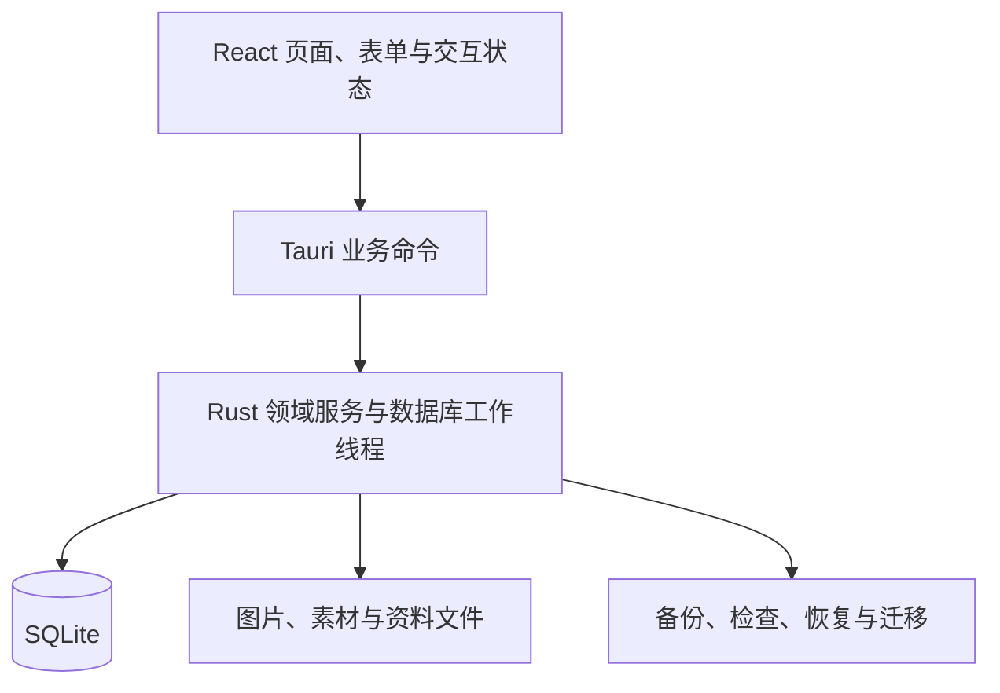

# 架构说明

物谱采用 Tauri 2、React／TypeScript、Rust 和 SQLite，运行于 macOS。前端是本地打包资源，持久化操作经 Tauri 命令进入 Rust；无服务端、Node sidecar、账号系统或网络同步。业务语义见[业务规则](PRODUCT_RULES.md)，开发入口见[开发与测试](DEVELOPMENT.md)。

## 分层与入口

| 位置 | 职责 |
|---|---|
| `src/` | 页面、组件、命令类型、展示格式、样例预览；外观令牌在 `src/theme.css` |
| `src-tauri/src/` | 应用入口、业务命令、数据存储、领域计算、工作线程与恢复协议 |
| `src-tauri/tests/` | 存储／领域集成测试、事务与故障注入、迁移、备份恢复 |
| `src-tauri/examples/` | 隔离的虚构样例导入与验收夹具，不用于正式资料 |
| `src-tauri/materials/`、`src-tauri/icons/` | 随包提供的素材与正式图标 |
| `tests/` | 前端纯逻辑、布局与格式约束；不等同于原生自动化 |
| `scripts/` | 素材生成、离线指南、许可清单、打包与辅助验收 |

前端不直接访问 SQLite。阻塞的数据库与文件工作通过后端工作线程处理；写操作串行化并在事务中维护业务事实与引用。界面刷新和缓存失效必须随业务提交结果更新。

## 身份与资料隔离

正式身份为 `local.thingary.main`，开发预览为 `local.thingary.preview`。它们使用不同资料目录；验收夹具还应有独立身份。浏览器预览只用内存虚构数据，刷新即重置。

恢复和切换资料库时使用资料库身份／generation 约束；旧表单、旧异步响应和旧请求不能落到新资料库。正式目录不是测试夹具，也不能靠修改版本号自动隔离资料。

## 保存、冲突与未知结果

写操作使用请求身份／回执防止重试产生重复事实，编辑使用修订约束避免旧表单覆盖后来更正。成功、明确失败和提交结果未知需要区分：结果未知先查回执，不能直接当失败重做。

用户主动关闭普通表单时不保存草稿；明确失败时保留当前输入以便修正。错误转换为可读提示，必要时关联字段与重试入口；日志避免记录完整表单、序列号、账户资料或图片内容。

## 图片与文件一致性

用户选中的图片经受控读取、暂存、校验和托管后与记录关联；失败不能静默跳过图片，也不能清理其他记录引用的文件。内置素材使用受控 ID 与随包资源，不接收任意前端资源路径作为可信来源。

删除资料先维护最近删除及其引用。恢复保留对象身份和关联；不能把照片当普通缓存随意清空。未引用原图与恢复保护副本目前不会自动清理，保持这一限制的说明。

## 备份、恢复与迁移

完整备份记录 SQLite 数据及托管文件，并校验格式、版本和内容。恢复先检查、再明确确认，准备新资料集、保护原资料并切换；恢复是整体替换。中断后的恢复不能仅凭 UI 状态推断成功，更不能自动创建空库掩盖损坏。

订阅简化使用 schema 21 的增量迁移：计划增加可空服务起点与覆盖锚点，付款增加可空覆盖区间，并保存之后的价格变化。旧字段不改值，空的新字段继续采用旧排期语义。权益与关联计划在同一事务、同一请求回执中保存，双方修订冲突使整个事务失败。付款确认时固定覆盖期，改计划不重写付款事实。范围补记也使用事务、计划修订和回执防重。

数据库 schema 版本、备份格式和应用发布版本承担不同职责。迁移保持历史事实；应用版本号调整不代表可以重置 schema、资料目录或稳定 ID。不要承诺高版本备份可被低版本恢复。

## 界面与可访问性约束

复用已有 SVG、组件与 `src/theme.css` 令牌，覆盖三种界面风格的浅／深组合。颜色表达不能替代文本，金额与日期格式统一，未知值不画成零。布局应覆盖正常、未知、空白、读取失败和保存失败；焦点、Tab 顺序、方向键、Esc 返回和中文输入组合需与操作语义一致。

新增界面提供同尺寸前后截图，并明确浏览器与原生证据的边界。界面规范以当前组件和令牌实现为基准，不复制历史原型中的固定尺寸或过时品牌元素。VoiceOver 等尚未验证范围见[使用指南](USER_GUIDE.md#limits)。

## 验证边界

Rust 故障注入验证事务、回执与恢复协议；前端逻辑检查验证格式、筛选和布局约束；原生验收验证 WebView、系统文件对话框与持久化。浏览器截图不能证明 macOS 原生功能已经通过。

目前只在 Apple Silicon、macOS 27 实测；打包最低目标 macOS 14 不等于已完成该版本兼容性验证。具体发布核验见[发布流程](RELEASING.md)。
