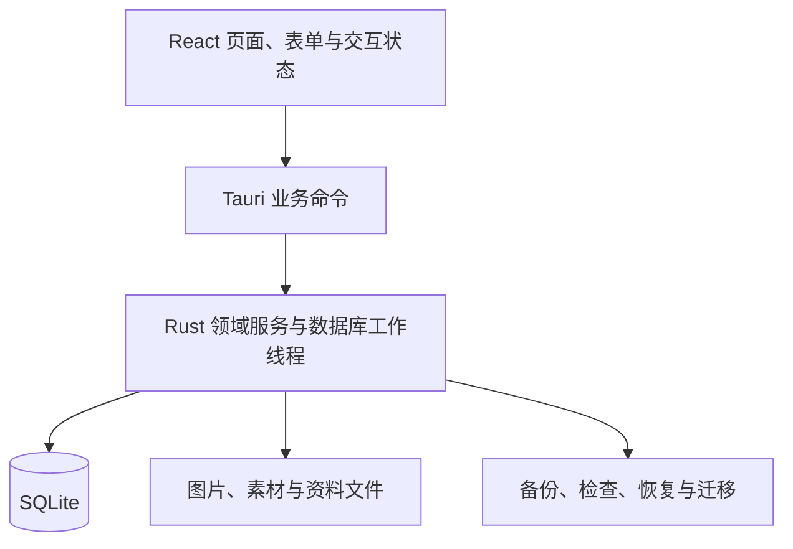

# 架构说明

物谱采用 Tauri 2、React／TypeScript、Rust 和 SQLite，运行于 macOS。前端是本地打包资源，持久化操作经 Tauri 命令进入 Rust；无服务端、Node sidecar、账号系统或网络同步。业务语义见[业务规则](PRODUCT_RULES.md)，开发入口见[开发与测试](DEVELOPMENT.md)。

下一阶段逻辑对象、方案/事实分离、事件与贷款接续、基准和导入事务的目标契约见 [统一规划设计](PLANNING_LIFECYCLE_DESIGN.md)及其专项规格，**分阶段实施中**；当前已接入的资金／事件核对和月账本见下文。命名方案、冻结基准、导入事务及真实报告 DTO 尚未接入，其物理表、命令与迁移版本仍在实施前确定，不能从设计对象推定数据库已变更。

## 分层与入口

| 位置 | 职责 |
|---|---|
| `src/` | 页面、组件、命令类型、展示格式、样例预览；外观令牌在 `src/theme.css` |
| `src-tauri/src/` | 应用入口、业务命令、数据存储、领域计算、工作线程与恢复协议 |
| `src-tauri/tests/` | 存储／领域集成测试、事务与故障注入、迁移、备份恢复 |
| `src-tauri/examples/` | 隔离的虚构样例导入与验收夹具，不用于正式资料 |
| `src-tauri/materials/`、`src-tauri/icons/` | 随包提供的素材与正式图标 |
| `tests/` | 前端纯逻辑、布局与格式约束；不等同于原生自动化 |
| `scripts/` | 素材生成、离线指南、许可清单、打包与辅助验收 |

前端不直接访问 SQLite。阻塞的数据库与文件工作通过后端工作线程处理；写操作串行化并在事务中维护业务事实与引用。界面刷新和缓存失效必须随业务提交结果更新。

## 身份与资料隔离

正式身份为 `local.thingary.main`，开发预览为 `local.thingary.preview`。它们使用不同资料目录；验收夹具还应有独立身份。浏览器预览只用内存虚构数据，刷新即重置。

恢复和切换资料库时使用资料库身份／generation 约束；旧表单、旧异步响应和旧请求不能落到新资料库。正式目录不是测试夹具，也不能靠修改版本号自动隔离资料。

## 保存、冲突与未知结果

写操作使用请求身份／回执防止重试产生重复事实，编辑使用修订约束避免旧表单覆盖后来更正。成功、明确失败和提交结果未知需要区分：结果未知先查回执，不能直接当失败重做。

用户主动关闭普通表单时不保存草稿；明确失败时保留当前输入以便修正。错误转换为可读提示，必要时关联字段与重试入口；日志避免记录完整表单、序列号、账户资料或图片内容。

## 图片与文件一致性

用户选中的图片经受控读取、暂存、校验和托管后与记录关联；失败不能静默跳过图片，也不能清理其他记录引用的文件。内置素材使用受控 ID 与随包资源，不接收任意前端资源路径作为可信来源。

删除资料先维护最近删除及其引用。恢复保留对象身份和关联；不能把照片当普通缓存随意清空。未引用原图与恢复保护副本目前不会自动清理，保持这一限制的说明。

## 备份、恢复与迁移

完整备份记录 SQLite 数据及托管文件，并校验格式、版本和内容。恢复先检查、再明确确认，准备新资料集、保护原资料并切换；恢复是整体替换。中断后的恢复不能仅凭 UI 状态推断成功，更不能自动创建空库掩盖损坏。

订阅简化使用 schema 21 的增量迁移：计划增加可空服务起点与覆盖锚点，付款增加可空覆盖区间，并保存之后的价格变化。旧字段不改值，空的新字段继续采用旧排期语义。权益与关联计划在同一事务、同一请求回执中保存，双方修订冲突使整个事务失败。付款确认时固定覆盖期，改计划不重写付款事实。范围补记也使用事务、计划修订和回执防重。

虚拟资产标签与计费使用 schema 22→23→24 的增量迁移（设计见 [VIRTUAL_ASSET_BILLING_DESIGN](VIRTUAL_ASSET_BILLING_DESIGN.md)，已实现并经过独立复审修复，纳入 2026-10-05 重建的 0.0.1 Beta，原生完整交互验收尚未闭环）：schema 22 新增 `label_scopes`、`plan_period_ends`、`virtual_topups`、`virtual_balances` 表，`virtual_assets` 重建以扩展类型 CHECK 并加入计费方式、标签、支付方式与永久有效列，`reminders` 重建以加入 `renewal` 类别，计划增加固定天数与试用列；schema 23 增加 `plan_rules` 生效规则分段表并在事务外暂停外键、事务内重建 `recurring_plans`（放宽结束日期下界到服务开始日，让试用内结束可保存），提交前执行 `foreign_key_check`，失败回滚并恢复连接原外键设置；schema 24 补齐规则的付款锚点、服务开始日和试用历史，持久化独立的自动续费状态。付款候选、范围补记、覆盖期与累计估算共同沿生效规则分段行走：每段有自己的锚点与周期长度，历史期用所属时段规则与价格，调周期、锚点或试用不回写历史事实，特殊到期在链上顺延；待付款金额与预测按服务期开始日的生效价格，预付日期不提前触发下一价格段。迁移只补默认值：旧行按“有计划→订阅、无计划→单次投入”填充计费方式，旧标签补“实物”范围，ID、金额、日期、价格历史、付款与图片保持原义。权益、计划、首次充值与标签引用在一次保存事务和同一请求回执中维护；充值与余额是独立稳定事实，删除恢复遵守父子关系；新表纳入规范 schema 定义校验、领域校验、备份 inspect 摘要与恢复检查。续期提醒沿用既有提醒计划推导：派生计划在每个写入后重算，停止、删除或模块关闭的资产不再出现在待通知计划中，从而撤销未发送通知。

schema 25 为维护记录增加配件类型：事务内重建 CHECK 约束，保留维护 ID、费用、时间、删除标记、审计与图片引用，恢复日期守卫及索引；提交前验证外键，失败回滚并恢复连接原外键设置。旧维护记录保持原义。

schema 26（当前源码未发布）为提醒增加 `repeat_every_period` 和 `lead_days`，旧行补为单次、提前 3 天，保障与心愿仍只支持单次。虚拟订阅付款入口和每期通知共用当前／未来未记录期推导，沿 `plan_rules`、特殊到期和分段价格读取，不回填历史漏记。paid／skipped 排除对应期；每期通知 ID 由提醒源 ID 与付款日组合，未来 12 个月内的付款期预先安排，写入／启动时沿原生调度补充并撤销不再有效的通知。备份规范 schema 随迁移更新，新版备份不可交给 schema 25 应用恢复。

全局搜索（B 阶段）是 `search.rs` 的只读投影查询：一次查询在同一个读事务内完成九类候选的匹配、固定排序、完整计数与分页，无写入、无独立磁盘索引与新全文检索依赖；模块开关在查询内门控类型与计数，响应回显关键词、类型、偏移与资料库 generation，过期 generation 直接拒绝。账户加入来源类型并按稳定 ID 打开资料表单，盘点结果进入 A 阶段的只读详情。

原生 `search_all` 命令经 Worker 调用；四类固定类别名称参与 SQL 候选匹配，与结果摘要使用同一显示映射，ASCII 大小写折叠保持 UTF-8 字节边界。读取版本采用当前连接的写入计数，仅用于本轮会话检测变化（包括失败写入后的保守失效），不落盘也不充当写入修订；后续分页或重开查询发现版本变化时返回第一页，响应页码与前端同步。前端面板的会话状态（关键词、类型、分页、滚动和读取版本）仅存内存，资料库切换或模块开关即清空并废弃在途响应。查询与来源打开分别使用票据及存活／上下文守卫；关闭、卸载或变更查询后不处理迟到结果；来源打开带并发锁，重试有独立轮次，组合输入结束可靠触发查询。已付与已跳过付款都按原记录及所属计划 ID 校验并打开精确期次。

C 阶段包含待替换物品关系与盘点表单简化（尚未包含在公开 Beta 下载包）：schema 28 为 `wishlist_items` 增加可空 `replacement_asset_id`（独立于购入关联的外键）与 `replacement_asset_name` 展示历史；写路径复用 `save_wish_plan` 的事务与回执，新增关系校验目标为在册未删除物品，保留已有软删关系允许编辑其他字段，物品本身不被修改；永久删除物品时先清外键、写入该物品名称作为失效关系展示资料，旧物生命周期不由该关系驱动。空 ID 清除有效关系但保留失效名称，`clear_replacement=true` 才明确清除历史；该可选标记为 false 时不参与序列化，保留已生成 schema 28 回执指纹。无替换操作的旧请求另按 schema 27 的原始字段顺序核对指纹，内容改变仍拒绝复用回执。盘点表单只提供金额输入，填齐所有应盘点账户后保存，用户输入一律提交 `entered`，即使数值等于前值。旧 `missing`／`unchanged` 状态及回执继续兼容读取与恢复；更正时未编辑的旧 `unchanged` 行提交空 amount，后端沿用原记录金额，避免只改备注重写历史余额。旧缺失条目进入更正后需补齐金额。前端不再提供状态按钮或批量确认，无额外 schema 变更。

schema 27（当前源码未发布，低频整理与心愿决策 A 阶段）为 `wishlist_items` 增加唯一权威的 `decision_state`（考虑中／已购入／不再考虑／历史待核实）、决定备注、购入来源与只读的历史生成关系 `legacy_generated_asset_id`／`legacy_generated_at`，并按旧 `achievement_source` 分类旧行：manual／conversion 且有原关联物品时保持已购入，无关联的合法旧实现转为历史待核实并保留旧日期，savings 与来源不足转为历史待核实并把自动生成物品移入历史关系，物品、金额、照片与审计不删不改；心愿提醒仅考虑中保留，审计表重建以放宽 action CHECK。旧 `status` 列留作兼容投影，v12／v14 成就触发器在新投影下继续成立。攒钱写命令停用（旧回执仍可核对），读取时自动补生成物品的路径退出；显式购入确认、关联已有物品与历史核实走独立原子命令（`convert_wishlist`／`link_wish_asset`／`verify_legacy_wish`），各自携带请求回执与修订校验，历史生成关系与有效购入关联同样阻止永久删除物品。盘点更正中，未编辑的 `unchanged` 条目以空金额保留原值，用户本次重新确认时提交显示金额并校验前次观测；不新增存储字段。核实表单以预填版本为修改基线，只提交有变化的字段，不用提交前重新读取的修订替代基线；关联选择器按搜索条件在后端分页查询，异步响应受当前搜索轮次约束，不截断候选全集。只读盘点详情按稳定 snapshot ID 读取，趋势／比较端点与财富 CSV 附带备注。

数据库 schema 版本、备份格式和应用发布版本承担不同职责。迁移保持历史事实；应用版本号调整不代表可以重置 schema、资料目录或稳定 ID。不要承诺高版本备份可被低版本恢复。

## 界面与可访问性约束

复用已有 SVG、组件与 `src/theme.css` 令牌，覆盖三种界面风格的浅／深组合。颜色表达不能替代文本，金额与日期格式统一，未知值不画成零。布局应覆盖正常、未知、空白、读取失败和保存失败；焦点、Tab 顺序、方向键、Esc 返回和中文输入组合需与操作语义一致。

新增界面提供同尺寸前后截图，并明确浏览器与原生证据的边界。界面规范以当前组件和令牌实现为基准，不复制历史原型中的固定尺寸或过时品牌元素。VoiceOver 等尚未验证范围见[使用指南](USER_GUIDE.md#limits)。

## 验证边界

Rust 故障注入验证事务、回执与恢复协议；前端逻辑检查验证格式、筛选和布局约束；原生验收验证 WebView、系统文件对话框与持久化。浏览器截图不能证明 macOS 原生功能已经通过。

目前只在 Apple Silicon、macOS 27 实测；打包最低目标 macOS 14 不等于已完成该版本兼容性验证。具体发布核验见[发布流程](RELEASING.md)。

## 已批准、分阶段实施的设计

[低频整理、盘点与心愿决策设计](LOW_FREQUENCY_REVIEW_DESIGN.md)维护目标行为与技术约束。A 阶段（心愿决策与盘点表达）、B 阶段（全局搜索）与 C 阶段（考虑替换的物品、逐账户金额盘点）已纳入 schema 27／28、搜索投影与各模块说明，完成 Review 修复、自动检查与隔离核心原生验收。原 C2 批量确认已按用户决定撤销；系统输入法组合、VoiceOver 与通知送达仍未原生验证。实施前核对最新 schema 与实际代码，不预占数据库或应用版本号。

规划持久化沿用 `plan_income`（schema29）与单行 `plan_profile` JSON（schema30），写入采用 `feature_requests`、generation 和 expected_revision。当前源码 schema31 只提升兼容版本，不重写旧 ID、零值、显式阶段与回执。`retire.core` 是可选严格契约：资金规则、T 日期、未来公积金、个人养老金账户／余额确认、费用参考额与实际发生分项；校验在 `plan_core.rs`，与个人资料保存同事务，备份采用相同结构和引用校验。旧缺省 core 仍可读，完整测算需补确认。`Saved.reference_issues` 是实时只读投影，不写入 profile；来源被更正后保留原关联并阻止完整结论。删除与 purge 拒绝仍被引用的来源，先在规划表单解除关联。

`plan_savings.rs` 与浏览器 `plan.ts` 都保留资产事实并新增 `mean_monthly_change_cents`、`median_monthly_change_cents`、`change_count`；旧 saving/spend/rate 字段仅为兼容投影，不作默认 UI 或未来假设。收入覆盖始终未确认。`plan-core.ts` 统一资金范围与现实发生缺项；`buildRetireCalc` 是摘要、目标、退休详情和心愿估算共同入口，所有路径通过 `plan-ledger.ts` 月账本，反求／风险路径复用同一本账。初始现金不扣债务本金，余额分池；B 收盘日与 T 金额基准独立，普通首期流按剩余天数折算，期初月供／持有费先支付，月底投入及收入不能掩盖期初不足。名义金额与养老金折现采用同一首期时间比例和 B/T 系数转换。`plan-events.ts` 保留过去月份偏移，逾期不重排；已发生首付按明确吸收关系跳过，B 后付款只扣一次，余债按余期延续，持有费独立。`pensionTable` 缓存各辞职年龄估算，独立受限公积金／个人养老金只在领取时转回可用池；本金不会在两个池收益。

界面复用现有规划页与表单组件：`PlanningCoreCard` 核对资金／费用，`PlanningOccurrenceDialog` 核对一次性付款／余债；不自动创建物品或支出。浏览器 `wealth-preview.ts` 仅内存虚构夹具，刷新重置。该阶段不是统一规划目标规格全部实现：冻结基准、明细阶段、通用受限资产解锁、完整报告 DTO、导入事务和收入覆盖存储仍待后续集成。

综合首页规划摘要：`review_overview` 以可选 `planning` 参数门控规划读取，在一个 worker job、一个 SQLite 只读事务中返回净资产和 `PlanSources`。明细直接采用该批财富摘要选出的完整盘点；各来源仍用 `Read<T>` 表达独立成败。`plan_review_in_transaction` 复用现有储蓄投影，避免嵌套事务；独立 `plan_review` 保持自己的只读事务。`ReviewPlanSummary` 只接受已提交的整批数据，复用 `plan-summary.ts` 与目标页的结论和比例，不运行压力测试或路线矩阵。`ReviewView` 统一处理请求票据、generation、日期、版本、模块与焦点／恢复刷新；同库刷新失败可保留整批上次结果并标明，身份或上下文变化丢弃旧响应。预算／资料定位意图仅存在 `main.tsx` 状态中，随库、页签与导航失效，读取完成后聚焦既有入口，不保存会话缓存或自动打开表单。

金融 CSV 解析器 `financial_import_parser` 是无存储依赖的 Rust 纯组件；所有 error 级问题均阻止提交，坏行不能被丢弃后将盘点组标为完整。报告组件 `planning-report` 接收严格校验后的只读白名单快照，隐私输出先脱敏再渲染／复制／打印，不读取 Store 或重新计算缺失字段。二者已合入源码与测试，但尚无金融导入写入、真实报告 DTO／产品入口和原生 PDF 流程。

### 规划首次设置

`PlanningPage` 共用 `PlanningSetup`，五步草稿最终通过一次 `plan_profile_save` 及原有请求回执保存。`planning-profile.ts` 共用个人资料表单转换，`planning-setup.ts` 校验显式阶段并保留全部事件与实际发生核对。`retire.setup_completed` 缺省为 false，旧记录反序列化兼容；不执行资产或收入迁移，不新增事实写入命令。组件退出清除草稿，待确认保存仍进入共享回执核对流程。完成后刷新目标／养老金数据；职业预设只供旧记录兼容，新引导使用自定义阶段。
