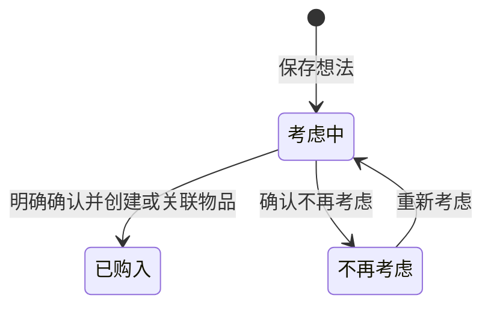

# 低频整理、盘点与心愿决策设计

状态：**A／B／C 已实现并完成独立 Review 修复；2026-10-06 完成隔离身份下的核心原生验收，修正普通编辑清除失效关系、默认列表遗漏历史待核实两项问题并补回归。盘点按用户最新决定简化为逐账户填写数值，撤销原 C2 批量确认方案。系统输入法组合、VoiceOver 与通知实际送达仍未验，不宣称全部原生路径通过。** 确认日期：2026-10-05；修订日期：2026-10-06。本文是本项改动的唯一目标设计，现行规则见 [PRODUCT_RULES](PRODUCT_RULES.md) 与 [USER_GUIDE](USER_GUIDE.md)，技术取舍见 [ARCHITECTURE](ARCHITECTURE.md) 的 schema 27／28 说明。

## 1. 定位与设计决定

物谱服务于个人物品档案、重要花费记录和金融净资产的低频盘点。用户可以隔几周或几个月回来，重新理解已有资料、核对账户、查找记录和考虑大额购买。低频不等于简陋；可选功能只要不妨碍基础使用、误导事实或占据核心信息位置，就可以保留。

心愿清单定位为**大额购买的考虑清单与决策记录**。它保存购买前的想法与资料，帮助用户再次判断是否需要，购买后连接物品档案，不以不断增加金额来推进心愿。

| 决定 | 原因与取舍 |
|---|---|
| 取消新心愿的攒钱模式与快捷加钱 | 独立“已攒金额”没有对应的资金分配事实，维护成本与低频使用不符；更换为更大的增量按钮也不能解决 |
| 倒计时改为可选计划日期与提醒 | 有日期的采购计划有效；没有日期的想法同样是完整记录，不需要先选择“实现方式” |
| 购买必须明确确认 | 预计价格、资金进度、日期到达都不代表已经购买 |
| 保留旧资料，单独解释旧自动实现 | 已生成物品可能被用户编辑或用于历史统计，升级不能自动删除、回退或把它们重新确认为购买 |
| 盘点备注补齐记录背景 | 账户余额差额不能解释原因，主观备注需要独立表达，不能充当自动财务归因 |
| 全局搜索独立于页面搜索 | 用户可能忘记资料在哪个模块；找到原记录不应改变页面筛选、统计口径或导航结构 |
| 总览直接显示金额所对应日期 | 间隔较长时，旧盘点不能被误解为实时余额 |

本项不扩展为日常流水、储蓄账户、预算系统、任务管理、行情、自动抓价、AI 或云同步。按次成本、目标成本、周期费用、虚拟资产及现有模块开关继续保留。现有侧栏层级、主题、主要页面与名称不变。

## 2. 范围与交付顺序

| 阶段 | 覆盖能力 | 完成条件 |
|---|---|---|
| A：购买决策与盘点表达 | 普通心愿、理由与链接、状态与购买确认、旧攒钱兼容；总览可见盘点日期、期间说明；盘点备注及只读查看 | §9 的 A 组条件通过，旧资料、回执、备份迁移与恢复可独立复查 |
| B：查找资料 | 搜索全部资料、稳定 ID 来源跳转与返回、模块和资料库隔离 | §9 的 B 组条件通过，不干扰页面搜索与金额汇总 |
| C：集中整理增强 | 心愿关联待替换物品；逐账户填齐金额后保存盘点 | §9 的 C 组条件通过；A、B 的事实与隔离约束继续有效 |

三个阶段均纳入目标设计。C 不阻塞 A、B，也不在早期交付中宣称完成。PDF 凭证、价格历史、候选型号比较、预算分配和自动复盘报告不在本项范围内。

## 3. 心愿清单

### 3.1 新增与编辑

新心愿默认是“考虑中”，名称为唯一必填。预计价格、考虑理由、链接和计划日期均可空；不要求用户选择攒钱或倒计时，也不要求填写购买渠道。

表单按下面顺序组织，复用当前组件及主题令牌：

1. 名称与图标／封面。
2. 预计价格（元，可空）和“想买的理由与顾虑”（可空，提示“为什么想买？还有什么顾虑？以后回来时提醒自己”）。
3. 相关链接（可空，复用现有 `external_link`，HTTP／HTTPS，最多 2048 字）。
4. “更多资料”（默认收起）：计划日期（填写后才出现提醒）、考虑替换的物品、图片。

分类、可能购买的渠道和置顶不在新心愿表单出现；旧记录已有这些值时，对应一行仍显示并可修改或清除，保存不丢值。添加日期由创建日自动记录，表单不可修改，详情只读显示，旧值保留。这只是显示层精简，不改变数据结构、偏好键、备份、回执与迁移。

考虑理由复用现有 `notes`，不另建一份“购买理由”再同步。名称沿用 1–200 字，备注最多 10000 字，不含 NUL；字符数前后端一致。预计价格为整数分，可未知或明确为零，不自动填商品链接中的价格。已有图片、图标、分类、渠道、优先级等资料保留；旧优先级不扩展为新的评分系统。

普通表单关闭丢弃未保存输入。明确失败保留当前输入供修正；已提交、结果未知的回执按 §8 核对，不能当作普通草稿丢弃。

编辑表单不提供直接切换“已购入”的状态开关；购入是独立确认操作。改名称、价格、日期或备注不得生成、删除、退役物品，也不得改变购买状态。

### 3.2 列表与详情的信息顺序

保留列表／网格与置顶。筛选为“全部｜考虑中｜已购入｜不再考虑”，初次默认仍为“全部”；不把本项变成默认导航重构。

列表列为“心愿｜预计价格｜加入日期｜计划日期”。名称下面显示状态、分类及一行理由摘要；网格显示同样信息。理由为空则省略摘要，计划日期为空在列表显示中性“—”，网格省略日期，不显示“目标日期待补充”。日期未知始终排在已知日期后，置顶仍优先，完整匹配结果排序后再分页，不能只排序第一页。

原“目标与进度”列改为“计划日期”；保留名称、价格、添加日期、计划日期的排序，不增加“达成率”或资金进度排序。已有优先级排序及值须兼容，不强迫用户重新分级。

页头显示“考虑中 N 条 · 预计价格合计 ¥X”，只统计真正考虑中的心愿，与列表搜索和分页无关；未知价另列“Y 条价格未知”，全为未知时金额为“未知”，没有考虑中心愿时为零。另有历史待核实记录时单列“M 条历史待核实”，不把它们的金额算成明确的未来购买计划。合计旁解释“仅为想法的预计价格，不是已发生支出或资金承诺”。

详情顺序：

| 位置 | 内容 |
|---|---|
| 顶部 | 名称、封面、状态、预计价格；旧记录提示如适用 |
| 主内容 | 想买的理由与顾虑、相关链接、图片 |
| 补充资料 | 添加日期；分类、可能购买的渠道有值才显示；有计划日期才显示日期与提醒 |
| 关系 | 已购入物品；C 阶段的待替换物品；旧自动生成物品单独解释 |
| 底部操作 | 考虑中：“已买到，记录购入”“不再考虑”；已购入：“查看物品”；不再考虑：“重新考虑” |

详情头部只放“编辑”按钮；删除只在编辑表单底部，进入最近删除，可恢复，详情不再有“更多操作”菜单。普通心愿详情不再展示攒钱圆环、已攒／还差、百分比、快捷加钱和“存一笔”。

### 3.3 状态与决策备注

面向新记录的状态只有“考虑中、已购入、不再考虑”。日期到达不会转换状态。没有购买不叫失败，保留不再考虑的记录供以后回看。

历史待核实的专门处理见 §3.6，不纳入新记录的默认流程。

| 操作 | 输入和结果 |
|---|---|
| 新增／编辑 | 名称必填，其他可空；不生成物品或支出 |
| 已买到，记录购入 | 打开实际购入表单，明确保存后关联物品并进入已购入 |
| 不再考虑 | 小型确认区，可选“决定备注”，确认后保留档案，不删除图片或已有关联物品 |
| 重新考虑 | 明确确认后回到考虑中；保留上一次决定备注，允许编辑，不自动恢复旧提醒 |
| 删除心愿 | 使用现有最近删除；不删除已购入或旧自动生成物品 |

“决定备注”在界面中显示为“为什么不买”。它与考虑理由各有职责：前者是最后一次决定的说明，后者是想法资料，不互相覆盖。决定备注可空，最多 10000 字；不是追加式日记。本项不增加每次浏览、修改或重新考虑的时间轴事件。

已购入记录不直接“重新考虑”。误记购入必须到关联物品核对，使用现有更正／删除机制；不能通过改心愿备注撤销真实购买事实。关联物品已售出或退役，心愿仍为已购入；软删除则显示“关联物品在最近删除”，提供前往恢复的入口，不开放重复转换。

### 3.4 购买确认与物品档案

“已买到，记录购入”复用现有物品表单及事务转换入口，标题明确“记录这次购入”。物品名称、分类、封面可预填，实际价格留空；预计价格以参考说明显示，不能预填为实付金额。购入日期按现有表单默认今天，允许用户改为真实历史日期或清空，不从计划日期推导。

保存一次完成物品、心愿状态、稳定 ID 关联和回执。取消保持原状态；事务失败不得留下半条物品或单独改变心愿。成功进入关联物品详情，保留返回原心愿入口。重复点击、超时后重试和重启核对只能对应同一件物品。

用户已单独建立物品时，可在购买确认中选择“关联已有物品”，避免再次建档。选择器按稳定 ID、名称和购入日期区分同名记录；只选未删除、未关联其他心愿的物品，退役或售出物品可用于补记历史购入。本心愿自己的旧版生成档案可以明确选为复用对象，不能因历史来源相同而被排除；也不能静默当作本次购入。确认关联不修改该物品的价格、日期、状态或备注。结果未知、修订冲突和并发关联同样校验回执及事务约束。

关联后原考虑理由留在心愿中，物品展示“来源心愿”跳转，不自动把理由复制成第二份可编辑备注。已有复制过的照片或备注按历史事实保留。实际物品购入只计一次重要支出；心愿预计价格不产生支出、不扣账户余额、不加入金融净资产。不再考虑的预计价不能叫“省下的钱”。

### 3.5 日期与通知

“计划日期”可空，表达准备再次考虑／购买的日期，不代表已经买到。可选提醒默认关闭，保留当前本地 9:00 单次通知能力，不新增重复催办。新增提醒需合法日期和系统权限；无日期时提醒关闭。

计划日期已过只显示日期及中性“计划日期已过”，不显示逾期债务、失败率或自动进入待关注。已购入／不再考虑／删除／关闭模块时撤销未发通知。重新考虑不自动恢复旧提醒。旧记录已经设置的日期与有效提醒继续保留；权限失败不能丢失其他输入。

### 3.6 旧攒钱与已实现记录兼容

迁移必须覆盖活动和最近删除记录、备份恢复、既有请求回执。旧 `saved_cents`、模式、实现来源、日期、审计和关联物品不得因取消功能而丢失。

| 原记录 | 目标显示与处理 |
|---|---|
| 进行中，包括旧攒钱未达标 | 考虑中；取消增量操作；原已攒金额在折叠“旧版记录”中只读保留，不作为预算或账户余额 |
| 明确 `manual` 或 `conversion` 已实现，且有关联物品 | 已购入，保留原关联物品与历史日期；旧日期不重新推断为真实购买日期 |
| 手动／转换已实现但无关联物品 | 历史待核实，保留旧日期；需显式记录购入或关联已有物品，不自动补生成 |
| `savings` 自动实现 | 历史待核实；“旧版因攒钱达标标为已实现，购入情况尚未确认”；原关联物品保持原样 |
| 已实现但来源不足以证明主动购入 | 历史待核实；“旧版已实现记录缺少购入确认来源，请核实”；不能声称它一定由攒钱产生 |
| 已放弃 | 不再考虑；原放弃时间保留 |
| 已删除 | 最近删除仍可按原 ID 恢复，恢复后采用相同显示规则 |

历史待核实不是新心愿可选状态。它在“全部”和“考虑中”筛选中可找到，带独立标记；不计入已购入数量、考虑中预计价合计或确认的未来计划，不强制用户马上处理。保留旧日期与“旧版记录”，不伪造本次核实日期。

核实操作有三种：

1. **确实已购入**：有原关联物品时明确复用该 ID，可补录实际价格、日期；确认后进入已购入，不新建第二件。原物品已软删除时先恢复，不能静默恢复或重复生成；没有原物品时进入 §3.4 的新建／关联流程。
2. **尚未购入，继续考虑**：确认后进入考虑中。旧自动生成物品仍保留，提示“旧版生成的物品仍在档案中，如为误记，请前往核对”，引导既有更正／删除入口。用户确认“尚未购入”时，将旧关联保留为只读的历史生成关系，清空有效购入关系；不能把旧物品当作本次购入。不得自动删物品、清除用户编辑或改写历史投入。
3. **不再考虑**：确认后进入不再考虑，原物品同样保留并提供核对入口；旧关联转为历史生成关系，不继续表示确认的购入。

历史生成关系可用独立的可空 `legacy_generated_asset_id` 保存，记录原 ID、来源和必要的失效展示资料；它不占用有效购入关联，也不作为新的来源事实。以后用户真正购买，可以明确复用这份档案、关联另一件已记录物品或新建；同一份旧档案被复用时只有一个物品 ID。物品来源显示“旧版由此心愿自动生成”，不能误标为新确认购入。历史关系的软删除／恢复／永久删除按引用规则处理，不为“清空有效购入关系”触发旧自动删除逻辑。

核实和补录用专门的原子请求，更新心愿与需要更正的物品时分别验证修订。核实表单须在原物品现值读完后才开放输入，只提交有修改的字段，并使用预填时的物品修订；未改动与留空都保持原事实，读取失败提供重试。打开页面、搜索、备份检查和迁移本身不能创建或修复物品关系。原“读取旧已实现心愿时自动补生成物品”的路径必须退出新行为。

旧物品仍按既有资料参与原统计，升级不自动改写过去的数量和金额；迁移提示明确说明“取消攒钱功能不会自动清理旧版已生成的物品”。时间轴保留旧自动实现事件的事实来源，使用“旧版自动实现心愿”说明，不能把升级日写成购买日或静默改成用户确认购入。

旧金额和旧目标价之后不再驱动状态、物品生成或删除。旧攒钱写命令停止接收新的写入，返回清楚的功能停用提示。已提交但结果未知的旧请求只查原回执：已提交则显示已保存的历史结果；明确未提交则显示未保存，不在新版补执行；暂时无法核对则保留请求入口，不丢弃、不产生第二次动作。

## 4. 总览：日期与期间

综合总览金融净资产卡在金额附近固定显示“截至 YYYY-MM-DD 完整盘点”；下一行中性显示“距今 N 天”。日期使用本地自然日差，当天为零；长期未盘点不变成红色警报，不自动生成待办。

有较新不完整盘点时保留现有提示：“YYYY-MM-DD 盘点尚缺 N 个账户，当前显示 YYYY-MM-DD 的完整盘点”，两处日期必须对应各自记录。只有不完整盘点时金额显示“—／尚无完整盘点”，不能显示零或部分合计冒充金融净资产。资料读取失败时保持错误状态，不能把旧值重新标为最新。

净资产、物品持有与固定负担仍采用当前各自口径，不因为年度筛选重新计算一套历史持有值。期间控件旁常显“所选期间用于重要支出与近期记录；持有物品与固定负担为当前资料，净资产取最近完整盘点”。重要支出卡继续标出年份／全部期间；固定负担加“当前计划”，心愿指标改为“考虑中心愿”，历史待核实数单列。

保留现有查看账户与盘点入口，不另建首页盘点向导、定期提醒系统或月／季度页面。切换模块、年份或资料库时，旧异步结果不得覆盖新结果。

## 5. 盘点备注与只读查看

### 5.1 填写与更正

盘点账户表下、金额预览和保存区前加入常显“本次盘点备注（可选）”多行输入，提示“记录这次盘点的背景，例如大额购买、账户调整；备注不参与金额计算”。支持最多 10000 字，复用现有 `Snapshot.notes` 和 `SnapshotSave.notes`，不另建复盘实体。

新盘点备注为空；更正盘点加载原备注，可编辑或明确清空。备注与账户条目在同一个保存请求中提交。只更正备注时必须保留已填写原条目的金额、分类与计入范围，不能因为表单重载把它们改为今天的设置；备注不影响完整性、差额、曲线或可比性。用户主动填写金额一律作为 entered 提交，即使等于前值；旧不完整盘点的更正需补齐金额，旧未编辑的 unchanged 条目沿用已记录金额，不重推导。

改盘点日期不自动把原备注套用到另一日：读取所选日期后，已有盘点加载它自己的备注；新日期备注为空。若当前有未保存的备注修改，切换前提示“切换日期将丢弃当前备注修改”，确认才切换，取消保留原日期。已有金额日期切换规则保持；普通关闭不保存备注草稿。

读取失败时禁用保存；明确保存失败保留输入；结果未知按 §8 冻结并核对，不重发不同内容。新旧盘点均允许备注为空，备注不是完成盘点的前置条件。

### 5.2 查看位置

盘点记录表增加“备注”摘要列（最多约 40 字，有内容才显示摘要），点击日期／摘要打开**只读盘点详情**；详情包含日期、完整性、记录时账户金额与状态、全文备注以及“更正这次盘点”。无备注显示“未填写备注”，无需补齐提示。移动焦点、打开详情、关闭详情不写入资料。

趋势图仍显示金额和状态，点选盘点时详情可见备注；两次盘点比较在各端点分别展示日期和备注，有较长内容可展开。不能把两个备注拼成系统生成的“变化原因”，也不能用备注解释已无法对账的差额。

总览近期记录、时间轴和搜索的盘点来源均进入只读详情；“更正”再进入原编辑流程。直接使用稳定 snapshot ID，先读取原记录，不用日期替代身份。原记录已删除、同日有新记录时提示原记录不存在，不能自动打开替代盘点。

当前财富 CSV 没有盘点备注列；实施时在末尾增加“盘点备注”，在对应盘点的每个账户行输出相同备注，原金额列、行粒度与排序不变。文本沿用既有 CSV 转义及安全处理，不丢换行、逗号或引号。完整备份及恢复本来已包含备注，新增界面也须证明原文本可回读。CSV 仍不是完整备份。备注修改不产生虚假的新盘点／付款事件。

## 6. 搜索全部资料

### 6.1 入口与操作

在应用壳的公共工具区加入独立图标按钮“搜索全部资料”，可在总览、设置和各模块打开；不新增侧栏页面。快捷键为 `⌘⇧F`，菜单“编辑 › 搜索全部资料”；现有 `⌘F` 继续聚焦本页搜索，`⌘N` 保持当前页新增。全局入口与本页输入分开，窄窗口保留图标和可读名称，不把两种搜索合成一个含糊输入框。

打开居中搜索面板，自动聚焦输入框，显示“搜索全部资料”和“仅搜索当前资料库已开启模块”。空关键词不查询也不显示最近使用历史。输入停止约 200ms 后查询；中文组合输入结束后再查询。清除回到空状态。

结果显示“找到 N 条”，可用“全部”和各已开启类型筛选。每条包括类型标签、名称／日期、匹配上下文及状态；单条为单一可聚焦操作，方向键上下选择、Enter 打开、Esc 关闭。Tab 正常到达筛选、结果、分页和关闭按钮；加载／错误／无结果有文字状态。

关闭返回原触发位置。打开结果通过现有来源机制进入记录；再次打开搜索保留本轮关键词、类型、分页和滚动，便于继续找，不持久化到磁盘。资料库切换、恢复、模块开关和应用重启清空搜索及失效响应。普通编辑或提交核对尚未结束时使用现有关闭／阻塞流程，不能借搜索跳转绕过它。

### 6.2 搜索范围

| 结果类型 | 首批可搜索字段 | 打开位置 |
|---|---|---|
| 物品 | 名称、品牌、型号、分类、标签名、物品备注 | 原物品详情 |
| 心愿 | 名称、分类、考虑理由、决定备注、相关链接 | 原心愿详情，包含历史待核实 |
| 账户 | 名称、类型显示名、机构、备注 | 按 ID 打开原账户资料表单，未保存不写入；不能只按名字筛选 |
| 盘点 | `YYYY-MM-DD` 日期、备注 | 只读盘点详情 |
| 独立重要支出 | 名称、分类、备注、日期 | 原支出详情 |
| 周期计划 | 名称、类别显示名、备注 | 原计划详情 |
| 周期付款记录 | 所属计划名、应付日期、实际付款日期、付款备注 | 对应计划的这一期记录，明确显示“已付”或“已跳过” |
| 虚拟资产 | 名称、类型显示名、标签名、备注 | 原虚拟档案 |
| 储值充值 | 所属虚拟档案名、充值日期、备注 | 原充值记录 |

物品购入／虚拟购买等聚合支出投影不再作为第二条“支出”结果；独立支出才有独立结果。时间轴、总览和统计是投影，不单独索引。首次不搜索附件内容、OCR、序列号、保障／维护子记录文本、退款子记录、储值余额核对历史、未确认付款候选或自动费用估算。范围在空面板的说明入口可查看，不能把未覆盖字段宣传成可搜索。

只搜索未软删除资料；退役／售出物品、停用账户、已购入／不再考虑心愿、结束／暂停的计划和虚拟权益仍可查。关闭模块的记录及结果计数均不返回，不为了打开结果自动启用模块。最近删除使用既有入口；正式库与样例库绝不混合。无本地网络或外部搜索请求。

### 6.3 匹配、分页与错误

去首尾空白，英文字母（ASCII）大小写不敏感的字面子串匹配；单个完整关键词，无分词、拼音、模糊匹配或通配符。名称／盘点日期匹配优先，其他字段次之；组内按记录添加时间降序、固定类型顺序、稳定 ID 排序。无添加时间的记录选用既有创建时间，不用本次查询时间。金额不作为文本搜索字段，不把格式化金额进行数值推断。

每页 30 条，关键词最多 200 个 Unicode 字符、禁止 NUL；过长输入给出明确提示，不静默截断。总数及各类型数量来自当前完整结果集，先搜索、排序后分页。备注摘要只截取实际命中附近约 80 个字符，明确标出匹配字段；不把随机片段显示为命中解释。

使用后端只读投影查询，不能拉取各模块第一页然后在前端拼结果。第一版不引入独立磁盘索引或新全文检索依赖，数据量需要时再以测量决定优化。每次查询在同一读取快照内计算结果与计数；资料修改后再次查询（包括重开面板）时清除当前结果、从第一页重新查，不混用不同版本的分页；读取版本只在内存会话内比较。

查询失败显示“搜索失败，重新搜索”，不将部分来源结果标为全部；旧关键词响应、切换资料库前的响应、关闭模块前的响应都必须丢弃。重试通过独立轮次重新发起查询，失效来源刷新时同步第一页的会话页码；来源打开只处理当前面板与当前查询的校验结果，关闭／卸载／切换上下文后废弃在途打开，回车及连击只打开一次。点击时再次校验 generation、类型、父子关系和稳定 ID；删除／停用模块后点击旧结果提示并刷新，不打开同名记录，也不落到另一个资料库。

## 7. 后续集中整理增强

### 7.1 待替换物品

心愿“更多资料”可选择一件当前未删除的物品，作为“考虑替换的物品”，允许未知或清空；选择器包含名称、购入日期和状态，用稳定 ID 区分同名记录。此关系与“已购入物品”是两条不同关系，不能复用 `converted_asset_id`。

详情显示关联物品名称、购入日期、状态、已有总投入／维护信息，并提供查看入口；未知值沿用原计算口径，不增加“该换了”的自动建议。原物品退役／售出不自动取消心愿，删除时显示“原物品在最近删除”，永久删除后以可清除的失效关系显示，不按同名重绑定。

购买新物品不自动退役、出售或删除旧物品，不推断旧物品售价，不从预计价格中扣除二手价值。指向关系参与软删除／恢复／备份完整性；永久删除原物品时将有效外键置空并保存关系展示所需的最小历史名称，不制造悬空外键或维护第二份物品档案。

### 7.2 逐账户填写金额

2026-10-06 按用户原生验收中的决定修订：低频盘点就是每月对照平台抄入金额，取消原 C2“选中账户确认未变”方案，同时移除单行“未变”“未知”与“其余标未知”入口。

新盘点每个应盘点账户的金额都留空，逐个输入当前数值，零余额填写 0；全部填齐才能保存。表格只保留账户、上次金额、本次金额、差额四列。上次金额及日期供核对，不自动填入本次金额；差额自动计算，输入等于上次金额也保存为 entered。无上次金额的账户同样需填写。

不再使用的账户在账户资料中设置停用日期，沿用既有停用规则，不用缺失金额或盘点状态代替。更正加载已记录金额；旧版不完整盘点保留只读事实，更正需补齐缺失金额。旧 unchanged 行未编辑时保留原记录金额；旧类型、迁移和回执保留兼容，不自动把缺失改成零。保存失败保留数字与备注，日期切换取消保留当前输入，普通关闭仍不存草稿。

## 8. 数据、事务与兼容约束

以下是目标业务字段与一致性要求；物理表结构及命令名在实施时结合当前 schema 确定，不在设计阶段占用版本号。

| 能力 | 字段／接口约束 |
|---|---|
| 心愿决策 | 增加唯一权威的 `decision_state`：`considering/purchased/dropped/legacy_achieved`；决定备注、明确购入确认的操作日期与来源；考虑理由继续使用原 `notes` |
| 旧兼容 | 保留旧攒钱字段及来源供只读历史，历史生成关系 `legacy_generated_asset_id` 与有效购入关联分开；旧 `status` 若保留只作兼容投影，不得作为第二套可独立修改的状态；历史旧日期保留，不当作新的确认日期 |
| 购入关系 | 原 `converted_asset_id` 稳定关联、每条心愿最多一个购入物品、每件物品最多一个有效来源心愿；同名不是同一件物品 |
| 待替换关系 | 可空 `replacement_asset_id` 与最小失效关系展示资料，不能与购入关系混用 |
| 盘点 | 复用现有备注字段及 10000 字校验；按 ID 增加只读盘点读取，历史记录与比较端点提供备注读取，不只依赖金额摘要 `Point` |
| 全局搜索 | 输入关键词、类型筛选、offset、limit、generation；响应回显上下文，包含统一结果、完整总数和类型数；扩展账户来源类型及原生验证路由 |
| 逐账户金额盘点 | 复用原 snapshot 保存命令；新输入一律 entered；旧状态与回执兼容，不增设 schema |

现有心愿偏好有严格字段反序列化与模式验证，不能仅前端把 `mode` 写成 `none` 或删掉字段。领域转换、默认值、严格校验、schema 迁移、备份规范、恢复校验、样例夹具与旧回执读取须一起兼容。

从当前 schema 顺序增量迁移，保留迁移前保护副本，版本号以实施时真实最新值为准。活动、软删除、自动生成已编辑物品、照片、关系、审计和回执均纳入虚构夹具。恢复旧备份经过同一目标适配，不因缺新字段拒绝合法旧格式，也不在恢复后重新执行旧攒钱转换。新格式不能承诺可被旧应用恢复。

所有写入携带 request ID、generation、expected revision；关系或多实体更正必须事务一致，先查原回执再处理重试。返回未知不得生成新 request ID 重做。旧回执保存结果按历史数据解读，不重新执行现在已停用的命令。纯浏览与搜索不写业务数据，不改变审计或旧事实。

删除、恢复、分类／渠道变更、模块开关、来源跳转和异步守卫沿用当前规则。心愿确认／关联后付款、净资产和支出投影不得双计。提醒推导及取消要覆盖新状态和迁移，不保留无效旧计划。

## 9. 验收标准

下列为待执行标准，不是已通过记录。功能验收全部使用虚构资料和预览／独立身份，不得打开或写入正式库 `local.thingary.main`。

### A：心愿与盘点

| ID | 场景 | 必须满足 |
|---|---|---|
| A01 | 仅名称创建心愿 | 考虑中，无攒钱／模式要求；未知金额与日期可空 |
| A02 | 理由、链接、照片与更多资料 | 保存重启可回读，链接有效校验，理由只有一个权威字段 |
| A03 | 没有计划日期 | 不出现待补日期、资金进度或未设目标警告 |
| A04 | 有日期、通知拒绝／允许、日期已过 | 输入保留，单次通知规则有效，无自动购买或催办 |
| A05 | 不再考虑与重新考虑 | 原档案、理由、图片、决定备注保留，无支出，无自动恢复提醒 |
| A06 | 新购入：预计 4000、实际 3600；未知实付 | 保存只生成一个关联物品；支出仅实际 3600 或明确未知；预计价不入账 |
| A07 | 取消／保存前失败／提交后响应丢失 | 无半转换；回执重试和重启最多一件物品 |
| A08 | 关联已有同名物品、并发关联 | 选定 ID 正确，另一件同名不受影响；冲突无半关联 |
| A09 | 关联物品退役／售出／删除恢复 | 心愿购入状态不倒退；软删除引导恢复，禁止重复转换 |
| A10 | 未知价、零价、全部未知、无考虑中心愿 | 页头正确区分未知、零与已知部分，不受搜索和分页影响 |
| A11 | 超过 100 条、置顶和排序 | 全集排序后分页，未知最后，列表／网格含义一致 |
| A12 | 旧攒钱未达标、达标已生成物品及已编辑 | 旧金额只读；自动实现待核实；升级不删物品或抹用户修改 |
| A13 | 旧手动／转换、来源缺失、软删除心愿 | 正确分类；缺来源不冒充已购入；恢复原 ID 和资料 |
| A14 | 待核实确认购入，原物品在最近删除／无关联 | 明确复用／恢复或选择新建；不自动补生成，不重复创建 |
| A15 | 待核实改为考虑中／不再考虑，之后再次购买 | 原物品及历史关系保留、有效购入关系清空；可明确复用／另关联／新建，不被旧关联阻塞、不自动重复生成 |
| A16 | 新编辑旧预计价、旧日期、旧已攒金额 | 不触发旧自动实现／回退；停用写命令无新业务副作用 |
| A17 | 旧请求已提交／未提交／暂不可核对 | 分别回读／明确未保存／保留核对入口，不能在新版重新补执行 |
| A18 | 旧备份恢复和故障中断迁移 | 新旧资料、图片、关系、审计、回执可核对，无新增幽灵物品 |
| A19 | 完整盘点隔 90 天、较新不完整盘点 | 总览金额附近日期可见；两个日期正确，无部分金额冒充完整值 |
| A20 | 无盘点／仅不完整／读取失败 | 未知与错误明确，不能当作零或最新余额 |
| A21 | 年份、模块、样例切换及响应乱序 | 常显期间解释，金额口径不变，旧响应不覆盖新资料 |
| A22 | 新盘点、有备注旧盘点、清空备注、只改备注 | 同请求保存；账户历史分类、金额与完整性不因备注变化 |
| A23 | 备注切换日期、取消、失败、结果未知 | 不串日、不丢已提交请求；普通关闭无草稿 |
| A24 | 10000 字／超限／NUL／中文与换行 | 字符限制一致、错误可读，长备注可回读 |
| A25 | 记录表、趋势、比较、时间轴来源 | 可看全文，端点分开，浏览只读，删除 ID 不落到同日替代记录 |
| A26 | 备份恢复与财富 CSV | 备注完整；金额与历史事实不改；旧合法备份兼容 |

### B：全局搜索

| ID | 场景 | 必须满足 |
|---|---|---|
| B01 | 总览、设置、各模块及窄窗口打开 | 全局入口可达，⌘⇧F／菜单有效；⌘F、⌘N 原义不变 |
| B02 | 空关键词、中文输入、快速修改词 | 无空查询；IME 不抢 Enter；乱序结果丢弃 |
| B03 | 九类结果、历史状态、停用账户 | 命中字段与类型明确；正常打开原记录，无投影重复 |
| B04 | 31、101 条匹配、同名与相同时间 | 计数准确、排序稳定、各页可达，无第一页拼接限制 |
| B05 | 搜索前后各页筛选与金额汇总 | 全局搜索无影响，本页搜索继续独立 |
| B06 | 删除结果、同名替代、父记录删除 | ID 校验后提示并刷新，不误开或误写 |
| B07 | 关闭模块、恢复、样例切换中旧响应 | 结果和计数均隔离；旧 generation 无效 |
| B08 | 名称／备注／日期大小写子串、超长与 NUL | 与定义一致；不声称支持金额、OCR 或模糊检索 |
| B09 | 查询失败、无结果、编辑／待核对请求 | 无伪完整结果，重试可达，跳转遵守原关闭／回执流程 |
| B10 | 键盘选择、关闭返回、再次打开与重启 | 焦点正确，本轮查询可返回，重启无持久搜索历史 |

### C：整理增强

| ID | 场景 | 必须满足 |
|---|---|---|
| C01 | 待替换同名物品、未知投入、退役／售出 | 关联 ID 正确，未知保持未知，不自动判定更换必要性 |
| C02 | 新物品购入与旧物品删除／恢复／永久删除 | 旧生命周期不自动变化，失效关系清楚，无悬空引用 |
| C03 | 有不同前值的账户、新账户、零余额 | 新盘点不自动填值，全部逐行填齐才可保存；零和前值相同金额均为 entered |
| C04 | 清空金额、旧缺失、保存失败、切换日期取消 | 空值阻止保存；旧缺失可补录；失败和取消保留输入；无状态或批量确认入口 |

### 共用验证

界面覆盖当前三种风格的浅／深、800px 与正常桌面宽度，提供同尺寸前后对照；正常、空白、未知、加载、读取／保存失败均可辨认。Tab、Enter、Esc、中文输入和焦点回到触发点单独验收；无障碍路径未执行则如实标记未验。

实施阶段运行 `npm run build`、`npm run test:ui`、`npm run check`、`npm test`，计算／迁移／回执／搜索分页使用有意义的行为测试。原生文件、通知、备份恢复、重启持久化用同代码的独立身份验证，浏览器截图不代替原生结果。

## 10. 代码入口与文档衔接

下列入口已在基线核对；实施前重新核对 HEAD、图索引及实际代码，不能把行号或旧 schema 当作永久事实。

| 能力 | 现有入口与需联动的边界 |
|---|---|
| 心愿列表／详情／表单 | `src/WishlistPanel.tsx`、`src/WishDetail.tsx`、`src/WishEditor.tsx`、`src/wishlist.ts`、`src/preferences.ts` |
| 心愿领域与转换 | `src-tauri/src/wish_plan.rs` 的 `save_wish_plan/save_wish_savings`；`src-tauri/src/wishlist.rs` 的 `convert_wishlist`、读／列举与旧自动关联／解除逻辑 |
| 总览日期与心愿数 | `src/ReviewView.tsx`、`src/review.ts`、`src-tauri/src/review.rs` 及统计投影；物品总览也须校对状态文案 |
| 盘点备注与只读详情 | `src/WealthPage.tsx` 的 `CheckIn`／历史／来源处理，`src/WealthChanges.tsx`、`src/wealth.ts`、`src-tauri/src/wealth.rs`、`src-tauri/src/csv_export.rs` 的 `wealth_csv` |
| 全局搜索与路由 | `src/main.tsx`、`src/topbar.tsx`、`src/topbar-model.ts`、`src/source.ts`、`src/useSource.ts`，后端命令、来源验证和新只读查询 |
| 通知／迁移／恢复 | 现有 reminders、storage、backup、deletion、样例数据与前端预览；schema 规范和回执格式一起检查 |

实施后，业务与兼容规则归入 PRODUCT_RULES；用户实际可用步骤归入 USER_GUIDE（同时检查离线指南）；技术取舍归入 ARCHITECTURE；验证方法变化才更新 DEVELOPMENT。INDEX 登记各阶段状态，CHANGELOG 与版本由维护者在发布时处理。本设计持续维护，不另建第二份完整功能规范。

详细执行顺序、任务交接和验收证据放私有过程记录，引用本设计与真实代码提交，不复制一份规则全文。文档设计交付不意味着代码完成、提交、推送、安装或发布。
