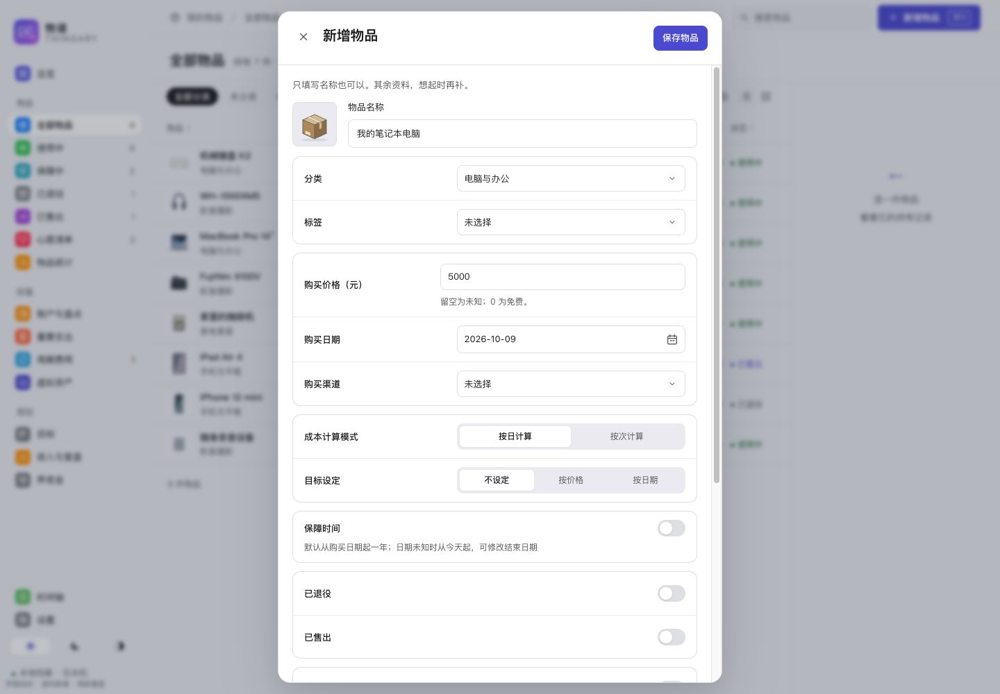
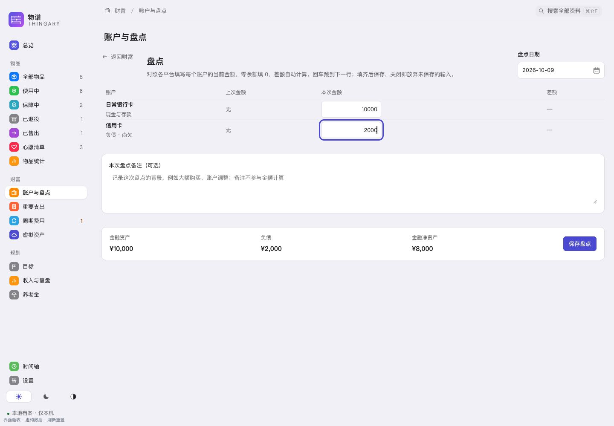
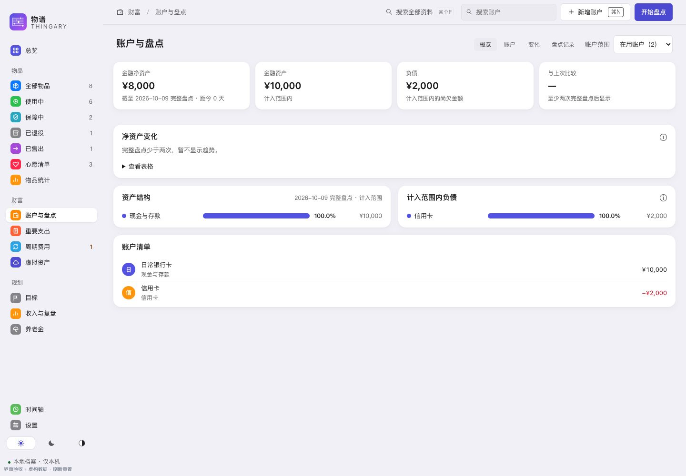
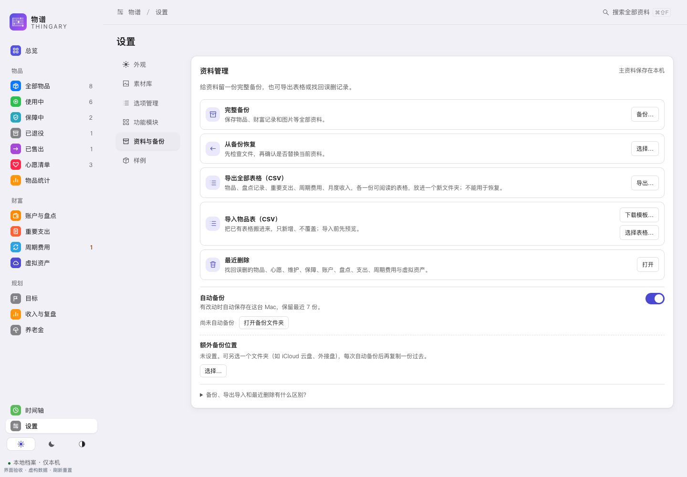
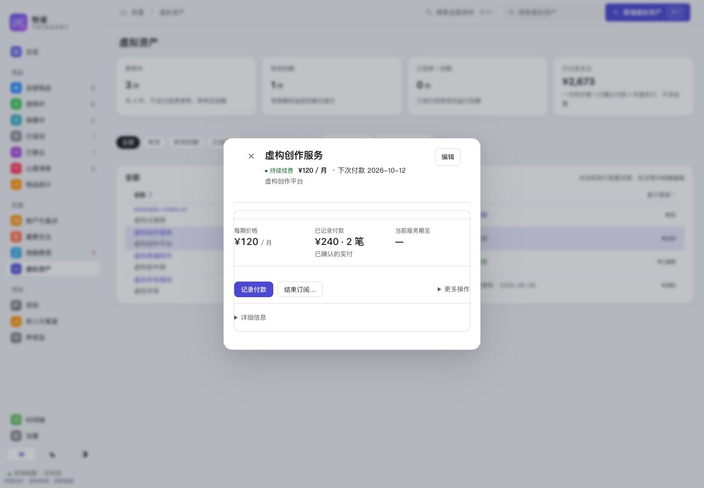

# 物谱使用说明

物谱用于记录值得留档的物品、定期盘点账户，以及按明确条件规划退休与财务独立；不需要编程、注册账号或联网使用。

[下载安装](#download) · [第一件物品](#first-record) · [第一次盘点](#first-snapshot) · [日常操作](#modules) · [规划入门](#planning) · [职业试算](#career-trial) · [备份与恢复](#backup) · [更新与换机](#update) · [常见问题](#faq) · [当前限制](#limits)

当前采用 **0.0.2 公开测试版**，用于收集使用与兼容性反馈。安装包与版本说明见 [GitHub Releases](https://github.com/CoderJackZhu/Thingary/releases)。若某个版本没有 DMG 附件，说明该版本尚未提供安装包；维护者的本机安装状态不代表已公开发布。

## 下载、安装与首次打开

### 选择正确的文件

首发面向 **Apple Silicon Mac**（M1、M2、M3 等 M 系列）。在  › 关于本机查看芯片：显示「芯片 Apple M…」才选 `arm64.dmg`。当前只在 macOS 27 验证，尚未实测 macOS 14 和 Intel Mac；暂不提供 Windows、Linux 或 Intel 安装包。

1. 在 [Releases](https://github.com/CoderJackZhu/Thingary/releases) 打开最新公开测试版（标有 Pre-release），当前为 `0.0.2`。
2. 在附件（Assets）中下载 `Thingary-<版本>-arm64.dmg`。`Source code.zip` 与 `Source code.tar.gz` 是源码，不是安装包。
3. 双击下载好的 DMG，将「物谱」拖到同一窗口里的「Applications／应用程序」文件夹。
4. 等待复制完成，在 Finder 的「应用程序」中双击「物谱」。安装后可推出 DMG；无需一直保留挂载窗口。不要直接从 DMG 运行应用。

### 首次被 macOS 阻止打开

首发安装包使用本地临时签名，未经过 Developer ID 签名和 Apple 公证。

1. 先尝试从「应用程序」打开一次物谱。
2. 若提示无法验证开发者或 Apple 无法检查该应用，打开「系统设置 › 隐私与安全性」。
3. 向下找到本次物谱的阻止提示，确认文件来自本项目的 Release 后，点「仍要打开」，再确认「打开」。

这是针对该应用的例外，不需要关闭整个系统的安全保护，也不需要使用终端。如果没有该按钮，或出现「将损坏你的电脑」「已损坏」等其他提示，停止操作并看[故障排查](#faq)，不要把不同提示都当作同一种拦截。受管理的 Mac 可能需要联系管理员。

步骤依据 [Apple 官方打开说明](https://support.apple.com/zh-cn/102445)。

### 先看看样例，再开始记录

第一次打开会进入独立的虚构样例库，顶部显示「样例体验」。可以浏览和修改样例，它们不会混进自己的资料。

图中已补充退休计划，用来说明总览的布局；首次样例不一定具有相同的规划条件。

准备好后，点顶部 **「开始记录我的资料」**。真实录入时请先确认顶部没有「样例体验」。只是取消表单或保存失败，不算已经开始记录。

## 五分钟入门：记录第一件物品

以下金额与名称只是例子，开始记录自己的资料时请按实际情况填写。

1. 在左侧进入「全部物品」，点右上角「新增物品」。
2. 名称填「我的笔记本电脑」，分类选「电脑与办公」。只填名称也能保存。
3. 如果实际购入价是 5,000 元，在「购买价格」填 `5000`，选择实际「购买日期」。日期默认今天，记录旧物时请改成实际日期；不知道金额或日期就留空，**不要用 0 代替不知道**。
4. 可点击名称左侧的图标选择封面；图片、品牌、备注都可以以后补。
5. 点顶部「保存物品」，保存后进入完整档案。点左上角「全部物品」回到列表；单击物品查看右侧摘要，双击或点「打开完整档案」查看和更正资料。

先记录最值得留档的几件物品即可，不必一次填完所有信息。普通表单点叉会丢弃未保存输入；已点击保存但结果未知时，请按提示核对原请求，避免重复提交。

## 五分钟入门：完成第一次账户盘点

如果只想记录物品，可以跳过本节；需要时在「设置 › 功能模块」启用「账户与盘点」。

1. 进入左侧「账户与盘点」，点「新增账户」。名称填「日常银行卡」，类型在「资产」分组里选「现金与存款」（资产或负债由类型决定，不用另选），平台可留空，点「保存账户」。启用日期不要晚于这次盘点日期；不需要卡号或登录信息。
2. 再建立「信用卡」，类型在「负债」分组里选「信用卡」，点「保存账户」。只记录仍需归还的欠款；没有欠款时填 0，不填信用额度。
3. 点「开始盘点」，选择核对余额的日期。假设银行卡余额 10,000 元、信用卡欠款 2,000 元，分别填写 `10000` 和 `2000`，负债填写正的欠款金额。
4. 填写每个应盘点账户的当前余额，零余额填 0，填齐后点「保存盘点」。这个完整例子的金融净资产为 **10,000 − 2,000 = 8,000 元**。
5. 下次约一个月后再核对余额；不需要逐笔录入每天的消费。至少两次完整盘点后才能比较账户变化。

保存后切回「概览」，即可看到账户、资产与负债汇总。

以上界面图片来自浏览器预览，全部使用虚构资料；安装步骤图是示意图。

前面电脑的 5,000 元是购入记录，**不加进这 8,000 元金融净资产**；如果银行卡余额已反映购买电脑，不要再从余额中扣一次。净资产变化也不等于投资收益。每次盘点都填写账户的当前数值；旧版缺失金额仍保持为空，不能当成 0。

## 先保护资料：完整备份与恢复

### 做一次完整备份

1. 录入第一批自己的资料后，进入「设置 › 资料与备份」。
2. 在「完整备份」旁点「备份…」，选择保存位置，等待应用提示备份完成。
3. 保存的是 `.thingary` 文件，包含物品、账户盘点、心愿、支出、周期费用、虚拟资产与图片等完整资料。
4. 把它再复制一份到外接盘或你自己管理的云盘，确认副本确实存在；不要只留在原机。备份内容未加密，请选可信的位置。

自动备份默认开启，但与主资料放在同一块磁盘上，不能防止整块磁盘损坏。详细行为见下文「记录与保护资料」。

### 从备份恢复

先为当前资料另做一次完整备份，再在「设置 › 资料与备份 › 从备份恢复」点「选择…」，选 `.thingary` 文件，阅读检查摘要，确认后替换当前资料。恢复是整体替换，不是合并。CSV 只用于阅读或导入物品，不能代替完整备份恢复。

## 样例体验

打开软件默认进入「总览」。首次使用会进入独立的虚构样例库，包含物品、心愿、保障、账户与历史盘点、重要支出、周期费用和虚拟资产。顶部持续显示「样例体验」。

- **可以编辑和删除样例**：这些操作只改变样例库。删除物品在「编辑资料」表单中点「删除物品」（本次修改不保存），确认后可从「设置 › 资料与备份 › 最近删除」恢复。
- **最近删除里有一条样例心愿**：展示心愿也能删除与恢复（新建或重置样例后才有）。
- **样例不接受新增物品**：在样例中点「新增物品」会回到自己的资料并打开新增表单；心愿的「已买到，记录购入」也会新增物品，样例中会被拒绝。心愿、账户、支出等其他记录仍按原规则留在样例中。
- **开始记录自己的资料**：先点顶部「开始记录我的资料」，再在任意模块添加；取消或保存失败不算开始记录。
- **再次查看样例**：「设置 › 样例 › 查看样例」会保留上次的样例修改；顶部「返回我的资料」随时返回。
- **恢复初始样例内容**：「设置 › 样例 › 重置…」，确认后重建完整样例，自己的资料不受影响。
- **删空自己的记录**：自己的资料不会被填入样例。只要自己的资料里还有记录（包括「最近删除」中的），启动时默认进入自己的资料；全部永久删除后，下次启动会先显示样例，点顶部「返回我的资料」即可回到空白的自己的资料。
- 编辑或核对未确认的保存结果期间，需要先结束当前操作才能切换。样例不发送系统通知；备份、恢复和导出须在自己的资料中操作。

## 界面与导航

- **侧栏：**「物品统计」在「物品」组末尾；「时间轴」与「设置」在侧栏底部，底部的太阳、月亮、半明半暗三个按钮分别是浅色、深色和跟随系统，同一时间只有一个高亮。
- **素材库**是「设置」里与「外观」并列的分组，在里面浏览、搜索素材并「添加图片」；**最近删除**在「设置 › 资料与备份」，点「打开」进入，用「返回设置」按钮、面包屑或 Esc 回到原分组。
- **物品分类栏：** 分类放不下时，末尾出现「更多分类」菜单，可搜索、用方向键选择，Enter 选中，Esc 关闭并回到按钮；选中的分类会显示在栏内。窗口很窄时整行收成一个选择按钮。「全部」和「未分类」始终固定可选。
- **心愿清单**筛选顺序为「全部｜考虑中｜已购入｜不再考虑」，默认「全部」，历史待核实的旧记录在「全部」和「考虑中」中可见并单独标记；列表列为「心愿｜预计价格｜加入日期｜计划日期」，名称下显示状态、分类与一行理由摘要。页头显示「考虑中 N 条 · 预计价格合计 ¥X（Y 条价格未知）· M 条历史待核实」，合计只是想法的预计价格，不是已发生支出或资金承诺。
- **周期费用**的计划名称、服务覆盖期与说明会自动换行，长说明不会撑宽页面。计划表列为名称、分类、每期金额（带周期单位，非月付另列月均）、下次付款、状态和累计费用（估算或已确认付款）；固定期限的租期预计费用显示在状态下。“到期”清单里月付等 7 天内、年付 30 天内的期次算即将到期。付款记录保留完整日期、金额和状态。

## 首页的物品日均成本

总览的“持有物品”主卡和“只看物品”顶部均显示“物品日均成本”：把当前持有各件物品的日均成本相加，含已退役物品与维护费，售出后退出当前合计。下方显示计入与未参与的件数，信息不全时标明“仅已知部分”；没有可计算物品时显示 —，空资料库为 ¥0.00。它是持有成本摊算，不是每天实际付款；金融账户、订阅与房租不参与。

## 列表排序

物品、心愿和财富模块的记录列表使用同一套操作：点击列标题排序，第一次选择其他列按升序，再点同一列切换升降序；↑ 表示升序，↓ 表示降序，↕ 表示可排序。名称按正反顺序，日期按早晚，金额按实际数值比较，不按格式化后的文字排序。Tab 可聚焦表头，回车或空格切换。

| 列表 | 默认顺序 |
|---|---|
| 物品 | 购入日期从新到旧；可点物品、购入日期、购入金额、日均、状态 |
| 心愿（列表视图） | 加入日期从新到旧；可点心愿、预计价格、加入日期、计划日期 |
| 虚拟资产 | 名称升序；可点名称、类型、期限与付款安排（按结束日期）、状态、累计费用 |
| 周期计划与待确认期次 | 下次付款／到期日从近到远；付款记录按期次从新到旧 |
| 重要支出 | 日期从新到旧；金额按列表显示的正负值排序 |
| 账户 | 名称升序；最近金额按所显示的余额或欠款排序，资产与负债类型保持不变 |
| 盘点历史 | 盘点日期从新到旧；可比较净资产、资产与负债金额 |

置顶物品与心愿仍优先显示，组内未知值放最后；按日均排序时按次计算和信息不全的物品也排在最后。持续订阅与永久权益没有结束日，期限排序时放在有限期记录之后；不完整盘点的金融净资产保持未知。不提供按组合说明文字或操作按钮排序。

排序只改变记录的展示，不改变期间、筛选、汇总或历史事实；物品与心愿先对完整结果排序再分页。窄窗口可在列表内横向滚动查看完整列。物品的「更多排序」只补充添加时间、持有时长，选中后按钮显示当前方式与方向，其他列不亮起排序箭头。持有时长从购入日算至今天，已售出算至售出日，包含退役后的持有期间；日期未知放最后。状态按使用中、已退役、已售出分组，降序时倒转。网格没有表头，保留上方完整排序选项。

## 记录与保护资料

从侧栏进入「全部物品」，点右上角「新增物品」（或按 ⌘N），填写名称后即可保存；金额和图片可按实际情况补充。购入日期预填今天，记录旧物时可通过「选日期」用鼠标选实际日期，也可用键盘输入；日期不确定可清空。其他日期字段也支持鼠标选择和键盘输入。在详情中可更正记录，也可点顶部「删除物品…」，确认后从「最近删除」找回。

名称左侧默认显示箱子。点击可选择图标、立体图标、最近使用的素材或自己的图片；支持分类和搜索。「摄影」分类包含相机、镜头和摄影配件，按常用器材优先排列；「最近使用」仍按实际选择顺序排列。自己的图片可从 Mac 选择，也可拖入或粘贴到选择器。实物照片等通过备注区的虚线「添加图片」入口加入。替换已有图标会把原照片保留为附件；恢复默认箱子也不会删除旧照片。

**搜索全部资料**：顶栏常驻「搜索全部资料」按钮（或按 ⌘⇧F、菜单「编辑 › 搜索全部资料」）打开居中搜索面板，查找任何已开启模块里的记录；它与本页搜索互不影响——⌘F 仍聚焦当前页的搜索框，⌘N 仍是当前页的新增。输入关键词后自动查询，英文字母不区分大小写，按字面子串匹配；中文输入在候选确认后再查询。账户类型和各类分类名称也可搜索。关键词最多 200 个字符，超长时会保留输入并提示；类型筛选与分页可用，方向键选择、回车打开、Esc 关闭并回到原位置。空面板里的「查看搜索范围」列出可搜索与不搜索的内容。账户结果会打开账户资料表单，盘点结果进入只读盘点详情；记录已删除或模块已关闭时会提示并刷新。搜索失败可点「重新搜索」；已跳过的付款结果也可打开对应期次。关闭面板再打开会保留这次的关键词、筛选、页码与滚动位置；若期间资料已修改，重新查询会回到第一页。切换资料库、改变模块开关或重启后清空。

**顶栏搜索与新增**：每个页面的右上角只放和本页有关的搜索与主操作，例如账户页是「搜索账户」「新增账户」「开始盘点」，支出页是「记一笔支出」。⌘N 执行当前页的新增；总览（综合回顾）和时间轴打开「新增记录」菜单，从中选择要新增的记录，只列出已开启的模块。⌘F 聚焦当前页的搜索框；设置和总览没有搜索，按 ⌘F 不会跳到别的页面。搜索按名称、类型、备注等页面上显示的文字查找，不区分英文大小写；只筛选下方列表并显示「找到 N 条」，不改变物品、账户、支出、周期费用等页面顶部的概览与金额汇总。搜索词在各页面分别保留，切到样例或自己的资料、关闭模块或重新打开应用后清空。窗口较窄时，搜索会收成一个按钮，点击或按 ⌘F 展开。菜单栏「文件」和「编辑」里的对应项也会显示当前页的动作；按钮上的 ⌘N 提示标在按下 ⌘N 会触发的那个按钮上。

侧栏底部的太阳／月亮／半明半暗圆形胶囊按钮可随时切换浅色、深色与跟随系统，高亮的一侧表示当前外观。「设置 › 外观」选择清新原生、暖米橄榄或柔和卡片，与明暗外观分开保存；之前选过「纸本档案」的会自动显示为暖米橄榄。单击列表中的物品后，右侧摘要底部始终可打开完整档案；摘要和完整档案的下方内容可各自滚动查看。

**开始录入真实资料后，请立即在「设置 › 资料与备份」做一次「完整备份」。** 以后定期重复，尤其是在大量录入、更换 Mac 或准备恢复资料之前。将生成的 `.thingary` 备份文件另存一份到这台 Mac 以外的地方，例如你自己管理的外置硬盘。检查外置副本确实存在、可读取；不要只把备份留在原机。

**自动备份**：默认开启，无需设置。资料有改动后约 2 分钟，在后台生成当天的完整备份（同一天多次改动只保留最新一份），保留最近 7 天有改动的备份，放在资料目录旁的 `auto-backups` 文件夹；样例中的改动不会备份，退出应用也不会等待备份。从旧版本升级、已有资料但还没有自动备份时，打开应用约 30 秒后会先备份一次。删除 App 后该文件夹仍在，重装即可看到。「设置 › 资料与备份 › 自动备份」可查看上次备份时间和占用、打开备份文件夹、直接从某一份恢复，或关闭自动备份（已有备份保留）。自动备份和资料在同一块磁盘上，防误删误改，不防硬盘损坏；需要时可在「额外备份位置」选一个文件夹（如 iCloud 云盘、外接盘），每次自动备份后再复制一份过去，外接盘未连接时只提示、不影响本机备份。注意：恢复本身也算一次改动，约 2 分钟后当天的自动备份会变成恢复后的内容。

需要恢复时，在「设置 › 资料与备份」在「从备份恢复」下点「选择…」，选中 `.thingary` 备份文件，先阅读应用给出的检查摘要，再确认替换当前资料。恢复会替换本机当前档案；操作前先为当前资料另做完整备份。

## 成本、状态与心愿

物品可选择按日或按次计算。按次请填写累计使用次数；零次时不会显示虚假的单次成本。物品详情顶部右侧显示单位成本、持有天数和目标进度；购买与投入以两栏列出，没有记录的保障、维护和图片各占一行并可直接添加。目标可按单位成本或日期设定；物品退役后目标停在退役日，重新启用后继续；详情会显示进度条，按日目标给出预计达成日期和剩余天数，按次目标给出还需使用次数，推算按当前总投入，之后新增维护会推迟达成。标签用来给物品分组（如「工作用」），一件物品一个标签，显示在列表的分类后面，也可在「筛选」中按标签筛选；使用中、保障、退役和售出按真实记录自动显示，停用标签不会修改历史。标签、购买渠道及售出渠道可在选择面板或「设置 › 选项管理」中管理、拖动排序，也可按上移／下移调整。

“不计入统计”可分别排除总金额、日均成本、统计页和全局时间轴，物品仍可在列表和详情找到。

维护记录的类型可选“配件”，例如 Mac mini 底座、补光灯透镜：费用计入主物品的总投入和日均成本。若配件已经单独建成物品，不再重复记维护费。

心愿是大额购买的考虑清单与决策记录：名称之外都可以留空，「保存心愿」只保存想法，不生成物品、不产生支出。表单依次为名称与图标、预计价格、想买的理由与顾虑、相关链接，以及默认收起的「更多资料」里的计划日期、提醒、图片和可选的「考虑替换的物品」。分类、可能购买的渠道和置顶不在新心愿表单出现，旧记录已有这些值时仍可修改或清除；添加时间自动记录、不可修改，在详情只读显示。「考虑替换的物品」：从在册物品中选一件（同名按购入日期与状态区分），这条关系独立于购入关联，不会改动该物品；详情会显示它的购入日期、状态与已有总投入，物品删除或永久删除后关系会相应显示恢复入口或失效历史；保留原关系或只修改备注均可正常保存，失效历史只有明确清除时才移除。选择器按输入搜索全部在册物品，结果可加载更多；资料读取失败可重试。计划日期可空，表示准备再次考虑／购买的日期；到期只显示日期与「计划日期已过」，不会自动购买或催办。

购买必须明确确认：考虑中的心愿在详情点「已买到，记录购入」打开「记录这次购入」表单，名称／分类／封面可预填，实际价格留空表示未知，预计价只作参考；若已单独建过物品，点「关联已有物品」搜索并按名称、购入日期和状态选择那一件，结果较多时点「加载更多物品」（本心愿的旧版生成档案也可明确复用），关联不会修改物品资料。保存一次完成物品、心愿状态、关联与回执；取消或失败不留下半条记录。已购入心愿点「查看物品」；关联物品被删进最近删除时详情提供恢复入口，误记购入须到物品中用更正／删除机制处理。

「不再考虑」可填写「为什么不买」（即决定备注），档案与图片保留，可随时「重新考虑」回到考虑中（上次的决定备注保留并可在那时更正，提醒不会自动恢复）。它与想买的理由分开，后者是想法资料。

**旧攒钱记录**：攒钱模式与快捷加钱已停用。升级前的已攒金额、模式与实现来源保留为只读历史（详情的「旧版记录」中查看）；旧版因攒钱达标自动标为实现、或来源不足的记录显示为「历史待核实」，其自动生成的物品仍在档案中。需要时点「核实这条旧记录」，等待原物品价格和日期读入后再更正；不修改则保留原资料，留空也保持原值。资料后来有更正时，修改会提示冲突，须重新读取。核实选项为：确实已购入（复用原物品，可补录实际价格与日期；原物品在最近删除时先恢复）、尚未购入继续考虑（旧关联转为只读历史关系，物品仍在，如为误记请前往核对）、或不再考虑。升级不会自动删除或补生成物品；升级前已提交、结果未知的攒钱请求仍可在详情核对，不会重新执行。

新建物品开启「保障时间」时，默认从购买日期起一年（闰年 2 月 29 日到次年 2 月 28 日），购买日期留空时从今天起，可修改结束日期。新建表单更改购买日期时，默认保障日期跟随更新；手动修改的结束日期保留，已有保障记录不会自动更新。

保障与倒计时可设置本地通知，首次启用需允许 macOS 通知。通知时间是所选日期上午 9 点，已过去的时间不补发；系统未能安排时会提示。保存后由 macOS 安排提醒，关闭窗口或完全退出物谱后仍可投递，无需常驻后台。Mac 关机、睡眠、专注模式及系统通知设置可能影响时间和横幅展示，不能保证准点弹出。更正日期、关闭提醒或删除相关记录并保存后，会同步更新或取消尚未发送的提醒。

购买趋势的两张图可悬浮查看准确日期、金额与件数，点击固定详情，再点取消；方向键切换期间，Home／End 跳到首尾，Esc 关闭。按月／季／年切换时清除旧选中期间，未知金额单独提示，精确明细也可展开“查看表格”。

统计页可在全部、本周、本月、本季、本年间切换，按购入日期筛选物品；购入日期未知只进入“全部”。可查看分类分布、持有周期、回收分析与售出保值率。回收率只比较已售出物品的已知购入价与售价，不含维护费用。页面下方的「售出保值率」按「售出价 ÷ 购入价」给出平均保值率（每件同权）、总回收率（按金额加权）、总盈亏和逐件排行，可切换从高到低或从低到高，点物品名进入档案；购入价未知或为 ¥0 的物品、「不计入统计」和已删除的物品不参与，未参与的列在卡片底部。

## 账户与盘点

侧栏“财富 · 账户与盘点”用于定期核对各平台余额与欠款。先新增账户：只需名称、平台、资产或负债、类型与启用日期，不需要卡号或登录信息；房贷、车贷等可关闭“计入金融净资产”。

概览的账户清单与「账户」页默认只显示使用中的账户。在页面上方「账户范围」可切换「已停用」或「全部账户」，不用去设置页；切换在本页各分段间保留，重新进入默认使用中。全部账户先列使用中、再列已停用；「账户」表的状态表头也可点击排序。这只是显示筛选，不改变净资产、盘点范围或历史记录。「变化」默认收起两端已知为零且无变化的停用账户；仍有余额、变化、未知金额或计入范围变化的停用账户保留，方便核对历史。上方比较指标与合计始终使用整个区间。

盘点时对照各平台逐行抄入当前金额，零余额填 0；回车到下一行，所有应盘点账户填齐后点「保存盘点」，差额自动计算。没有「未变」「未知」或批量确认。已经不用的账户在账户资料中设置停用日期，按该日期的停用规则处理；账户已有盘点历史时保留历史记录。同一天再次盘点会更正原记录。账户表下方的「本次盘点备注（可选）」记录背景（例如大额购买、账户调整），随金额一起保存，不参与计算。更正会加载原金额，只改备注不会重新按更早盘点推导金额；修改金额就直接填写新数值。旧版不完整盘点可以查看，更正时补齐缺失金额再保存。切换日期会加载那一日自己的备注，有未保存的备注修改时提示确认，取消保留当前日期、金额与备注。

「盘点记录」表有备注摘要列；点日期或摘要打开**只读盘点详情**，查看日期、完整性、各账户记录金额与全文备注，「更正这次盘点」再进入编辑。总览近期记录与时间轴里的盘点来源同样进入只读详情。导出的财富表在行末增加“盘点备注”列。有账户未填写的盘点单独标出，不画进净资产曲线，也不参与和上次的比较。净资产变化包含存取、消费和估值变动，不等于投资收益。实物购入金额不计入金融净资产。

净资产、单账户趋势、购买趋势与规划年龄图按窗口宽度留出横轴文字间距，相近日期不堆叠；省略的只是刻度文字，完整数据点与悬浮详情仍保留。

概览「与上次比较」卡片的「看哪些账户带来变化 →」和页内「变化」分段会打开两次盘点的逐账户比较：默认就是概览用的那对日期，也可从下拉里任选两次盘点（起点须早于终点）。表格按对净资产的影响排序，可切换按类型；每行显示起点、终点、变化和对净资产的影响，负债同时显示「欠款变化」和对净资产的影响，不进合计的负债（如房贷）单列一节。能对账时表尾显示「合计 ＝ 净资产变化 ✓」；有一端未知或账户改过「计入」设置时，指标显示「—」并说明原因，表尾只给已知账户的变化合计。区间里新启用的账户标「新增账户」，起点算 0。下方的结构比较显示资产按类型的占比在两次盘点间的变化。点行尾的箭头可展开该账户全部盘点的小趋势线和明细（日期、金额、与前次、状态、是否计入），「未知」的盘点在趋势线上留空不画 0。窄窗口下类型和变化率两列会收起，金额不截断。

误建的盘点和从未盘点过的账户可移入最近删除；有盘点记录的账户请填写停用日期（停用前最后一次盘点须为 0）。账户与盘点包含在完整备份中。恢复前会检查版本兼容性；较新版本的备份不保证可被旧版本恢复，详见下文「更新与换机」。

### 导入账户与完整盘点历史（当前源码，尚未发布）

在「账户与盘点」切到「账户」，点「更多 → 导入历史」。只接受专用 UTF-8 CSV 账户／完整盘点模板；可组合两份或只导入一种，不接受收入、总额参考、Excel、OCR 或银行格式。

1. **选择文件**：从常显入口保存模板或虚构样例。账户表用稳定的 `account_key`，盘点表用 `snapshot_key` 和同一账户键；编号不等于名称。金额单位元，最多两位小数，负债填正数，日期 `YYYY-MM-DD`。余额空白报错，明确零写 `0`，不复制前值。
2. **对应账户与列**：标准列自动匹配，其他表头可对应模板列。确认来源名称和映射集合；重导入同一份历史时保持一致，不同表格用不同来源。同名仅作候选，需要明确选择已有账户，否则账户文件的新编号会创建新账户。`kind_at_date` / `counted_at_date` 可显式记录历史类型／范围；空值用映射账户当前资料，类型必须与账户方向一致，不更改当前账户类型。
3. **预览核对**：查看新增、相同、冲突及可定位问题。每个盘点日须包含真实资料库中当日所有有效账户，缺行、空余额、重复组行不能形成完整盘点。冲突只选保留现有、更正整项或明确排除；盘点更正覆盖整组，不能逐行合并。资料在预览后被改、模块切换或恢复会使旧预览失效。先建立完整保护备份；备份取消／失败明确显示未受保护，须主动确认才可继续。
4. **确认与回执**：所选有效集合在一次事务提交，任一失败整批无写入。核对实际新增／更正／跳过数量与对象修订，重复批次可查看原回执。结果未知先按原请求核对；查询无回执表示该资料库内未提交，不换新请求重做。恢复后的当前库若没有旧请求回执，不能据此断定原库未提交，元数据仍保留。起点改变会提示复核计划来源，未来净投入、规划假设和冻结基准不会自动改变。

每批合计最多 **20 MiB、50000 数据行**；超限请拆分。对象、组内账户、问题和回执分页各最多 50 项，分页不减少后端核对。解析有进度与取消，提交后只核对结果；关闭普通预览不保存草稿或 CSV 副本。非法货币符号、千分位、指数或分单位须在源表修正，当前不自动清理。

同批指纹相同仍只展示原回执，不再次写入。回执中的对象已被删除或永久清除时，预览与回执明确显示原导入日期和当前不可用对象数；历史新增数量不代表对象仍在库内。尚未清除的对象可从最近删除恢复；需要再次导入时，修改文件内容并核对外部编号，或更换映射集合。已清除对象的原外部键不能在原映射集合重新绑定。

**金融 CSV 导入不等于完整备份。** 它只写账户和盘点，不带入物品、图片及全部关系。更正后的整体回退使用导入前 `.thingary` 完整备份；永久清除后的外部键保留墓碑，不能按同名重绑。

## 重要支出

侧栏“财富 · 重要支出”回顾多年大额消费。物品的购入价和维护费用会自动计入，改了物品价格这里也会跟着变；设了“不计入统计页”的物品不计入。旅行、培训等没有对应物品的花费，用“记一笔支出”单独记录，可选旅行、教育培训、医疗健康、家居服务、数字服务、礼物人情、其他。

从侧栏普通进入默认显示「全部」：四项摘要（支出／退款／净支出／售出回收）汇总所有年份，下方是逐年柱状图「各年支出」。点击某年的柱子（或用 Tab 聚焦后按 Enter）进入该年，查看 1–12 月的月度图和全年明细；点「全部」或某个年份按钮随时切换。年度图只为有带日期记录的年份画柱，没有记录的中间年份不补零、按真实年份标识；从月份返回「全部」时，刚才查看的那根年度柱会重新获得焦点。金额未知或全部未知的年份在柱上标「金额待补」，不会画成确定的零支出；当年柱注明「截至今天已记录」。期间选择只保存在本次浏览中，不写入资料；从明细打开原记录再返回时，所选期间、搜索与滚动位置保留。

明细里的名称可打开来源：物品购入、维护和售出打开物品；房租、订阅等周期付款打开所属计划的只读详情，附「来源付款记录」，列出原付款期、实际付款日、实付金额及已记录的覆盖期，修改时点「更正这笔付款」；虚拟资产打开服务档案的只读详情，储值充值打开对应充值记录。独立支出与退款仍打开原支出表单。跳转按原记录的稳定 ID 核对，记录已删除或归属变更会提示，不会打开同名替代。

每笔支出可记一次退款：原来的月份仍按全额计，退款计入退款日期所在的月份。先记了支出、后来又把它建成物品时，在支出里“关联到物品”，这笔就不再单独计入，避免重复。售出回收单独列出，不从支出里扣除。日期未知的购入或维护单独小计，不归入任何月份。支出与退款也会出现在时间轴的“支出”筛选里，误删的支出可在最近删除恢复。

## 周期费用

侧栏“财富 · 周期费用”记录房租、订阅等付款安排。选周期，再填一次付款的总金额：月付填月费，季付填整季总额。填写开始使用／租住日期、下一期付款日，订阅结束方式默认“持续续费”，其他费用默认“持续进行”，不确定何时结束就不用填结束日期。历史开始日期不会自动补造付款或生成多年待确认。月底付款按原始月日锚点顺延，不会逐月提前。

**新建周期费用默认用简易表单**（房租、订阅、水电网、保险、会员都一样），只问五件事：付款周期（每月／每季／每半年／每年）、每期金额（季付填整季的钱）、租住开始日期、**提前几天付款**（当天／提前 7 天／15 天／一个月，或自己填天数）、**到期日**（房租叫租期到期日，其他叫结束日期；**不含当天**，就是下一期的第一天；不确定何时结束留空，会一直续费）。表单下面直接列出将生成的每一期（付款日、覆盖期）和合计，你看一眼就知道对不对。例如 2025-07-06 起租、每季 8,400、提前一个月付、到期日 2026-07-06：共 4 期，付款日 6 月 6 日、9 月 6 日、12 月 6 日、3 月 6 日，合计 33,600，月均 2,800。填 2026-07-05 也是同样的 4 期。开始日期是过去的日期时，会多一个「已过去的 N 期都已付清」开关（房租默认开，其他费用默认关）：保存时一次补记为已付，日期按付款日、金额同每期，计入重要支出；日期或金额不同，之后在付款记录里单独更正。需要固定天数、免费试用、分段价格等高级设置时，点表单底部的「改用完整表单」；已有的这类计划仍用完整表单。

例如月租 3,000 元、不确定租到何时：选择每月、填 `3000`、租住开始和下次付款日，保持持续进行。租一年但季付：选每季、填 `9000`、指定租期起止。租期 2026-11-01 至 2027-10-31，2026-10-25 提前付第一季，在“付款覆盖期与更多设置”确认本期服务开始是 2026-11-01；应用安排四期，不会把 2027-10-25 为下一年预付算进来。页面显示月均 3,000 元、期限预计 36,000 元。末期覆盖至结束日，金额仍按整期，不自动按天折算。

点击计划行（或按 Enter）先打开**只读详情**：每期价格与月均、累计估算、已记录付款、当前服务期、下一付款候选、最终结束日、已付覆盖期和关联的服务档案分开展示，修改点「编辑」进入表单。订阅类计划在详情里可「建立关联服务档案」：填服务资料后一次保存，只新增档案，已有付款与排期保持原样，不补记任何新付款；两页随即共用计费信息、付款记录与整组删除／恢复。

到期不会自动算作已付。逐期点“确认已付”（可改实付日期和金额）或“本期不付”。补历史付款时，打开已保存计划里的“补记往期实际付款”，选择范围、每期实付并勾选确实已付；已有记录会跳过。补记默认按付款日记录实付日期，不同日期和金额可在付款记录中单独更正。请先保存对计划的修改再补记。

已确认付款才计入重要支出和时间轴。年化、月均、未来 12 个月预计、期限预计和累计估算均不是已付，也不改变账户盘点。累计估算按服务整期与价格记录计算：录入前历史按当前价格估算，之后调价从更正日起分段；不代表历史实际扣费。

改计划金额、周期或付款日不改已确认金额、日期和覆盖期，旧期次不再符合新安排时显示“计划外”。已关联订阅的计费编辑会同时更新服务档案一侧；两页名称不同的旧记录在编辑里会分别显示「服务名称」与「付款计划名称」，需要一致时点「统一名称」明确选择。结束已关联订阅用「结束订阅…」：确认最后使用日（默认建议当前服务期末）后关闭续费，两页状态一致；历史付款与估算依据保留。暂停续费不改变已付权益，恢复从当天管理、不补暂停期间。删除计划连同付款隐藏，可从最近删除恢复。目前需要打开物谱查看，没有周期付款系统通知。

## 虚拟资产

侧栏“财富 · 虚拟资产”记录买断软件、域名和订阅权益。新建订阅只填一次，应用同时创建关联的周期计划。例如从 2024-01-04 开始持续使用 GPT：选订阅服务、每月、填当前月费、开始使用填 2024-01-04、下一期付款填实际下次续费日，保持“持续续费”。无需填写有效期或逐月补记，列表显示持续订阅、月费、月均、下次付款与累计费用（估算）；未补付款不会被判为已到期。

如果服务已经结束（例如只订阅了 2024 年至 2026 年初），填写实际开始日期、付款日和最后使用日期，结束日期已过会自动判断为已结束。过去的付款日只是排期起点，不表示服务结束。保存后显示“已结束”，不再安排后续续费，也不计入“使用中”。例如 2024-01-20 至 2026-02-19、每月 140 元，共 25 期，累计费用估算为 3,500 元，不会继续增加。已有记录可点名称编辑并补上结束日期。已结束订阅保留在历史档案中，不再显示在主页「待关注」；即将到期且尚未结束的权益仍会提示。

累计估算与付款事实分开展示。确认这些月份确实都已付后，选中该订阅，点“补记历史付款”，选择付款期范围、填写每期实付并勾选确认；已有付款或跳过记录不会被覆盖。尚未补记时显示“未记录付款”，不会把估算冒充实付或写入重要支出。历史价格有变化时，可分段补记不同实付金额。

“持续订阅／已暂停续费”表示你记录的安排，不保证平台实际扣费。实际已确认金额和已付覆盖期分别展示；有结束日期按结束日提示到期。已关联订阅不再使用时点“结束订阅…”确认最后使用日，历史档案与花费保留；单次购买、储值及未关联档案沿用原有停用规则。买断软件按一次性价格记录，未填有效至表示永久有效。域名仍可手填期限或关联已有计划；不保存账号、密码或激活码。

订阅默认每月。例如 10 月 4 日开始，首期服务至 11 月 3 日，11 月 4 日开始下一期；不指定结束日就持续续费，月底按实际月份处理。表单会展示首期区间。单期结束不会触发权益到期提示，总览和侧栏也不会反复提示持续订阅的每月付款待确认；要记录实付时仍可进入周期费用操作。主动选择“有结束日期”时，订阅默认建议一个周期；房租选择“有结束日期”仍默认建议一年。

虚拟资产是服务档案，周期计划记录每期价格、付款日期和实际付款。新建订阅会同时创建并关联一项周期计划；GPT Plus 和 Claude 使用相同规则。详情里的“周期计划”会显示关联关系。旧版独立订阅没有关联计划，原金额按单次投入保留，更新不会推断月费；如需按月计费，核对每期金额与服务期间后新建订阅，原历史花费保留并注意避免重复补记。列表的累计费用优先显示按服务期间计算的估算，并标明已记录付款；顶部“已记录支出”只汇总实际记录，重要支出不重复计算。未关联的单次价格按购买日计入数字服务支出。旧版独立订阅保持单次投入，旧关联计划保持原排期；未指定结束日的旧订阅同样显示持续订阅，已付覆盖期单独保留。有指定结束日按该日期提示到期。更新不会把旧价格改成月费或补记历史。删除进入最近删除，可恢复。

### 标签、计费方式与储值

一次性服务已完成时，在单次购买表单的「使用情况」选「已结束使用」，填写实际结束日期，不必把购买日期改掉或伪造到期日。结束后费用仍保留，也可撤回。纯医疗等消费可以直接录入「重要支出」，同一笔不要在两个地方重复记。还贷款本金通过账户盘点同时减少欠款与资产，只把利息记成支出。贷款账户需计入净资产才能抵消本金流出；若此前未计入，相关区间可标记为一次性变动，不让它代表常态支出。

> 以下功能随 2026-10-05 重建的 0.0.1 Beta 提供；原生完整交互验收尚未闭环，参见[当前限制](#limits)。

新增虚拟资产时选择三种**计费方式**之一：

- **单次购买**：填实付金额与购买日期；明确勾选“永久有效”后状态与详情显示永久，留空则是“未设置有效期”——两个明确状态（旧买断软件留空仍按永久解释，旧域名留空仍显示待补充）。支付方式只是文字备注。
- **订阅**：默认用与周期费用相同的简易表单——付款周期、每期金额、开始日期、提前几天付款、结束日期，下面预览每一期；后续续费价格、本期特殊到期、备款提醒和支付方式收在「更多」里；需要免费试用、固定天数、暂停续费时点「改用完整表单」。结束日期不含当天（那一天就是下一期的第一天），留空表示持续续费。下面是完整表单里各项的含义：填每期价格、周期、开始使用日期。“自动续费”与“最后使用日期”是两个独立控件：默认持续续费；开启续费时也可随时设定最后使用日期；关闭续费则需确认“使用至”哪天，到那天为止仍算使用中，次日自动显示已结束。只填名称、价格、开始日和结束日即可录入历史订阅（例如 2024-01-20 至 2026-02-19、每月 140 元，保存后直接显示 25 期、3,500 元估算、已结束）。“高级订阅设置”一层展开：免费试用（默认 7 天，从开始日计入第一天，计费从试用结束的次日开始）、固定天数周期（7／30／90／365 或自定义 1–3650 天，按自然日计数）、付款日锚点（未手改时随开始日期与试用联动；下次付款是推算值，不会写回锚点）、本期服务开始日、暂停、后续续费价格（从指定生效期开始分段，清空并保存即取消尚未生效的部分，已确认付款不变）、本期特殊到期、一次性续期提醒和支付方式备注。
- **储值**：如饭卡、购物卡。按“充值”累计投入：每条充值记录充值日、实付、赠送和到账额度。到账额度默认随实付与赠送联动（实付 150＋赠送 50 默认到账 200），手动修改后停止联动——折扣充值可以这样记录，额度不等于支付成本。实付按充值日期计入重要支出，赠送与额度不计入。实付未知的充值照实保留，累计显示“仅已知部分”；无充值记录显示“尚未记录充值”，不会写成零。详情面板可补记、更正、删除充值和记录带日期的“剩余额度”；额度到期日过去后档案自动显示到期，不退款。

每条虚拟档案可设置一个**标签**。标签与实物标签是同一套管理（设置 › 标签）：新建时可选适用范围（实物／虚拟／通用），改名两域同步；另一领域仍有引用时不能收窄范围，删除时两个领域的引用一起迁移。同一标签的实物“标签投入分析”不包含虚拟费用。

列表可按状态、标签（含未设置）和计费方式筛选，表头可排序。“金额”列显示每期价格或单次金额（如 ¥140／月、¥150 单次），按未年化的原始金额排序——周期不同不代表负担可比；“累计费用”列单独排序，订阅标注“估算”（已记录付款在详情查看），储值显示实付投入。列表不再单列“计费方式”和“开始”，计费方式看金额单位或用筛选，开始日期在详情。已有付款或充值事实的档案不能更换计费方式；转换请求会被拒绝并说明原因。

储值档案的日常维护在右侧详情面板：点列表行打开后可“记一笔充值”、更正或删除已有充值，并可记录带日期的“剩余额度”（手动盘点，充值与到期不会自动扣减）。重要支出里的充值条目点击后会定位到对应档案并高亮那笔充值。

订阅的“自动续费”与“最后使用日期”独立保存：可持续续费到指定日期，关闭续费时默认建议当前服务期末。开始日期、周期或试用变更时，尚未手改的建议末日会立即跟随更新；手填或已保存的结束日保持原样。高级订阅设置集中管理试用、固定天数、付款锚点、后续价格与提醒；自定义天数为空或超限时不能保存。旧版关联计划保留原排期，可在周期费用中管理。充值更正保留已保存的到账额度；需要跟随实付与赠送变化时，点击“恢复到账额度默认联动”。

**0.0.2 的订阅付款与提醒**：持续自动续费的 GPT Plus 等订阅，请开启“自动续费”并把“最后使用日期”留空；它表示整项服务真正终止的日期，每个月的服务末日不应填在这里。虚拟列表只在付款日前的窗口内显示“记录付款”（月付等 7 天，年付 30 天；开启每期提醒时取提醒提前天数和这个默认值里较大的；逾期未记录会一直显示），年付域名付完后不会提前一年弹出；更早付款可在详情点「记录付款」进入。列表与详情均可记录真实扣款，填写实付金额和实际付款日后保存。状态继续显示“持续订阅”，付款候选转到下一未记录期。历史漏记仍用“补记历史付款”，不会自动变成支出。

“当前服务期”指包含今天的服务期间，提前支付后不会跳到未来未付期；“下一付款候选”与“已付覆盖期”分别显示。周期费用与虚拟资产的编辑入口共用后续价格、特殊到期和提醒设置。关闭虚拟资产模块后，周期费用仍可维护计费与提醒配置，提醒显示暂停。提醒单独保存后关闭编辑表单，需重新打开再编辑计费，避免沿用旧修订。

点订阅行打开只读详情。周期费用、虚拟资产和重要支出里的同一个订阅打开的是同一个详情：顶部是名称、状态、每期价格与下次付款，三项主指标是每期价格（含月均）、已记录付款和当前服务期至；当前服务期、下一付款候选、最终结束日、已付覆盖期、累计估算、备款提醒等放在默认折叠的「详细信息」里分开展示。正常情况下不再显示「关联某某」或互相跳转的入口，只有档案停用待核对、一方在最近删除、两边名称不同时才会提示。修改点「编辑」；不再使用时点「结束订阅…」确认最后使用日，关闭续费，两页保持一致。删除已关联订阅是**整组**的：服务档案与付款计划一起移入最近删除，确认框会列出将隐藏的付款笔数；从最近删除也是整组恢复，删除前单独删过的付款不会回来。档案停用但计划仍在进行的旧记录，详情会出现「核对停用记录」：确认已结束（同一事务设置最后使用日并关闭续费）或撤回误记停用（只清标记、原排期保持）。

升级前分别保存的旧订阅档案和同名的付款计划，会在周期费用与虚拟资产页顶部提示“发现旧记录可能是同一个订阅”。点「查看并合并…」逐对勾选：合并只把档案挂到计划上，不新增也不删除付款；档案原有的单次价格和到期日不再单独计入重要支出（以付款记录为准），原值保存在档案备注里，有旧单次价格的默认不勾选，请先确认这笔钱已在付款记录中。名称只要有一点不同就不会被提示，可继续在计划详情用「建立关联服务档案」。

旧记录如果只有一方或双方已删除，详情或最近删除会进入“核对历史关联记录”：可恢复原有双方，或归为一个可整组恢复的删除组；有多个候选时须明确选择。不会新增付款，原先单独删除的付款保持删除。永久清除或清空最近删除前，会展示全部付款、价格与规则、特殊到期、提醒的影响；事实或引用变化后须重新读取，受引用保护的组会完整保留并说明原因。

点订阅行打开详情，再点“编辑”，在“备款提醒”开启“每期提醒”，选择扣款前几天（默认 3 天）。每期自动提醒，确认真实扣款已付后撤销该期提醒，继续下一期；仅向付款账户充值时不要确认订阅已付。“仅本次”仍可指定日期，已有的单次提醒不会自动改成每期。每期提醒提前安排未来 12 个月内的扣款期，重新打开应用时补充；自动续费关闭、暂停排期、停止使用或服务结束后会暂停或撤销。已过的提醒不补发，通知权限与系统投递限制沿用既有到期提醒。每期提醒与直接付款入口随 0.0.2 Beta 提供。

## 规划：收入与复盘

### 从目标开始

1. 打开左侧「目标」，尚未设置时点「开始设置」。
2. 确认目标、退休后的完整生活费，以及哪些资金和退休收入参与本次计划。
3. 查看软件算出的每月所需金额；预计每月能存的钱可以留空，确认后再补。
4. 点「查看测算详情」核对条件和详细结果；想临时比较工作变化，再打开下面的职业试算。

目标、收入与复盘、养老金各自进入自己的任务，不再自动弹出整套设置。目标未设置时点「开始设置」，四步是 **想过怎样的生活 → 用哪些钱来准备 → 看看每月要存多少 → 确认计划**。没想好的留空；最后一次确认才完整保存，关闭、Esc 或跳过不保存草稿。收入事实随时可记录，养老金只填写本任务资料，无需先确定目标或未来投入。

**先看软件算出的结果，再决定是否估计自己的储蓄。** 确认目标、完整退休预算、资金与退休收入后，首先显示所需月投入；可展开两段实际收益各降低／提高 2 个百分点的对照。实际收益已扣除通胀，投资本身不保证需求降低。反求金额不会成为你的预计投入，也不是成功概率。界面把预计投入称为「每月能存的钱」，确认步骤默认收起；没想好可以跳过。它指收入减全部开销后留下的钱，包括买基金等投入，不含投资涨跌。留空保持未知；「按每月存 0 元试算」只是可修改的本次假设，负数表示动用存款。未知时不显示推算达成时间、资产预测图、模拟比例或心愿影响，自己设定的目标时间仍显示。

**资金与收入按选择计入。** 实际盘点按明确账户范围使用；没有盘点或财富关闭可手填模拟金额、截至日期与备注，模拟与实盘不相加。退休收入可暂不选择（需求待补齐）、本次不计（保留原资料）、勾选手填收入，或北京估算加其他收入。北京缴费起止与每月投入正负分开确认。已有费用逐项选择总预算已含、额外或排除，债务付款不能从完整账本随意排除。

目标或测算详情提示费用未核对时，点「确认这些费用怎么算」直接打开费用窗口，分别核对退休前每月存的钱、退休后每月生活费；默认只列待确认项，「显示已确认的费用」可查看或修改其他项。保存后回到当前页，不必重走四步设置，也不改其他目标与假设。四步设置中的费用入口同样单独显示两组费用，完成后回到原步骤，最后统一保存。计划暂不计入时保留费用关系，重新开启沿用；新费用、已删除来源或重复旧关系仍需核对，保存会清理失效／重复关系。资金核对默认聚焦新增或尚未确认账户，可勾选「显示已确认账户」查看全部。

详情的「如果每月存这些钱，会怎样？」只在当前页临时显示，不改变首页、心愿或保存数据；保留它须明确保存。完整预算全程可支付才算覆盖；终点恰好为零说明无余量。保存结果未知时先核对原回执，不能另建请求覆盖它。

### 当前资金能撑多久

**现在没收入，资金能撑多久？** 在目标页展开「资金能撑多久」，不用先设退休目标。填当前能动用的资金（或采用已核对的规划资金）、截至日、可靠到账、必要开销；没有到账请打开「目前没有可靠到账」，留空不会当作零。必要开销填包含当前房租、月供、社保等的总数，系统不会再自动加这些费用。可选资金底线与检查期间。起点10万元、每月开销5000元、没有到账，可完整支付20个月；月底到账3000元时可支付48个月，第49个月月初剩4000元，不够付5000元。底线3万元、没有到账时，第14个月付款后触底。输入是临时试算，退出不保存；没有设置底线只检查支付能力，不代表安全。不计投资收益、通胀、未来大额事件或月供结束，不推断何时复工。结果从截至日开始，旧盘点不能冒充今天余额。

### 职业变化临时试算

先完成目标设置；无已保存的通用计划时不会出现这张卡片。

**歇一阵或换工作，退休目标还保得住吗？** 目标页的职业试算卡片默认收起，点「打开职业变化试算」后选一个问题：我想歇一阵能撑多久、高收入还要做多久、换工作后每月要攒多少。起点按你的资料填好（每月花销取自过去的盘点，复工后每月能攒先按和现在一样），请改成你自己的估计；答案在旁边（窄窗口在上面），并列出这次的假设。社保、医保算进花销里；默认不计退休后的养老金、公积金和个人养老金，所以结果偏保守，想改在「更多假设」里。它只做试算：不保存、关闭即丢弃，不会改你的目标和资料，也不替你预测会不会被裁、多久找到工作。

过去盘点推导的花销只是填写起点，可能含估值与一次性变化；有缺项时请手填自己的估计，不要将它当作已核实的月消费。最长空窗还要求保住原退休目标，和上面只看当前收支的资金续航不是同一个问题。切换页面或规划来源更新会清掉本次试算。

### 已有资料、复盘与进一步核对

**旧退休计划需要重新设置。** 原阶段、35岁路线、职业空窗等估算已退出。已有通用计划继续使用；旧资料没有通用输入时显示「待重新设置」，目标、完整预算、预计投入、未来收入（如企业年金）、房租与停工后的续缴安排需要重新确认。旧生活费不自动改成完整预算，旧阶段不平均成月投入。账户、盘点、已记录收入、养老金已缴资料、已发生付款与余债保留，未发生的大额设想需重新决定是否纳入。旧阶段费用关系退出，费用是否已含在预计投入或退休预算中分别确认。

以下规划功能随 0.0.2 Beta 提供，资料兼容版本为 schema 33（包含通用规划基础及关联订阅组）；测算依赖用户确认的预算、资金规则和假设。

规划默认展示金融净资产变化（含估值变化）、已记录到账收入和公积金。收入条数不代表记录完整；不再用资产涨幅反推消费、真实储蓄或储蓄率。

1. 在「月度收入」记录到账日期、税后到账和公积金缴存，已知零填 0。最新公积金明确为 0 时不会沿用更早的非零金额。
2. 照常完成账户盘点。至少两次完整且范围可比的盘点即可复盘资产变化，没有收入仍展示已知资产事实。
3. 近12个月的月均净资产变化按区间天数加权，中位数每区间一票。一次性变动可排除于历史参考；历史涨幅不会自动成为未来净投入。

**当前源码新增盘点后的轻量复盘入口**（尚未随本次任务发布）：保存完整盘点后，在“盘点记录”点击“查看这一期的复盘”，会选中该次盘点对应区间；可关闭提示或直接忽略。规划关闭时入口改为“查看这一期的变化”；不完整的旧盘点仍从原来的补录入口处理。

“这一期要核对的事”列出账户与资料、重要发生及当前计划，每行都可跳过。无已保存计划时隐藏后两行。“补录”打开对应盘点，“记一笔收入”打开现有收入表单，“去核对”打开已有发生核对窗口；关闭窗口不默认确认，缺项保留。调整预计日期到当前计划编辑，取消沿用发生核对的取消状态。清单每次由资料重新计算，没有打卡或完成状态。

下方至多三条观察只陈述事实，优先显示缺金额、范围变化、无收入与待核对安排。原因表中未知金额显示“金额未知”，合计不含这些行并说明条数；退款与售出回收已扣除。记录只解释变化，不调整资产数字。读取错误在对应来源提示重试，其余已读资料继续可看。

**养老金**页仍保存个人资料并估算领取年龄、缴费年限、养老金及受限余额。未来公积金采用目标页独立确认的金额；缺规则时标明部分估算，不把历史缴存作为确定未来。资金起点采用最近完整盘点收盘日，本页实际金额按该日购买力展示。既有个人养老金余额可在资金核对中关联独立受限账户；勾选余额已核对，未关联账户且已核对表示明确无已有余额。估算不保存，也不代表政策承诺。

**先核对规划资金与费用**：在目标设置和详情中确认可动用／受限／本情景排除的账户及参与比例、未来公积金月缴存和积累／退休两种费用作用域。「已含」保存参考额并避免重复扣款；「额外」只扣一次。已有贷款本金不先从现金中扣掉。金额基准日期与盘点日独立，第一次保存后固定。其他受限资产解锁尚未建模。未覆盖负债、缺规则或来源不符时只显示缺项。

**核对实际发生**：大额计划点「发生核对」，确认实际日期、首付／杂费等一次性付款分项、付款账户和是否已经被当前起点盘点吸收；仅核对部分付款时不要勾选“付款分项完整”。有贷款再填截至起点的余债与剩余期；维护费单独继续。可通过已有记录的稳定 ID 关联物品、重要支出或已购入愿望，日期和金额须相符；不会自动新建物品或第二笔支出。已发生事实不能通过纳入开关或删计划撤销。来源更正后需重新核对；来源仍有规划引用时删除会提示先解除关联。预计月过去但未确认时显示“日期已过，待核对”，不挪到当前月。首月普通投入按盘点后剩余天数折算；同月一次性支出、月供和持有费先检查已有资金，月底投入不能填月初缺口；未记录具体到期日时按期初付款保守估算。

**目标**页目前提供退休与财务独立计划，显示目标时间、完整退休预算、规划资金和选填的预计月储蓄；下面单独显示按条件算出的每月所需金额。只有预测所需资料齐全时，才判断目标时的资金是否够用；缺项时给出待补条件。尚未设置时显示「开始设置」；仅选择北京养老金估算时才需要补齐对应社保资料。点「查看测算详情」进入退休与 FIRE 详情，点「← 返回目标」回来。

通用模型使用一个可选的月投入，不要求填写职业、35岁路线或储蓄阶段，也没有预设跳槽、降薪和失业。职业变化通过上面的独立临时试算卡片评估，不改写通用计划。

目标页的「大额计划」卡放买房、买车和其他大额设想：点「+ 北京买房」「+ 二三线买房」「+ 老家全款」「+ 二手车」「+ 其他大额」先放一个进来，金额只是占位，点「编辑」改成自己的（总价、首付、杂费、贷款利率与年限；买房另填每月物业维修与买房后不再付的房租，买车另填每月养车费、换车周期、用到几岁、每次卖旧车回收）。每件会显示买后每月的月供与储蓄、首付付不付得起（不够时最早哪个月够）、只算这一件时对退休的推迟，买房还对比 5、7、10 年后买。右边的开关决定是否计入退休结论：几套方案并排比较时只开其中一套。退休后月预算填写完整总额，再确认这些月供和持有费是否已含，避免漏算或重复。这些只是估算，不会扣你真实的资产。

目标页下方的「大额购买计划」卡列出「考虑中」的心愿：每件显示预计价格、计划日期，以及只买这一件时 FIRE 推迟约几个月、是否会让可支配资产低于应急金线；有计划日期的几件同时买下的总影响也在下面。这只是「如果按计划买下」的估算，不会扣你真实的资产：**打算买的才填计划日期**（例如双十一要买就填 11 月 11 日），还没决定的不要填；没填日期的只显示「如果今天买」的假设，不进合计；计划日期已过的不计入；没有预计价格的无法估算。预计价格建议填偏保守（偏高）的，买在哪里、哪个便宜、涨价就不买之类的想法写在「想买的理由与顾虑」里。心愿详情（考虑中）里也有一行同样的说明：「如果按计划在计划日期买下，按当前储蓄那时可支配资产约 …；买下后 FIRE 推迟约 N 个月」。这些只是估算，不会改变心愿状态，也不代替「已买到，记录购入」。规划模块关闭或资料不全时不显示。

**退休与 FIRE 详情**分「概览」和「假设分析」。目标与预算中选择FIRE或传统类型、期望退休年龄、规划终点、完整月预算与收益假设。FIRE找资产首次够用的月份，传统类型检查目标年龄的资金缺口或盈余。未来投入只填一个月金额，留空为未知；退休收入明确选择不计、手填或北京估算，北京缴费起止另行确认。详情可添加医疗、住房等预算明细和税后收入项，收益、波动率与通胀均是假设。

**概览**从上到下：结论（徽章、一句判词、当前组合与目标年龄所需的进度条）；投资组合轨迹图（实线是预计，虚线是所需，竖线标出目标年龄、FI 与退休，鼠标移上去看每年的数字）；Coast FIRE、Lean FIRE（支出 70%）、FI、Fat FIRE（支出 150%）四个里程碑；覆盖情况（某个年龄每月支出由收入、养老金、组合提取各承担多少，可拖动年龄，也可看随时间变化的图）；逐年快照表。右上角可在「现值」（折成今天的购买力）和「名义值」（计入通胀后你将看到的数字）间切换。

「所需月投入」回答按当前条件要在目标年龄达标，每月需要存多少；收益各降低／提高2个百分点可单独比较，不会保存为你的预计投入。通用Coast里程碑保留，没有固定35岁检查点或职业分段对照。

**假设分析**回答「什么可能破坏这个计划」：六项通用压力测试为收益率降低、通胀升高、支出增加、提前2年退休、缴款减少和退休初期市场下跌。可运行市场路径模拟，查看资金够用的路径占比、扇形图与两张矩阵；收益顺序检查对照基准和同一次下跌发生在退休开头／末段。这些是模型结果，不是现实概率，也不是承诺；缺项时说明缺什么。

这里的收益率是未来假设。软件尚不计算真实投资收益归因、组合收益率，也不自动获取行情；金融净资产的涨跌不能替代它们。当前源码已提供账户与完整盘点的[金融历史 CSV 导入](#financial-history-import)，尚未发布；0.0.2 Beta 下载包不包含此入口。月度收入导入、历史总额参考、收入覆盖声明与正式报告入口仍未提供。

参数表现在可点击查看依据与核对日期：官方值、据官方值推算、测算假设分别标明。你自己覆盖的值单独显示，不会继承官方核对状态。

可在「设置 › 功能模块」关闭「规划」，资料不会删除。

## 总览与时间轴

总览顶部可在「综合」和「只看物品」之间切换，App 会记住上次的选择。综合回顾从上到下依次是：金融净资产（取最近一次完整盘点，最新盘点不完整时顶部提示缺几个账户；大数字下是截至日期、较上次的变化和资产负债）与历史净资产曲线、规划摘要、资产结构与持有物品、辅助指标、待关注和近期记录。它们分别列出，不加成一个“总资产”。

「金融净资产」旁的眼睛按钮可隐藏／显示金额，隐藏后用 `******` 替代，同时收起金融曲线、规划摘要和资产结构的金额，并隐藏近期盘点的金融金额。应用记住这个显示偏好。它只作用于总览金融信息，物品和费用金额、其他页面与导出仍按原方式显示。

开启「账户与盘点」与「规划」时，顶部内容宽度达到 960 像素后，净资产与曲线约占左侧 2/3，规划摘要约占右侧 1/3；更窄时上下排列。关闭规划后净资产恢复满宽；只开启规划而关闭账户与盘点时，显示开启依赖模块的提示。「只看物品」不读取或显示规划摘要。

规划摘要与目标页采用同一退休假设和月龄：FIRE 显示还需多久、已覆盖退休所需，或实际搜索终点前尚未达成；传统模式显示目标退休年龄的盈余或缺口。覆盖比例是当前可支配资产与今天退休所需之比，不是成功概率。下方「月均净资产变化（含估值变化）」是历史资产参考，独立于预计每月投入。缺完整盘点、个人资料、预算、明确净投入或资金／现实发生核对时，按缺项显示下一步；来源读取失败单独标明，未知不显示成零。点击摘要入口去规划或盘点后返回总览，曲线范围、期间与滚动位置保留；刷新时标明上次结果，切换资料库清空会话上下文。

曲线下方的「近 6 个月／近 1 年／全部」只决定曲线画哪一段，不改变大数字、变化额和结构表；某个范围内完整盘点不足两次时该按钮置灰。资产结构按类型列出最近一次完整盘点的占比与金额，「较上次」是与上一次完整盘点相比的变化：类型在上次没有时标「新增」；两次盘点的计入账户范围不同、变化读取失败时显示「—」并说明原因，不会当作零。这些变化含存取与估值，不等于投资收益。辅助指标是重要支出（可切换年份）、固定负担、平均持有和考虑中的心愿。待关注列出待确认付款、即将到期的付款与权益，只提示、不会自动付款；近期记录按所选年份显示。

时间轴可按领域（实物、心愿、财富盘点、支出）、年份和事件类型组合筛选，日期待补的记录单独列出。近期记录、待关注和时间轴里的「查看来源」会直接打开原记录：盘点打开只读盘点详情，付款打开所属计划的只读详情并展示来源付款记录，再明确选择更正；支出、心愿、虚拟资产和计划打开各自的档案。之后点侧栏回到总览或时间轴，年份、筛选和滚动位置都会保留；记录已删除时会提示并刷新，不会打开同名记录。

## 批量处理物品

在物品列表中按住 ⌘ 点击可加选或取消，按住 ⇧ 点击可连选，⌘A 选中当前筛选的全部结果（不只当前页），Esc 取消；也可以点列表上方的选择图标（两个叠放的方块），再逐个点选，或点出现的「全选」。选中两件及以上时，右侧会显示已选数量、购入合计和批量操作：设置分类与渠道、标签、退役（全部已退役时为重新启用）、添加保障、售出、统计口径和删除。

每项操作打开一张表，一行一件物品：默认「保持不变」，用「全部设为」一次填满整列，再单独改个别行；不适用的行（例如已售出的物品不能退役）会灰显并说明原因。批量保障默认从各自的购入日期起一年，购入日期未知时从今天起；批量售出需要逐件填写售价（可为 0），会显示净成本。保存时整批一起生效；之后底部出现「撤销」（10 秒内也可按 ⌘Z），一次撤回整批，之后被单独改过的物品保持不变。

## 三种资料操作的区别

| 操作 | 用途 |
|---|---|
| 完整备份 `.thingary` | 保存可用于整体恢复的档案、关系和图片；异地保存它。 |
| 导出全部表格 | 在你起名的新文件夹里一次放五份 CSV：「物品」（一行一件）、「盘点记录」（每次盘点每个账户一行，未知金额留空）、「重要支出」（含退款与关联物品）、「周期费用」（含每期付款）、「月度收入」，方便在表格软件里做自己的分析；文件夹已存在时不会覆盖。它不是完整备份，**不能用于恢复**；文件夹里的「物品.csv」可直接用物品 CSV 导入；金融历史导入须按专用模板和完整盘点规则核对。 |
| 导入物品 CSV | 把已有表格一次搬进来：先「下载模板…」按表头填写（只有名称必填），再「选择表格…」。导入前预览可导入行数、有问题的行及原因、将新建的分类与渠道；疑似重复默认跳过。只新增，不修改已有物品；全部成功才写入。导出的物品表也能直接导入。 |
| 金融历史 CSV 导入（当前源码） | 在「账户」页更多菜单使用专用模板，仅导入账户和完整盘点，先预览、整批提交；不包含图片与全部关系，不能用于整体恢复。 |
| 最近删除 | 找回当前资料库中误删的记录；不能代替异地备份。 |

**删除与恢复。** 删除只用于录错或重复的记录；东西不用了、送人或丢了请用「退役」，卖掉了用「售出」，退货则直接删除。物品、维护、保障、售出都在各自的编辑表单里修改或删除：物品在「编辑资料」顶部，维护和保障点「更正」后在表单中删除，售出记录点「修改」后可「撤销误记售出」，退役或重新启用记错了可在时间轴点「更正」后「撤销误记」（只能撤销最近一条）。心愿在「编辑心愿」中删除，实现的物品仍保留。删除后底部会短暂出现「撤销」，这 10 秒内也可以按 ⌘Z（光标在输入框里时 ⌘Z 仍是撤销文字）；之后可到「设置 › 资料与备份 › 最近删除」恢复，恢复时这次删除带走的维护、保障、关联支出和图片一起回来。「最近删除」不会自动清空；「永久删除」和「清空最近删除」需要再次确认，删除后无法找回。由心愿实现的物品要先永久删除那条心愿才能永久删除。

## 心愿完成与系统通知

启用计划日期提醒后可继续填写，不必等待系统许可对话框。macOS 首次请求时请允许“物谱”发送通知；若曾拒绝，可用表单中的“打开系统通知设置”前往系统设置 › 通知 › 物谱。开关与日期保存并不代表系统通知已经获准；界面会提示尚未安排成功的提醒。

## 桌面录入与心愿操作

新建和编辑表单顶部保存，点叉直接退出并丢弃未保存的输入，不保留普通草稿。已点击保存但结果待确认时，按顶部提示核对原请求，避免重复记录。

心愿列表整行点击进入详情；考虑中的心愿在详情底部有「已买到，记录购入」「关联已有物品」和「不再考虑」。

「设置 › 功能模块」可以关掉不用的模块（心愿清单、时间轴、统计、账户与盘点、重要支出、周期费用、虚拟资产、规划），关掉后侧栏、总览和时间轴不再显示它，心愿提醒随之暂停；资料不会删除，重新打开即恢复。各记录列表的操作见[列表排序](#list-sorting)。

默认分类为电脑与办公、手机与平板、影音摄影、家电家居、服饰配饰、出行运动和其他。首次打开时，旧的默认分类（如电脑、摄影器材、生活家电）会自动并入对应分类，物品随之移动；自己新建或改过名的分类保持不变。分类和渠道左侧手柄可拖动排序，拖动时整行跟随指针；右侧排序按钮或聚焦手柄后的上下方向键也可排序；改名和移除放在每行更多菜单。名称和新建按钮相邻，输入后点击创建即可。

## 更新、换 Mac 与卸载

### 安装更新

物谱目前没有自动更新。前往 [Releases](https://github.com/CoderJackZhu/Thingary/releases) 查看新版本，先阅读该版本说明。

当前 0.0.2 Beta 将旧数据库通过增量迁移兼容升级至 schema 33，保留旧档案、付款事实、稳定引用与图片；资料身份和备份格式仍保持不变。升级后的资料和新版备份不能直接交给旧版打开，回退需使用升级前且与旧版兼容的备份。

当前源码另含账户／盘点历史导入的 schema 34 增量迁移，尚未发布。旧 schema 33 资料与备份可兼容升级，映射与回执随新版完整备份恢复；新版库不可直接交给 schema 33 应用打开，回退使用升级前备份。

1. 在当前版本中做完整备份，并保存一份到原机以外。
2. 使用「物谱 › 退出物谱」退出应用；只关窗口不一定退出。
3. 下载适合芯片的新版 DMG，打开后拖入「应用程序」，按 Finder 提示替换旧应用。
4. 从「应用程序」打开新版，查看「物谱 › 关于物谱」确认版本，核对已有资料。

卸载旧应用不是更新的必需步骤。更新通常保留资料，但不要跳过备份；不要直接降级打开较新版本修改过的资料。确需回退时，使用与旧版本兼容的升级前备份，并保留现有资料。

### 从此前 2.6.1 更换为公开测试系列

此前 2.6.1 安装包已撤下，公开版本曾按维护者决定重新编号为 `0.0.1`（前一个测试版为 `0.1.0-beta.1`），现已更新至 `0.0.2`。编号重排本身不改变应用资料身份、备份格式或数据库 schema；当前包另包含兼容升级至 schema 33 的功能迁移。**仍先做完整备份并异地保存**，退出旧应用，再按上面的安装更新步骤手动替换；核对资料后继续使用。当前没有自动更新，较低的公开版本号不是数据格式降级；以后真正降级仍须确认兼容性，不要据此假定所有旧版都可读新资料。

### 从 2.5.0 或更早的自用版本迁移

**新用户不用做这一步。** 当前版本不会自动读取旧身份 `local.possio.main`，旧 `.possio` 备份也不再识别。曾用过旧自用版且有自己的资料时：

1. 在旧版做完整备份，异地保存；退出旧版与新版应用。
2. 在 Finder 的「前往 › 前往文件夹」输入 `~/Library/Application Support/`，把旧 `local.possio.main` 文件夹完整复制到安全位置，保留原始副本。
3. **仅在没有 `local.thingary.main` 文件夹时**，将旧目录改名为 `local.thingary.main`。若新版已启动且新目录已存在，先分别保存两个目录，停止迁移并联系维护者；不要删除或覆盖其中任何一个。
4. 对需要恢复的旧手动备份先复制一份，只把副本的 `.possio` 后缀改成 `.thingary`；旧目录中 `library/auto-backups/` 的旧备份也需按此后缀识别，保留原件后再处理。改后缀不会转换格式，仍须由应用检查兼容性。
5. 打开新版，核对物品、账户和图片，再重新设置主题偏好与通知权限。核对完成前保留旧副本与备份；没有自己的资料时无需迁移。

不确定哪一份是自己的资料、无法完整备份或遇到格式检查失败时，停止迁移并[反馈问题](https://github.com/CoderJackZhu/Thingary/issues)，不要上传真实资料。

### 换一台 Mac

在旧 Mac 做完整备份，把 `.thingary` 文件复制到新 Mac。在新 Mac 安装同版本或兼容的更新版本，切到「我的资料」，通过「从备份恢复」读取该文件。核对物品、账户、记录和图片后再处理旧机器；不要依靠 CSV 搬迁完整档案。

### 卸载与重装

在 Finder 的「应用程序」中移除「物谱」只删除应用，**不会删除资料或自动备份**；同一用户下重装通常仍能读到原资料。主资料保存在 `~/Library/Application Support/local.thingary.main/`。请通过应用管理它，不要随意移动或删除该目录；如需彻底清除，请先保留异地备份并确认不再需要资料。

## 常见问题

| 遇到的问题 | 怎么处理 |
|---|---|
| 下载页只有 Source code | 这不是安装包。请在已发布版本的 Assets 中找 `.dmg`；尚未发布或没有对应芯片附件时，不要改后缀冒充安装包。 |
| 首次无法验证开发者 | 按上文「首次被 macOS 阻止打开」的步骤，仅为可信来源的物谱允许打开。 |
| 提示应用已损坏、将损坏电脑，或没有「仍要打开」 | 停止打开；核对是否来自项目 Release，重新下载。如仍失败，报告系统版本与完整提示。不要关闭系统安全保护或运行来历不明的修复命令。 |
| 看见不属于我的记录 | 确认顶部是否显示「样例体验」，点「开始记录我的资料」或「返回我的资料」。样例是独立的虚构库。 |
| 保存没有成功，输入还在 | 阅读顶部提示，修正字段后再保存；结果未知时先点「检查提交结果」，不要重复新建同一条。 |
| 找不到某个功能 | 查看「设置 › 功能模块」是否关闭了该模块，关闭不会删除记录。 |
| 数字显示「—」或「待补充」 | 常见原因是价格、日期或账户余额未知，或还没有足够的完整盘点；补齐事实即可，不要填假的 0。 |
| 误删了一条记录 | 立即用「撤销」，或进入「设置 › 资料与备份 › 最近删除」恢复；永久删除后不能靠最近删除找回。 |
| 关闭表单后输入没了 | 普通表单不会保存草稿。要保留记录请点保存；仅结果未知的提交会留待核对。 |
| 卸载后记录还在 | 应用和资料分别保存，这是为了重装可继续使用。详见「卸载与重装」。 |
| 能在手机、Windows 上用吗 | 首发只提供 Apple Silicon Mac 版本，尚无其他平台客户端，也没有跨设备同步。 |
| 文件上传或同步到哪里了 | 应用不联网、不上传。你主动选择的额外备份位置若是云盘，其副本由该云盘软件同步；资料与备份没有应用级加密。 |
| CSV 打开乱码或列不对 | 用表格软件的导入功能选择 UTF-8 编码、逗号分隔；原始 CSV 保留一份，不要把调整过的表格当作完整备份。 |

其他问题请通过 [GitHub Issues](https://github.com/CoderJackZhu/Thingary/issues)反馈，写明物谱版本（「物谱 › 关于物谱」）、macOS 版本、芯片、步骤与错误文字。截图请遮住真实资料；不要上传真实数据库、发票、序列号或备份。数据丢失或损坏时先保留当前资料和已有备份，不要反复恢复覆盖。

安全漏洞按 [安全政策](../SECURITY.md)私下报告，不在公开 Issue 中附细节。

## 当前限制

0.0.2 Beta 于 2026-10-09 使用全新隔离身份与虚构资料验证：首次样例、切换自己的空资料、新建物品和账户、完整盘点、原生备份／恢复文件对话框、恢复确认与重启保留。另以 0.0.1 源码生成的 schema 25 虚构资料验证直接升级与旧备份恢复至 schema 33，原有字段值和图片一致；此项是 Store/API 验证，不代表旧版 App 原生升级流程已完整实测。职业试算等全部新增功能的原生交互仍未逐项覆盖。

心愿决策重设计、盘点备注与只读详情、搜索全部资料、考虑替换的物品及逐账户金额盘点已在当前源码实现。2026-10-06 在 Apple Silicon、macOS 27 的独立身份下验证核心保存、原生搜索菜单／快捷键／方向键来源跳转、schema 26 备份恢复与 schema 28 往返、重启保留；系统输入法组合、VoiceOver 与通知实际送达仍未验。这些改动已包含在 0.0.2 Beta 下载包中；上述日期的验收记录不代表本次重新覆盖了全部原生路径。设计见[低频整理、盘点与心愿决策设计](LOW_FREQUENCY_REVIEW_DESIGN.md)。

当前源码的退休预算与单次虚拟服务结束路径已于 2026-10-06 在 Apple Silicon、macOS 27 隔离原生身份下验证保存、取消、重开、筛选、金额保留与重启持久化；预算弹窗键盘焦点与提前付款天数排列已复验。备份恢复回读另用隔离 Store API 验证。系统输入法组合、VoiceOver 和通知送达未验；这些功能已包含在 0.0.2 Beta 下载包中。

0.0.1 Beta 加入、0.0.2 Beta 保留的功能包括虚拟标签、储值、续期提醒和周期费用布局修复；这些新增路径的原生完整交互验收尚未闭环，自动检查与浏览器验证不能代替原生验收。

本版本没有同步或自动更新（自动备份见上文「记录与保护资料」）；安装包仅有本地临时签名，未经过 Developer ID 签名和公证。已在当前 Apple Silicon Mac 验证，尚未实测 macOS 14 和 Intel Mac。VoiceOver、显示缩放以及 Dock 固定后重启仍未实测。运行中跟随系统切换外观已在隔离环境验证。完整备份上限为 32 GiB、10 万个文件，备份过程中需要约为资料两倍大小的可用磁盘空间（备份文件本身加一次完整校验）。图片移除或关闭未保存表单后，未引用的托管原图不会自动清理；每次恢复前生成的保护副本和恢复前的旧资料也保留在资料目录中，不会自动删除。若遇到上述兼容或辅助功能问题，请先保留现有资料和异地备份。

公开版本记录见 [CHANGELOG](../CHANGELOG.md)，开发与验证方法见[开发说明](DEVELOPMENT.md)。
