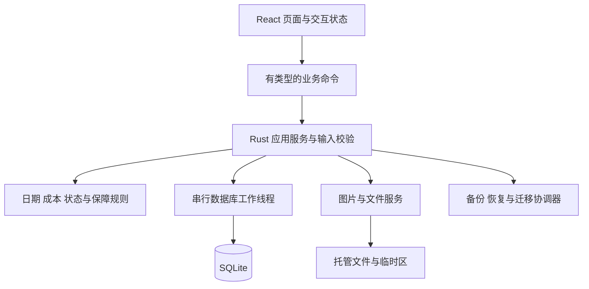

# ADR-001：Possio 本地桌面架构与风险验证计划

日期：2026-09-24 · 状态：Proposed（已作为任务拆分基线；尚待工程验证，不代表选型实测通过）

本文件是技术设计的完整入口，集中记录选择、理由、接口、数据一致性和验证计划，不另维护重复架构文档。业务范围见 [产品设计](../PRODUCT_DESIGN.md)，验收编号见 [功能规格](../FUNCTIONAL_SPEC.md)，视觉基线为 [A「静序」](../UI_DESIGN.md)。

## 1. 约束与建议结论

首版服务个人中文 Mac 自用、单机、人民币实物档案。数据要可长期读取、误删可恢复、备份完整；无账户、服务器、同步或后台开发代理。

建议沿用产品设计的 **Tauri 2 + React/TypeScript + Rust + SQLite**，以 Vite 构建前端、npm 管理前端依赖；数据库通过 Rust 层的 rusqlite 访问。界面使用 A 的样式变量和按需组件，先不引入完整管理后台框架。图表库在统计切片前选择，暂不为尚未制作的页面装依赖。

Tauri 可以承载编译成 HTML/CSS/JS 的前端，并使用系统 WebView；这是选型依据，不是本项目性能保证。[Tauri 官方概述](https://v2.tauri.app/start/)。Vite 的开发服务和发布时打包静态资源是不同路径，发布配置应使用构建产物。[官方 Vite 集成](https://v2.tauri.app/start/frontend/vite/)。

| 候选 | 取舍 |
|---|---|
| Tauri + React + Rust（建议） | 延续原技术方向和已做的桌面交互；业务逻辑集中；代价是跨语言边界和 WebView 的原生体验需要实测 |
| SwiftUI 原生重做 | 值得在原生菜单、输入、辅助功能无法达标时重评；当前切换会改变既定工程方向，不能仅因用户喜欢 Mac 风格就推断必须采用 |
| Electron | 可保留 Web 技术；当前没有必须随应用分发完整浏览器运行时的需求，暂不选 |
| 自托管 Web 服务 | 与双击使用、退出无自建常驻服务的产品目标不符 |

不根据一般框架宣传承诺包体、启动时长或省电；第 10 节验证失败时应修订方案。

## 2. 分层与运行形态



- 首版一个主窗口、一个数据库实例。重复启动聚焦已有窗口；再用数据目录锁保护跨版本误开，不能仅靠界面判断。单实例插件可作为窗口层入口，但不能替代存储锁。[官方 Single Instance](https://v2.tauri.app/plugin/single-instance/)。
- 正常关闭窗口遵循 Mac 窗口与应用分离的习惯，Dock 可重新打开；⌘Q/菜单退出是完整退出。无托盘守护、自动启动、独立 HTTP API 或 Node sidecar。此关闭行为为技术交互建议，须在打包验证中确认用户预期。
- 写事务经过单一队列；阻塞的 SQLite 与大文件操作不在 UI 线程运行。起步不使用多连接写池，先满足数百至数千条个人资料。
- React 保存只提交业务命令，不直接运行 SQL、不把本地存储缓存当成资产真相。成功返回后更新/失效相关查询；失败保留草稿。
- 计算集中在 Rust 领域模块；前端显示后端返回的已计算结果与完整性，不复制另一套成本公式。日跨界、从休眠恢复、应用重新聚焦时刷新“今天”相关指标。

## 3. 业务接口与错误契约

以下是命令设计，不是已经注册的 API。输入由前后端共同描述，Rust 最终校验；前端校验只是即时提示。

| 命令组 | 输入要点 | 输出与一致性 |
|---|---|---|
| 查询资产/详情 | 搜索、状态/分类/保障筛选、排序、页大小/游标 | 稳定 ID、原始字段、成本完整性、摘要与修订号 |
| 新增/更正资产 | request_id、输入、编辑时的 expected_revision、已暂存附件 token | 返回对象 ID 和新 revision；请求重复返回同一结果 |
| 生命周期动作 | 资产 ID、源 revision、动作、日期/售价等 | 校验来源状态和时间顺序，同事务更新事实及当前状态 |
| 维护/保障 | 资产 ID、记录 ID（编辑时）、日期可空、费用/保障内容 | 原记录更正；统一触发成本/保障/时间轴刷新 |
| 心愿转换 | 心愿 ID、revision、实际输入、request_id | 唯一 converted_asset_id；成功才出现已实现 |
| 最近删除 | 类型筛选；对象 ID、revision、删除/恢复动作 | 支持资产、维护、保障；明确父资产是否需要先恢复 |
| 文件导入 | 用户已选择文件对应的受控来源 | 返回短期 staging token 和预览信息，不接受任意前端目标路径 |
| 导出/备份/恢复 | 用户选择的目的地或备份；恢复确认绑定检查结果 | 任务 ID、阶段、进度与验证结果；完整结束才提示成功 |

写命令带 request_id 与内容指纹。事务内同时记录操作结果；同 key 同输入复用结果，不同输入返回冲突。编辑保存带 expected_revision，旧表单不得覆盖后来更新。恢复切换数据集后增加数据集代号，拒绝旧窗口/旧请求继续写入新数据集。

统一返回 code、简短中文 message、可定位的 field_errors、retryable、correlation_id。错误类至少区分输入非法、状态冲突、对象删除、缺失对象、存储忙、空间不足、附件无法读取、备份不兼容。普通界面不显示底层堆栈；诊断日志保留错误代号和关联号，不默认记表单正文、序列号、买家信息或完整路径。

## 4. 数据模型与业务自然日

本节补足产品逻辑模型的工程约束，不把它当成已运行的 SQL migration。

| 组 | 存储与约束建议 |
|---|---|
| 资产与心愿 | 稳定 UUID；名称非空；金额为可空的整数分；currency 固定 CNY；revision；created/updated 审计时间；deleted_at |
| 生命周期事实 | 单独保存有效动作及顺序，资产行上的 status 是同事务维护的当前快照；更正保留内部关联；有效售出至多一条，保存前状态用于撤销 |
| 维护/保障 | 显式 asset_id 外键；独立 deleted_at；未知日期/金额为 NULL；金额和日期状态独立 |
| 分类/渠道 | 稳定 ID；引用可空表示未分类/未记录；改名不改变关联；删除需要明确迁移，含心愿及软删除记录 |
| 附件 | 托管文件、哈希、大小、格式、相对路径；通过显式外键关联表链接资产/维护/保障/心愿，避免无约束的多态 ID |
| 幂等与恢复 | 操作键、指纹、结果 ID 与 revision；schema 版本、数据集代号；恢复日志放在数据集切换之外 |
| 外观与列表状态 | 用户偏好与临时界面状态分开；资产草稿不自动混入正式资产查询 |

数据库业务事实是权威来源。购买、维护和心愿等系统时间轴从来源派生；生命周期从有效动作派生；保障到期由查询时计算，避免启动时重复插入。手工事件暂不加入 P0。内部纠错记录不进入消费统计。

日期用不带时间的 YYYY-MM-DD 业务值，审计时间为 UTC 时间戳；“今天”取 Mac 当前本地自然日。切换时区不改已保存日期，动态指标按当前本地日重算。负日期间隔先校验报错，不靠 max(1, …) 掩盖非法出售日期。

金额存整数分，所有加减作溢出检查；日均使用精确比值/十进制舍入，边界统一保留两位。IPC 中金额建议使用十进制分的字符串，避免 JavaScript 大整数精度损失；后端负责范围限制。数值上限、文本长度和附件上限将在首个工程切片前给出统一配置和验收，原型正则不作为产品上限。

SQLite 建议使用 rusqlite 的 bundled 与 backup 能力，以锁定所带数据库版本并调用快照备份；仓库说明支持这些 feature。[rusqlite 官方仓库](https://github.com/rusqlite/rusqlite)。锁定时核对实际 SQLite 版本而非只看 Rust 包版本。SQLite 官方披露 WAL-reset 问题在 3.51.3 修复，部分旧分支有回补；采用 WAL 时必须使用含修复版本，并验证本项目配置。[SQLite WAL 说明](https://www.sqlite.org/wal.html)。

连接建议开启外键和明确的繁忙等待；起步采用单工作连接，WAL 与同步级别作为 R02 实验项，不先凭默认值宣布耐久性合格。

## 5. 统一最近删除

用户已选择：资产、维护、保障放在同一最近删除页面。列表具有“全部/资产/维护/保障”筛选，显示记录名、类型、所属资产、原状态（适用时）和删除时间。

采用**独立删除标记 + 父对象可见性**：删除资产只设置资产自身标记；其维护、保障和文件通过父资产一起隐藏，不批量覆盖每个子记录原本的删除状态。

- 删除单条维护/保障，设置该记录标记；从普通详情、有效时间轴、费用/保障摘要中排除。恢复后重新参与对应计算。
- 删除资产时，最近删除新增一条资产项；因父对象隐藏的子记录不冒充“用户独立删除”的项目，不制造大量重复条目。
- 先独立删除维护，再删除资产：最近删除保留两个真实删除项，子项显示父资产也已删除。恢复资产仅恢复原本有效的关联记录；那条维护仍待单独恢复。
- 父资产未恢复时，单独恢复子记录按钮说明“先恢复所属资产”，提供定位入口；不悄悄连带恢复父资产。
- 所有恢复保留原 ID，不新建事实或重复图片；恢复 Sold 保持 Sold。P0 没有永久清空和后台清理，托管原文件仍受软删除记录引用。

图片替换后的旧文件与无引用暂存残留不能立即按常规“清理缓存”删掉。只有在恢复检查完成且确认不属于有效、软删除或正在提交的引用后，才进入单独的清理机制；首版宁可保留可诊断的残留，也不误删档案。

## 6. 图片导入与提交协议

目标：崩溃前后不能出现“数据库已成功保存但指定图片从未落盘”，也不能由失败重试删除别的对象引用的图片。以下为设计协议，须通过 R03 故障注入验证。

1. 读取用户选中的文件到应用 staging，检查可读性、大小、真实格式，生成哈希及预览；不修改源文件。用户取消保留安全清理路径。
2. 提交前把文件搬到同一数据集内的最终托管位置，文件名用内部稳定 ID；完成持久化所需步骤后再开启业务事务。路径不能使用未经处理的用户文件名。
3. 同一事务写业务资料、附件引用和幂等结果；成功后才回报保存完成。提交前文件已存在，不把跨文件系统移动假装成数据库回滚。
4. 数据库失败，文件可能成为暂时无引用文件；保留操作清单供恢复/清理。崩溃后先核对请求结果与引用，再重试或清理；不能盲目重复插入。
5. 缩略图是可重建缓存，托管原图是用户档案。HEIC 等若暂不能生成预览，要明确告诉用户，不声称通过支持验收；不未经用户确认转换并丢弃原文件。

前端只收到受控图片地址或 token。封面从有效附件引用选取；显示缺图占位时保留资料，提供重新选择入口。不允许任意 HTML/SVG 附件进入应用脚本执行上下文。

## 7. 一致备份、迁移与恢复

### 7.1 完整备份

首版偏向简单、可验证：备份期间暂停写入（读取仍可用），等待已受理的业务/文件提交结束，再取得 SQLite 快照及同一状态下的附件清单。界面说明“正在备份，暂不能保存修改”，草稿保留。

用 SQLite Backup API 制作独立数据库快照；它提供数据库快照能力，但**不会自动覆盖本项目附件**，附件一致性由上述协调过程保证。[SQLite 官方备份说明](https://www.sqlite.org/backup.html)。备份不直接复制运行中的主库文件。

将快照、包括最近删除引用的全部原图、manifest 打包到用户目标目录内的临时文件；校验数据库、外键、引用和文件哈希，完成后再成为最终备份。错误或磁盘不足不留下名为成功备份的半成品。记录应用/schema/备份格式版本及创建时间；缓存不属于完整性必需项。暂停窗口的实际时长须实测，不预设不可兑现的“瞬时备份”。

### 7.2 恢复协议

恢复到新的数据集目录，然后切换一个小的 active 指针，避免分别覆盖当前数据库和图片时产生混合版本。建议数据目录包含 active、datasets/<id>/、restore-journal、staging、backups、cache；只在获准工程阶段建立实际路径。

1. 检查格式、版本、归档路径、解压限额、链接类型、条目冲突；拒绝路径穿越、绝对路径和越界链接。对 schema、引用与数据约束做验证，不仅检查 ZIP 能否打开。
2. 展示时间、数量与完整替换影响。用户确认绑定检查时的备份指纹，文件变化则重新检查。
3. 暂停读写命令并等待在途操作结束；制作可验证的当前数据保护副本。失败则不切换。
4. 在隔离目录还原并再次验证，必要迁移仅作用于副本；关闭旧连接后，记录切换日志并原子替换 active 指针。
5. 打开新数据集、验证可读，递增数据集代号，清除旧查询缓存；成功后才向用户报告。旧数据集和保护副本保留到后续明确的清理策略。
6. 任意阶段被终止，下次启动根据持久化日志与指针选择一套完整、可验证的数据集。指针不明、验证失败时进入恢复入口，不能自动创建空库造成“资料丢失”。

文件刷盘、目录更新与断电可靠性需要实际验证，不能把“rename 通常原子”写成所有崩溃场景已证明安全。首版不合并恢复，不支持将更高版本备份强行降级。

### 7.3 迁移与 CSV

schema 版本独立于 App 版本和备份格式版本。迁移前保护数据；按顺序运行版本迁移并检查失败回滚。失败保持原版本可恢复，不使用删库重建修复。

CSV 是可读资产表，默认全部未删除资产，包括 Sold；未知留空，人民币及单位写清。首版默认提供电子表格安全输出：对可能被解释为公式的文本加安全前缀，并在导出说明中注明；完整无损恢复依赖完整备份。引号、换行、逗号、中文及公式样式样例列入 R06，不以人工打开“看起来正常”作为唯一验证。

## 8. 界面与权限边界

组件按 assets、wishlist、maintenance、warranty、timeline、insights、data-management 分组；共享表单错误、金额、自然日、空状态、摘要和焦点管理。维护/保障恢复位于统一最近删除，不为其创建另一套管理站点。

静态资源随 App 打包；不加载远程网页作为应用主界面。外部购买链接只在用户点击后交给系统浏览器，并限定合法协议；不自动获取其内容。前端只暴露需要的业务命令、文件选择、受限图片读取和窗口能力，不启用任意 SQL/任意 shell/全盘文件权限。

Tauri 区分 WebView 与 Rust 核心的信任边界；配置权限不能代替命令内部对输入和文件范围的校验。[官方安全模型](https://v2.tauri.app/security/)。本应用的边界设计仍需自行验证，不能把使用框架视为自动获得全部安全性。

## 9. 工程目录、工具链与检查安排

以下是拟建结构，本轮不创建空源码目录：

```text
src/app/                 应用外壳、主题、导航与查询协调
src/features/            按业务组织页面、表单和查询
src/shared/              共享 UI、DTO 与调用边界
src-tauri/src/domain/    纯业务规则
src-tauri/src/services/  完整用例、幂等、恢复与备份协调
src-tauri/src/storage/   数据库、文件与迁移
src-tauri/src/commands/  对外命令及错误转换
src-tauri/migrations/    有序数据库迁移
src-tauri/tests/         临时目录集成与故障恢复验收
src/**/tests/            前端组件与用户交互验证
```

命名：业务命令表达意图，避免泛化成任意 update_table；Rust 字段 snake_case，前端 DTO 按单一明确映射生成/核对，禁止混合。数据库/文件写入不出现在页面组件中。领域测试固定 Clock，业务金额与日期由专用类型保护。正式格式化工具与代表性代码示例在首次工程验证后建立，不将原型压缩脚本当作编码规范。

当前机器只读观察（2026-09-24）：macOS 27.0、arm64；Node v26.9.0、npm 11.19.1、rustc/cargo 1.96.0；xcode-select 指向 CommandLineTools。路径/版本存在不代表 SDK、签名或打包已验证。官方 macOS 开发前置条件见 [Tauri Prerequisites](https://v2.tauri.app/start/prerequisites/)。

初始验收目标建议为当前自用的 Apple Silicon Mac；旧系统和 Intel 不先作兼容承诺。打包目标的最低版本在 R01 记录，不能单凭当前主机版本推断最低要求。

依赖锁文件、工具版本、实际构建/测试命令在 R01 创建并执行成功后登记 README。当前不存在 package.json 或 Cargo.toml，不提供看似可运行的项目命令。不从其他 Agent 的私有运行环境借用项目包管理器，不主动修改全局配置。

## 10. 风险验证计划

以下全部**未执行**。建议先批准一个有限的工程验证阶段，只用虚构数据和临时数据目录；不等于一次授权实现整个 P0。

| 编号 | 风险及对应 AC | 获准后的验证方法 | 通过所需证据 |
|---|---|---|---|
| R01 | 本机可打包、原生入口与退出；AC39/40 | 最小 A 风格窗口；离线启动、⌘Q、再次启动、主题/文件对话框/键盘 | 记录实际工具和依赖锁版本、构建命令、App 运行和退出行为；最低系统目标明确 |
| R02 | 日期金额、事务与幂等；AC01/04/07/11/22–26 | 固定 Clock、边界数据、同 key 重试、旧 revision 和故障注入 | 同一事实只有一次，金额不漂移，无半事务；实际 SQLite 版本包含必需修复 |
| R03 | 文件提交与崩溃；AC03/18/40 | 在复制后、入库前、提交后逐处终止；缺权限/无空间/损坏图片 | 重启恢复一致；共享和软删除引用不被误清理；验证支持的图片格式 |
| R04 | 三类删除交互；AC13/27–29/41–44 | 独立删子项、删父项、父子逆序恢复、故障重试 | 原 ID、原状态保持；旧独立删除不被父恢复撤销；附件可用 |
| R05 | 备份恢复与迁移；AC30–34 | 编辑与备份同时请求、缺附件/损坏/路径异常/不兼容备份、切换阶段终止 | 一致的备份可在空目录恢复；失败不损害原数据；重启能选择完整数据集 |
| R06 | CSV/统计完整性；AC35–38 | 未知/零/负净成本、闰日月末、特殊文字与导出范围 | 与 Spec 边界表一致；无隐含的重复金额；文本可读且不触发公式 |
| R07 | Mac UI 可用性；AC06/09/40 | 实际窗口宽度/缩放/长名称/键盘/VoiceOver/深浅色 | A 的列表、摘要与表单不遮挡关键动作；取得正常截图路径或人工观察记录 |

纯业务与存储集成优先使用 Rust 测试；前端组件验证在工程阶段选定轻量工具。真实 Mac 端到端验证须分清“浏览器模拟前端”和“实际 App”。截至核验日，Tauri 文档已介绍 WebdriverIO Tauri service 的 embedded 路径支持 macOS，而直接 tauri-driver 仍不支持 Mac；可评估只用于测试构建的嵌入驱动，不能把测试服务器带入发布 App。[官方 WebDriver 文档](https://v2.tauri.app/develop/tests/webdriver/)。

本轮未安装测试驱动、未执行截图绕行。此前原型截图问题记录仍在 UI 文档中；需要正常可用路径或用户实际观察补足，不把 DOM 检查当视觉通过。

性能先给建议预算以便评估：当前自用机、发布构建、1,000 条资产/5,000 条关联记录、分页缩略图下，普通查询 p95 目标 200 ms，交互保存 p95 目标 500 ms（不含大文件），冷启动目标 2 s。它们是待测目标，不是已达成承诺；备份另按数据量报告时长、暂停写入时长和最大内存。

## 11. 阶段出口与后续工作

具体实施顺序、风险对应任务和阶段出口统一见 [实施任务与开工检查](../IMPLEMENTATION_PLAN.md)。首批 V00–V05 聚焦 R01/R02/R03/R05 的底层验证，在 CP0 报告实际结果；R04 随三类实体实现后完整验证。首批工程验证尚未获准，所有实验仍未执行。

根据实验结果冻结最低系统、依赖版本、文件协议和测试方式。失败时修订本 ADR，保留原因；基础备份/恢复协议先验证，完整 P0 关系加入后在 T18 再做全面恢复验收。任务表不把早期局部通过当作完整功能通过。

当前仍由 Codex 主线保持文档和决策连续性；无新增 Spec CLI、无人值守开发或 Hermes 并发。后续只有边界独立、验收明确的任务才考虑委派，不以省 token 为由拆散同一事务逻辑。

本轮工具发现未提供可调用的 Context7 resolver/query，已改查上文官方资料；核验日期为 2026-09-24。外部资料证明框架能力和限制，本文件中的项目方案及预算是设计建议，不是实测事实。
