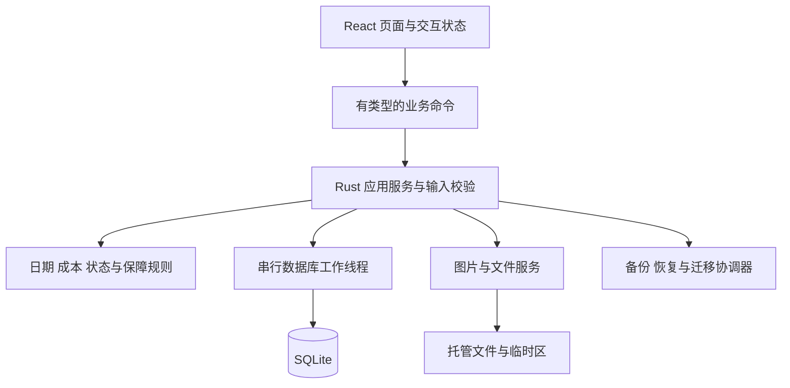

# ADR-001：Possio 本地桌面架构与风险验证计划

日期：2026-09-24 · 状态：Accepted for CP1（依用户“进行下一个阶段”采用当前架构推进基本流程；HEIC 已在 T05 实测，完整实体与 Mac 体验仍需后续验证）

本文件是技术设计的完整入口，集中记录选择、理由、接口、数据一致性和验证计划，不另维护重复架构文档。业务范围见 [产品设计](../PRODUCT_DESIGN.md)，验收编号见 [功能规格](../FUNCTIONAL_SPEC.md)，视觉基线为 [A「静序」](../UI_DESIGN.md)。

## 1. 约束与建议结论

首版服务个人中文 Mac 自用、单机、人民币实物档案。数据要可长期读取、误删可恢复、备份完整；无账户、服务器、同步或后台开发代理。

建议沿用产品设计的 **Tauri 2 + React/TypeScript + Rust + SQLite**，以 Vite 构建前端、npm 管理前端依赖；数据库通过 Rust 层的 rusqlite 访问。界面使用 A 的样式变量和按需组件，先不引入完整管理后台框架。图表库在统计切片前选择，暂不为尚未制作的页面装依赖。

Tauri 可以承载编译成 HTML/CSS/JS 的前端，并使用系统 WebView；这是选型依据，不是本项目性能保证。[Tauri 官方概述](https://v2.tauri.app/start/)。Vite 的开发服务和发布时打包静态资源是不同路径，发布配置应使用构建产物。[官方 Vite 集成](https://v2.tauri.app/start/frontend/vite/)。

| 候选 | 取舍 |
|---|---|
| Tauri + React + Rust（建议） | 延续原技术方向和已做的桌面交互；业务逻辑集中；代价是跨语言边界和 WebView 的原生体验需要实测 |
| SwiftUI 原生重做 | 值得在原生菜单、输入、辅助功能无法达标时重评；当前切换会改变既定工程方向，不能仅因用户喜欢 Mac 风格就推断必须采用 |
| Electron | 可保留 Web 技术；当前没有必须随应用分发完整浏览器运行时的需求，暂不选 |
| 自托管 Web 服务 | 与双击使用、退出无自建常驻服务的产品目标不符 |

不根据一般框架宣传承诺包体、启动时长或省电；第 10 节验证失败时应修订方案。

## 2. 分层与运行形态



- 首版一个主窗口、一个数据库实例。重复启动聚焦已有窗口；再用数据目录锁保护跨版本误开，不能仅靠界面判断。单实例插件可作为窗口层入口，但不能替代存储锁。[官方 Single Instance](https://v2.tauri.app/plugin/single-instance/)。
- 正常关闭窗口遵循 Mac 窗口与应用分离的习惯，Dock 可重新打开；⌘Q/菜单退出是完整退出。无托盘守护、自动启动、独立 HTTP API 或 Node sidecar。此关闭行为为技术交互建议，须在打包验证中确认用户预期。
- 写事务经过单一队列；阻塞的 SQLite 与大文件操作不在 UI 线程运行。起步不使用多连接写池，先满足数百至数千条个人资料。
- React 保存只提交业务命令，不直接运行 SQL、不把本地存储缓存当成资产真相。成功返回后更新/失效相关查询；失败保留草稿。
- 计算集中在 Rust 领域模块；前端显示后端返回的已计算结果与完整性，不复制另一套成本公式。日跨界、从休眠恢复、应用重新聚焦时刷新“今天”相关指标。

## 3. 业务接口与错误契约

以下是命令设计，不是已经注册的 API。输入由前后端共同描述，Rust 最终校验；前端校验只是即时提示。

| 命令组 | 输入要点 | 输出与一致性 |
|---|---|---|
| 查询资产/详情 | 搜索、状态/分类/保障筛选、排序、页大小/游标 | 稳定 ID、原始字段、成本完整性、摘要与修订号 |
| 新增/更正资产 | request_id、输入、编辑时的 expected_revision、已暂存附件 token | 返回对象 ID 和新 revision；请求重复返回同一结果 |
| 生命周期动作 | 资产 ID、源 revision、动作、日期/售价等 | 校验来源状态和时间顺序，同事务更新事实及当前状态 |
| 维护/保障 | 资产 ID、记录 ID（编辑时）、日期可空、费用/保障内容 | 原记录更正；统一触发成本/保障/时间轴刷新 |
| 心愿转换 | 心愿 ID、revision、实际输入、request_id | 唯一 converted_asset_id；成功才出现已实现 |
| 最近删除 | 类型筛选；对象 ID、revision、删除/恢复动作 | 支持资产、维护、保障；明确父资产是否需要先恢复 |
| 文件导入 | 用户已选择文件对应的受控来源 | 返回短期 staging token 和预览信息，不接受任意前端目标路径 |
| 导出/备份/恢复 | 用户选择的目的地或备份；恢复确认绑定检查结果 | 任务 ID、阶段、进度与验证结果；完整结束才提示成功 |

写命令带 request_id 与内容指纹。事务内同时记录操作结果；同 key 同输入复用结果，不同输入返回冲突。编辑保存带 expected_revision，旧表单不得覆盖后来更新。恢复切换数据集后增加数据集代号，拒绝旧窗口/旧请求继续写入新数据集。

统一返回 code、简短中文 message、可定位的 field_errors、retryable、correlation_id。错误类至少区分输入非法、状态冲突、对象删除、缺失对象、存储忙、空间不足、附件无法读取、备份不兼容。普通界面不显示底层堆栈；诊断日志保留错误代号和关联号，不默认记表单正文、序列号、买家信息或完整路径。

## 4. 数据模型与业务自然日

本节补足产品逻辑模型的工程约束，不把它当成已运行的 SQL migration。

| 组 | 存储与约束建议 |
|---|---|
| 资产与心愿 | 稳定 UUID；名称非空；金额为可空的整数分；currency 固定 CNY；revision；created/updated 审计时间；deleted_at |
| 生命周期事实 | 单独保存有效动作及顺序，资产行上的 status 是同事务维护的当前快照；更正保留内部关联；有效售出至多一条，保存前状态用于撤销 |
| 维护/保障 | 显式 asset_id 外键；独立 deleted_at；未知日期/金额为 NULL；金额和日期状态独立 |
| 分类/渠道 | 稳定 ID；引用可空表示未分类/未记录；改名不改变关联；删除需要明确迁移，含心愿及软删除记录 |
| 附件 | 托管文件、哈希、大小、格式、相对路径；通过显式外键关联表链接资产/维护/保障/心愿，避免无约束的多态 ID |
| 幂等与恢复 | 操作键、指纹、结果 ID 与 revision；schema 版本、数据集代号；恢复日志放在数据集切换之外 |
| 外观与列表状态 | 用户偏好与临时界面状态分开；资产草稿不自动混入正式资产查询 |

数据库业务事实是权威来源。购买、维护和心愿等系统时间轴从来源派生；生命周期从有效动作派生；保障到期由查询时计算，避免启动时重复插入。手工事件暂不加入 P0。内部纠错记录不进入消费统计。

日期用不带时间的 YYYY-MM-DD 业务值，审计时间为 UTC 时间戳；“今天”取 Mac 当前本地自然日。切换时区不改已保存日期，动态指标按当前本地日重算。负日期间隔先校验报错，不靠 max(1, …) 掩盖非法出售日期。

金额存整数分，所有加减作溢出检查；日均使用精确比值/十进制舍入，边界统一保留两位。IPC 中金额建议使用十进制分的字符串，避免 JavaScript 大整数精度损失；后端负责范围限制。数值上限、文本长度和附件上限将在首个工程切片前给出统一配置和验收，原型正则不作为产品上限。

SQLite 建议使用 rusqlite 的 bundled 与 backup 能力，以锁定所带数据库版本并调用快照备份；仓库说明支持这些 feature。[rusqlite 官方仓库](https://github.com/rusqlite/rusqlite)。锁定时核对实际 SQLite 版本而非只看 Rust 包版本。SQLite 官方披露 WAL-reset 问题在 3.51.3 修复，部分旧分支有回补；采用 WAL 时必须使用含修复版本，并验证本项目配置。[SQLite WAL 说明](https://www.sqlite.org/wal.html)。

连接建议开启外键和明确的繁忙等待；起步采用单工作连接，WAL 与同步级别作为 R02 实验项，不先凭默认值宣布耐久性合格。

## 5. 统一最近删除

用户已选择：资产、维护、保障放在同一最近删除页面。列表具有“全部/资产/维护/保障”筛选，显示记录名、类型、所属资产、原状态（适用时）和删除时间。

采用**独立删除标记 + 父对象可见性**：删除资产只设置资产自身标记；其维护、保障和文件通过父资产一起隐藏，不批量覆盖每个子记录原本的删除状态。

- 删除单条维护/保障，设置该记录标记；从普通详情、有效时间轴、费用/保障摘要中排除。恢复后重新参与对应计算。
- 删除资产时，最近删除新增一条资产项；因父对象隐藏的子记录不冒充“用户独立删除”的项目，不制造大量重复条目。
- 先独立删除维护，再删除资产：最近删除保留两个真实删除项，子项显示父资产也已删除。恢复资产仅恢复原本有效的关联记录；那条维护仍待单独恢复。
- 父资产未恢复时，单独恢复子记录按钮说明“先恢复所属资产”，提供定位入口；不悄悄连带恢复父资产。
- 所有恢复保留原 ID，不新建事实或重复图片；恢复 Sold 保持 Sold。P0 没有永久清空和后台清理，托管原文件仍受软删除记录引用。

图片替换后的旧文件与无引用暂存残留不能立即按常规“清理缓存”删掉。只有在恢复检查完成且确认不属于有效、软删除或正在提交的引用后，才进入单独的清理机制；首版宁可保留可诊断的残留，也不误删档案。

## 6. 图片导入与提交协议

### U01 内置素材接入约束（2026-09-25，实现已交回）

素材选择复用下述托管/暂存/原子保存协议。前端提交受控素材 ID 和 generation，Rust 从随 App 编译/打包的白名单 PNG 取字节，经 worker 调用既有 `Store::stage_photo`，返回既有 Photo；最终图片关联与封面仍由 `save_asset` 一次提交。不得接收任意素材路径/URL，不以浏览器 data URL 或类别兜底冒充持久选择。

2026-09-25 用户中途调整后新增自定义素材库：schema 9 增加 `materials` 表（id、名称、哈希、大小、创建时间），字节存入既有内容寻址 `files/<sha256>` 仓；上传经原生选择器与 worker 校验（格式、20 MiB、可生成预览）后先落盘再入库；备份打包 attachments 与 materials 引用的全部文件，恢复沿用既有校验。表单提交仍只引用素材 ID，不改变 request_id、revision、generation、草稿和回执协议。

上传 review 修复：打开选择器前，前端持久保存上传操作 UUID + generation；素材行 ID 采用该 UUID，后端先检查已有结果，再读取源文件。响应异常时经串行 worker 核对该 ID，未确认前禁止新的上传/删除；资料切换后不得对新库重放旧操作。不新增 schema，上传核对不承担永久删除后的历史审计。

素材清单独立于 Demo 资产资料，稳定 ID 对应显示名和原图；图本体与生产清单可进入正式包，虚构价格/名称/维护等 Demo 数据仍不进入正式产物。复用现有 SVG 与已转换 PNG，明确唯一原图来源并同步转换工具、Demo 导入示例路径，不复制多套人工维护的清单。用户保存后拥有托管的原图副本，后续素材目录变化不替换已有档案图片。表单新增逻辑不得改变原有 request_id、revision、generation、草稿和备份契约。发现必须改变这些协议的情况，交回 Codex 审查原因，不临时另造协议。

### 既有文件导入协议

目标：崩溃前后不能出现“数据库已成功保存但指定图片从未落盘”，也不能由失败重试删除别的对象引用的图片。以下为设计协议，须通过 R03 故障注入验证。

1. 读取用户选中的文件到应用 staging，检查可读性、大小、真实格式，生成哈希及预览；不修改源文件。用户取消保留安全清理路径。
2. 提交前把文件搬到同一数据集内的最终托管位置，文件名用内部稳定 ID；完成持久化所需步骤后再开启业务事务。路径不能使用未经处理的用户文件名。
3. 同一事务写业务资料、附件引用和幂等结果；成功后才回报保存完成。提交前文件已存在，不把跨文件系统移动假装成数据库回滚。
4. 数据库失败，文件可能成为暂时无引用文件；保留操作清单供恢复/清理。崩溃后先核对请求结果与引用，再重试或清理；不能盲目重复插入。
5. 缩略图是可重建缓存，托管原图是用户档案。HEIC 等若暂不能生成预览，要明确告诉用户，不声称通过支持验收；不未经用户确认转换并丢弃原文件。

前端只收到受控图片地址或 token。封面从有效附件引用选取；显示缺图占位时保留资料，提供重新选择入口。不允许任意 HTML/SVG 附件进入应用脚本执行上下文。

### T05 已落地的实现约定

- 原生 `NSOpenPanel` 在 AppKit 主线程选择文件，受控 worker 读取并校验；前端仅得到图片 ID，不暴露任意文件读取接口。选图时即把原始字节持久化到 `files/<SHA-256>` 并写暂存凭据，取消不产生资产或附件数据库记录。
- schema 4 增加 `asset_photos` 当前图片集合和 `asset_media.cover_id` 显式封面。选中图片、封面、文字资料、revision 和回执在同一事务提交。未指定图片字段的旧保存请求继续保留现有图片，旧回执指纹保持兼容。
- JPEG/PNG/WebP/HEIC 均可导入；每张 20 MiB、最长边 12000、总像素 4000 万，每件物品当前最多 20 张。ImageIO 生成方向正确、最长边 960 的 PNG 预览，原图不转码替换。Rust 解码器有 192 MiB 分配限制；该数字不是 ImageIO 解码器的硬内存保证。
- 缓存每次读取前仍验证原图哈希。缺图不改变文字档案，重新选择相同哈希原文件可修复；不同图需在编辑中新增/替换，不冒充修复。改封面、移除当前图片和软删除资产均不立即删除原始字节，后续清理须遵循第 5 节。
- 完整备份包含数据库与所有附件原图，包括已移出当前集合但仍保留的历史引用；不包含缓存和未提交草稿。旧 schema 1/2/3 可迁移到 4，备份校验新增图片/封面归属检查。CP0 的备份容量限制仍待 T18 调整和验收。

## 7. 一致备份、迁移与恢复

### 7.1 完整备份

首版偏向简单、可验证：备份期间暂停写入（读取仍可用），等待已受理的业务/文件提交结束，再取得 SQLite 快照及同一状态下的附件清单。界面说明“正在备份，暂不能保存修改”，草稿保留。

用 SQLite Backup API 制作独立数据库快照；它提供数据库快照能力，但**不会自动覆盖本项目附件**，附件一致性由上述协调过程保证。[SQLite 官方备份说明](https://www.sqlite.org/backup.html)。备份不直接复制运行中的主库文件。

将快照、包括最近删除引用的全部原图、manifest 打包到用户目标目录内的临时文件；校验数据库、外键、引用和文件哈希，完成后再成为最终备份。错误或磁盘不足不留下名为成功备份的半成品。记录应用/schema/备份格式版本及创建时间；缓存不属于完整性必需项。暂停窗口的实际时长须实测，不预设不可兑现的“瞬时备份”。

### 7.2 恢复协议

恢复到新的数据集目录，然后切换一个小的 active 指针，避免分别覆盖当前数据库和图片时产生混合版本。建议数据目录包含 active、datasets/<id>/、restore-journal、staging、backups、cache；CP0 已在临时验证目录建立这些路径，未建立正式资产库。

1. 检查格式、版本、归档路径、解压限额、链接类型、条目冲突；拒绝路径穿越、绝对路径和越界链接。对 schema、引用与数据约束做验证，不仅检查 ZIP 能否打开。
2. 展示时间、数量与完整替换影响。用户确认绑定检查时的备份指纹，文件变化则重新检查。
3. 暂停读写命令并等待在途操作结束；制作可验证的当前数据保护副本。失败则不切换。
4. 在隔离目录还原并再次验证，必要迁移仅作用于副本；关闭旧连接后，记录切换日志并原子替换 active 指针。
5. 打开新数据集、验证可读，递增数据集代号，清除旧查询缓存；成功后才向用户报告。旧数据集和保护副本保留到后续明确的清理策略。
6. 任意阶段被终止，下次启动根据持久化日志与指针选择一套完整、可验证的数据集。指针不明、验证失败时进入恢复入口，不能自动创建空库造成“资料丢失”。

文件刷盘、目录更新与断电可靠性需要实际验证，不能把“rename 通常原子”写成所有崩溃场景已证明安全。首版不合并恢复，不支持将更高版本备份强行降级。

### 7.3 迁移与 CSV

schema 版本独立于 App 版本和备份格式版本。迁移前保护数据；按顺序运行版本迁移并检查失败回滚。失败保持原版本可恢复，不使用删库重建修复。

CSV 是可读资产表，默认全部未删除资产，包括 Sold；未知留空，人民币及单位写清。首版默认提供电子表格安全输出：对可能被解释为公式的文本加安全前缀，并在导出说明中注明；完整无损恢复依赖完整备份。引号、换行、逗号、中文及公式样式样例列入 R06，不以人工打开“看起来正常”作为唯一验证。

## 8. 界面与权限边界

组件按 assets、wishlist、maintenance、warranty、timeline、insights、data-management 分组；共享表单错误、金额、自然日、空状态、摘要和焦点管理。维护/保障恢复位于统一最近删除，不为其创建另一套管理站点。

静态资源随 App 打包；不加载远程网页作为应用主界面。外部购买链接只在用户点击后交给系统浏览器，并限定合法协议；不自动获取其内容。前端只暴露需要的业务命令、文件选择、受限图片读取和窗口能力，不启用任意 SQL/任意 shell/全盘文件权限。

Tauri 区分 WebView 与 Rust 核心的信任边界；配置权限不能代替命令内部对输入和文件范围的校验。[官方安全模型](https://v2.tauri.app/security/)。本应用的边界设计仍需自行验证，不能把使用框架视为自动获得全部安全性。

## 9. 工程目录、工具链与检查安排

以下是拟建结构，本轮不创建空源码目录：

```text
src/app/                 应用外壳、主题、导航与查询协调
src/features/            按业务组织页面、表单和查询
src/shared/              共享 UI、DTO 与调用边界
src-tauri/src/domain/    纯业务规则
src-tauri/src/services/  完整用例、幂等、恢复与备份协调
src-tauri/src/storage/   数据库、文件与迁移
src-tauri/src/commands/  对外命令及错误转换
src-tauri/migrations/    有序数据库迁移
src-tauri/tests/         临时目录集成与故障恢复验收
src/**/tests/            前端组件与用户交互验证
```

命名：业务命令表达意图，避免泛化成任意 update_table；Rust 字段 snake_case，前端 DTO 按单一明确映射生成/核对，禁止混合。数据库/文件写入不出现在页面组件中。领域测试固定 Clock，业务金额与日期由专用类型保护。正式格式化工具与代表性代码示例在首次工程验证后建立，不将原型压缩脚本当作编码规范。

当前机器只读观察（2026-09-24）：macOS 27.0、arm64；Node v26.9.0、npm 11.19.1、rustc/cargo 1.96.0；xcode-select 指向 CommandLineTools。路径/版本存在不代表 SDK、签名或打包已验证。官方 macOS 开发前置条件见 [Tauri Prerequisites](https://v2.tauri.app/start/prerequisites/)。

初始验收目标建议为当前自用的 Apple Silicon Mac；旧系统和 Intel 不先作兼容承诺。打包目标的最低版本在 R01 记录，不能单凭当前主机版本推断最低要求。

依赖锁文件、工具版本、实际构建/测试命令在 R01 创建并执行成功后登记 README。现已建立最小验证工程，锁文件与实际命令见 README。不从其他 Agent 的私有运行环境借用项目包管理器，不主动修改全局配置。

## 10. 风险验证计划

以下是风险验证要求。用户已授权并执行首批 V00–V05，实际通过范围和缺口以 [验证报告](../VERIFICATION_REPORT.md) 为准；完整 R01–R07 尚未全部验收。

| 编号 | 风险及对应 AC | 获准后的验证方法 | 通过所需证据 |
|---|---|---|---|
| R01 | 本机可打包、原生入口与退出；AC39/40 | 最小 A 风格窗口；离线启动、⌘Q、再次启动、主题/文件对话框/键盘 | 记录实际工具和依赖锁版本、构建命令、App 运行和退出行为；最低系统目标明确 |
| R02 | 日期金额、事务与幂等；AC01/04/07/11/22–26 | 固定 Clock、边界数据、同 key 重试、旧 revision 和故障注入 | 同一事实只有一次，金额不漂移，无半事务；实际 SQLite 版本包含必需修复 |
| R03 | 文件提交与崩溃；AC03/18/40 | 在复制后、入库前、提交后逐处终止；缺权限/无空间/损坏图片 | 重启恢复一致；共享和软删除引用不被误清理；验证支持的图片格式 |
| R04 | 三类删除交互；AC13/27–29/41–44 | 独立删子项、删父项、父子逆序恢复、故障重试 | 原 ID、原状态保持；旧独立删除不被父恢复撤销；附件可用 |
| R05 | 备份恢复与迁移；AC30–34 | 编辑与备份同时请求、缺附件/损坏/路径异常/不兼容备份、切换阶段终止 | 一致的备份可在空目录恢复；失败不损害原数据；重启能选择完整数据集 |
| R06 | CSV/统计完整性；AC35–38 | 未知/零/负净成本、闰日月末、特殊文字与导出范围 | 与 Spec 边界表一致；无隐含的重复金额；文本可读且不触发公式 |
| R07 | Mac UI 可用性；AC06/09/40 | 实际窗口宽度/缩放/长名称/键盘/VoiceOver/深浅色 | A 的列表、摘要与表单不遮挡关键动作；取得正常截图路径或人工观察记录 |

纯业务与存储集成优先使用 Rust 测试；前端组件验证在工程阶段选定轻量工具。真实 Mac 端到端验证须分清“浏览器模拟前端”和“实际 App”。截至核验日，Tauri 文档已介绍 WebdriverIO Tauri service 的 embedded 路径支持 macOS，而直接 tauri-driver 仍不支持 Mac；可评估只用于测试构建的嵌入驱动，不能把测试服务器带入发布 App。[官方 WebDriver 文档](https://v2.tauri.app/develop/tests/webdriver/)。

本轮未安装测试驱动、未执行截图绕行。此前原型截图问题记录仍在 UI 文档中；需要正常可用路径或用户实际观察补足，不把 DOM 检查当视觉通过。

性能先给建议预算以便评估：当前自用机、发布构建、1,000 条资产/5,000 条关联记录、分页缩略图下，普通查询 p95 目标 200 ms，交互保存 p95 目标 500 ms（不含大文件），冷启动目标 2 s。它们是待测目标，不是已达成承诺；备份另按数据量报告时长、暂停写入时长和最大内存。

## 11. 阶段出口与后续工作

具体实施顺序、风险对应任务和阶段出口统一见 [实施任务与开工检查](../IMPLEMENTATION_PLAN.md)。首批 V00–V05 聚焦 R01/R02/R03/R05 的底层验证，在 CP0 报告实际结果；R04 随三类实体实现后完整验证。首批工程验证已执行，基础原生检查已补验；当前按后续授权推进基本资产流程，实际证据与未验项见验证报告。

根据实验结果冻结最低系统、依赖版本、文件协议和测试方式。失败时修订本 ADR，保留原因；基础备份/恢复协议先验证，完整 P0 关系加入后在 T18 再做全面恢复验收。任务表不把早期局部通过当作完整功能通过。

当前仍由 Codex 主线保持文档和决策连续性；无新增 Spec CLI、无人值守开发或 Hermes 并发。后续只有边界独立、验收明确的任务才考虑委派，不以省 token 为由拆散同一事务逻辑。

本轮工具发现未提供可调用的 Context7 resolver/query，已改查上文官方资料；核验日期为 2026-09-24。外部资料证明框架能力和限制，本文件中的项目方案及预算是设计建议，不是实测事实。

## 12. T06b 实施补充（2026-09-24）

- schema 5 新增分类、渠道、全局修订号与命令回执表，资产外键可空。v4 升级在一个 SQLite 事务中完成；旧资产不猜测分类/渠道，初始化选项 ID 只生成一次。schema 1–4 备份可恢复并迁移至 5，现行备份写 schema 5 并校验名称和引用。
- 名称按 ECMAScript trim 空白集去首尾、NFC 归一化，再检查 1–80 个 Unicode 标量、无控制字符。同类 ASCII 大小写不敏感去重，跨分类/渠道可重名；未分类/未记录为对应空值显示保留词。每类最多 500 项是当前技术边界。Rust 锁定 `unicode-normalization 0.1.25`，使用官方 [NFC 接口](https://docs.rs/unicode-normalization/0.1.25/unicode_normalization/trait.UnicodeNormalization.html)；前端采用相同口径。
- 管理命令携带 request_id、generation、expected_revision。回执与业务更新同事务；重复请求不重放，不同内容复用 ID 拒绝。引用新增/变化、删除/恢复推进全局修订号，过时的引用确认必须重新读取。
- 移除分类/渠道必须显式提供同类目标 ID 或 null；同一事务迁移正常及最近删除资产、推进其 revision，再移除选项，失败全部回滚。旧资产草稿不能覆盖已迁移关系；改名和排序保留 ID。
- 新资产编辑提交两个外键；旧请求未携带 classification 时保留现有关系，旧回执指纹兼容。详情和搜索按 ID 解析最新名称；删除后的旧筛选保留并提示不可用，不静默改成全部。
- 设置复用 T06a 受控组件，持久状态统一由 IPC 快照提供。发命令前暂存原请求；回执未知时暂停写入并读取结果，不生成新请求盲目重试。离开设置不卸载草稿；原生关闭时提示处理未保存或未确认操作。
- 当前仅资产引用，心愿引用在 T12 接入后补充同一事务和 AC37 验收。完整原生错误恢复及已有图片/删除流程归 T06c/T20，不能由本轮存储测试替代。

## 13. T07 实施补充（2026-09-25）

- schema 6 为资产增加 `lifecycle_state`，建立 `lifecycle_events`（稳定 ID、资产外键、严格递增序号、动作类型、自然日、备注、建档/更新时间）。旧资产迁移为 Active，不生成虚构历史；升级失败整笔回滚。
- `change_lifecycle` 使用现有串行命令、generation、revision 和请求指纹/回执。状态事实、当前状态、revision 和回执同事务提交；已完成请求先核对回执，迟到重试不会重演动作。
- 退役/启用日期必填，不晚于本机今天，不早于已知购入日期或上一次动作。同日依序号排列。更正只改原动作日期，限制在相邻日期之间，保留 ID、顺序、备注和当前状态。购入日期更正需列出冲突的历史动作。
- schema 6 备份验证包含生命周期顺序、日期和状态一致性；旧 schema 1–5 继续恢复迁移。退役仍属于持有，软删除/恢复不改状态历史。Sold 仅拒绝非法来源状态，真实售出流程留 T08。
- 表单复用现有关闭保护和本地草稿；未确认回执时锁定输入，查询完成后才允许继续。完整备份界面、全局时间轴和完整 Mac 验收仍按后续任务推进。实测见 [T07 记录](../verification/T07_LIFECYCLE_RESULT.md)。


## 14. T08 实施补充（2026-09-25）

- schema 7 建立 `sales` 和 `sale_audit`；每资产最多一条有效售出。售出保存来源 Active/Retired；更正保留 sale ID；撤销标记该记录失效并恢复来源状态，原始记录及请求审计仍保留。schema 6 升级不生成售出事实，失败整笔回滚。
- `change_sale` 复用串行 Worker、generation、revision、请求指纹及回执。同事务写售出、审计、资产状态、revision、更新时间和回执；重复请求返回当前档案，不重演旧动作。售价以整数分规范化，前导零不会造成审计与备份不一致。
- 售出日期必填、不晚于今天、不早于已知购入和前置状态日期；售价必填、非负、允许零。Sold 的历史状态日期更正不得越过有效售出日期；购入日期更正同样受售出约束。未知购入资料允许售出，净成本/净日均不伪造；已知成本以售出日固定天数并允许负值。
- schema 7 备份验证售出、纠错链、回执与当前状态一致，继续支持 schema 1–6 迁移。售出及撤销审计不混入退役/启用表；T14 全局时间轴需组合有效事实，T18 再验完整实体备份。T09 接入维护后补全结算口径。
- 售出表单暂存原请求，结果未知时禁止重写，通过回执查询恢复；冲突先读取最新档案再明确保存。实际证据和剩余验收见 [T08 记录](../verification/T08_SALES_RESULT.md)。

## 15. T09 实施补充（2026-09-25）

- schema 8 建立 `maintenances`、`maintenance_photos` 和 `maintenance_audit`。当前事实、图片关联、资产 revision、更新时间、审计快照与请求回执在同一事务提交；更正保留 maintenance ID，重复请求不重演事实。
- 维护日期允许未知；已知日期不得晚于本机今天、早于已知购入日期或晚于有效售出日期。更正购入／售出日期时反向检查已有维护并指出冲突记录，避免只在一个入口维持时间关系。
- 维护费用以整数分保存，`NULL` 表示未知，`0` 表示免费。已知维护费用始终求和；购入价或任一维护费用未知时总投入、净成本和日均成本保持未知。售出收益只在后端汇总扣除，前端不复制公式。
- 维护图片复用托管附件和选择器，校验附件属于同一资产。schema 8 白名单、数据集校验和备份恢复覆盖三张维护表、触发器及原图；schema 1–7 恢复后迁移到 8。
- T09 不增加维护独立删除；统一子实体删除／恢复仍归 T11。实际证据与未覆盖的原生边界见 [T09 记录](../verification/T09_MAINTENANCE_RESULT.md)。

## 16. T10 实施补充（2026-09-25）

- schema 10 建立 `warranties`、`warranty_photos` 和 `warranty_audit`。保障事实、图片关联、资产 revision、更新时间、审计快照与请求回执同事务提交；更正保留 warranty ID，重复请求不重演。`warranties.deleted_at` 列随本版建立但 T10 不写入，为 T11 独立删除语义预留，无需再迁移。
- 保障类型为厂家保修、延保、AppleCare、商店保修、其他保障；提供方、起止日期、备注可空。已知起止日期要求结束不早于开始（领域校验加 schema 触发器双层），起止同日合法；**不设今天、购入或售出钳制**，保障可以未来开始或到期，保障与资产生命周期、成本完全独立。
- 到期状态查询时派生，不落库、无常驻任务。完整日期且 `start <= today <= end` 才算当前有效；剩余自然日 0–30（含两端）为即将到期，31 及以上为保障中；任一日期缺失为待补全，不推断有效。Rust `warranty::derive_status`/`summarize` 与 SQL 筛选条件同口径，前端只展示后端派生结果（浏览器预览的内存适配器使用经同一用例固定的 TS 镜像）。
- 资产保障筛选 `covered`（有有效保障，含临期）、`expiring`（即将到期）、`lapsed`（有记录但当前无有效）、`none`（无记录）与搜索、分类、生命周期取交集，排除已删除资产；混合状态匹配语义由 `tests/warranty.rs` 与 `tests/warranty.test.mjs` 用同一组固定用例锁定。
- schema 10 白名单、数据集校验和备份恢复覆盖三张保障表、触发器及原图（保障图片复用托管附件并校验同资产归属）；schema 1–9 恢复后迁移到 10。父资产删除／恢复沿用既有隐藏语义，保障与附件随父资产恢复可读。
- 前端复用维护表单协议：原生 dialog、焦点/ESC、localStorage 草稿（`possio.warranty-draft.v1`）、pending 完整 payload、同请求回执核对、generation/revision 冲突与关闭保护。跨日刷新沿用 `refreshCostsForNewDay` 同一路径（列表、当前详情、保障摘要随重读更新）。
- T10 不做保障独立删除、通知、PDF、CSV、AI、同步或全局时间轴；统一最近删除归 T11，完整备份界面归 T18。实际证据与未验项见 [T10 记录](../verification/T10_WARRANTY_RESULT.md)。

## 17. A · 财富盘点技术设计（2026-09-28，W01 已实现）

依据[产品设计第 17 节](../PRODUCT_DESIGN.md#17-统一资产扩展需求草案2026-09-28)与已确认的 X-D01–X-D04。只覆盖 A 首版：账户/负债、集中盘点、净资产趋势、删除恢复与完整备份。可读导出、盘点提醒、时间轴事件、总览卡片、外币、修订日志不在本版。实现沿用本 ADR 第 2–7 节协议，不另造第二套回执、删除或备份机制。

### 17.1 schema 15

一次迁移（`src-tauri/src/x01.sql`，与 `u02.sql` 同方式），单事务，失败整笔回滚。旧库升级后新表为空，不推算历史余额。

```sql
CREATE TABLE fin_accounts(
  id TEXT PRIMARY KEY, name TEXT NOT NULL, institution TEXT NOT NULL,
  side TEXT NOT NULL CHECK(side IN ('asset','liability')),
  kind TEXT NOT NULL CHECK(kind IN ('cash','investment','mixed','fund','bond','housing_fund','other_asset','credit_card','loan','other_liability')),
  counted INTEGER NOT NULL CHECK(counted IN (0,1)),
  opened_on TEXT NOT NULL, closed_on TEXT, notes TEXT NOT NULL,
  position INTEGER NOT NULL CHECK(position>=0), revision INTEGER NOT NULL CHECK(revision>0),
  created_at TEXT NOT NULL, updated_at TEXT NOT NULL, deleted_at TEXT,
  CHECK((side='asset') = (kind IN ('cash','investment','mixed','fund','bond','housing_fund','other_asset'))),
  CHECK(closed_on IS NULL OR closed_on > opened_on));
CREATE TABLE fin_snapshots(
  id TEXT PRIMARY KEY, date TEXT NOT NULL, notes TEXT NOT NULL,
  revision INTEGER NOT NULL CHECK(revision>0),
  created_at TEXT NOT NULL, updated_at TEXT NOT NULL, deleted_at TEXT);
CREATE UNIQUE INDEX fin_snapshots_live_date ON fin_snapshots(date) WHERE deleted_at IS NULL;
CREATE TABLE fin_snapshot_entries(
  snapshot_id TEXT NOT NULL REFERENCES fin_snapshots(id),
  account_id TEXT NOT NULL REFERENCES fin_accounts(id),
  state TEXT NOT NULL CHECK(state IN ('entered','unchanged','missing')),
  amount_cents INTEGER CHECK(amount_cents BETWEEN 0 AND 99999999999),
  side TEXT NOT NULL, kind TEXT NOT NULL, counted INTEGER NOT NULL CHECK(counted IN (0,1)),
  PRIMARY KEY(snapshot_id, account_id),
  CHECK((state='missing') = (amount_cents IS NULL)));
```

- 金额一律非负整数分，由 `side` 决定加减；负债为“尚欠金额”。IPC 用十进制分字符串，复用 `domain::cents` 与 `MAX_CENTS`。
- `side` 在账户建立后不可改（首次盘点前也不改，误建请删除重建）；`kind`、`counted`、名称可改。条目复制保存当时的 `side/kind/counted`，此后账户修改不重写旧盘点（X-D01）。名称取当前值，改名不改变数字。
- 盘点只有一个 `date`（X-D03），同一日期至多一份有效盘点（部分唯一索引）。完整与否**不落库**，查询时派生，避免后补账户后状态失真。
- `unchanged` 与 `entered` 都带金额；`unchanged` 取该账户在本盘点日期之前**最近一个已知金额**（跳过 `missing`），前端可不传金额，传了必须相等。之前从无已知金额时不能选 `unchanged`。该校验只在保存时进行；日后更正更早的盘点不连带改写后续 `unchanged` 条目，它们保存的金额本身就是当日确认的事实。

### 17.2 纳入范围、完整性与可比性

- 账户在日期 D 应盘点：未删除，`opened_on <= D`，且 `closed_on IS NULL OR D < closed_on`。保存盘点时必须恰好覆盖该集合，每个账户一行（可为 `missing`）；不在范围的账户拒绝，缺行拒绝。
- 盘点完整 = 当前应盘点集合每个账户都有非 `missing` 条目。事后新建一个 `opened_on` 较早的账户，旧盘点自动变为不完整并列出缺漏账户，不补零（17.4 第 4 条）；再编辑那份盘点即可补录。
- 两份盘点可比 = 两份都完整，且两份共有的账户里没有 `counted` 在两期之间变化。新开、销户属于真实变化，不影响可比。
- 停用：`closed_on` 之前最后一份有效盘点中该账户金额必须为 0，或该账户从无条目；否则拒绝并提示“先在盘点中记录余额为 0”。之后不再出现在新盘点。重新启用即清空 `closed_on`。
- 删除账户：仅限无任何条目（含已删除盘点中的条目）的误建账户，走软删除和最近删除；有历史的只能停用。
- 更正账户的启用/停用日期时，有效盘点中已记录的日期必须仍在范围内；已删除盘点不参与此检查，所以 W03 恢复盘点时须重新校验日期唯一、账户范围与应盘点集合。

### 17.3 计算（Rust `wealth.rs`，前端不复算）

- 金融资产 = `side='asset' AND counted=1` 的已知金额和；负债同理；净资产 = 资产 − 负债，可负。求和用 `checked_add`。
- 不完整盘点：只返回已知小计和缺漏数，净资产标为不完整；曲线上以区别样式标出，比较与变化率跳过它。
- 变化 = 本次 − 上一份**可比**盘点；变化率仅在上期净资产 > 0 时给出，按整数分做精确除法、两位舍入（样例 X-AC02 = 3.03%）。只有一个点时不给趋势。跨月显示实际起止日期，不称“本月增长”。
- 结构：最近一份完整盘点里计入的资产按 `kind` 汇总，分母为金融资产；资产合计为 0 不给比例。负债另列。

### 17.4 命令

均走串行 worker，写命令带 `request_id`、`generation`，编辑带 `expected_revision`；回执复用 `feature_requests(id,fingerprint,result)`，同 key 同指纹返回原结果，不同指纹 `REQUEST_CONFLICT`。不新建审计表（X-D01 不做修订日志）。

| 命令 | 作用 |
|---|---|
| `wealth_accounts` | 账户列表（含停用），附最近一次条目金额与所属盘点日期 |
| `wealth_account_save` | 新建/更正/停用/重新启用账户，校验 17.2 停用规则 |
| `wealth_snapshot_draft(date)` | 返回 D 日应盘点账户、各自前一份有效金额与日期；已有同日盘点则返回其 ID 以转为更正 |
| `wealth_snapshot_save` | 整份盘点一次提交；日期不晚于本机今天；校验覆盖集合、`unchanged` 值、唯一日期 |
| `wealth_summary` | 曲线点（日期、资产、负债、净资产、完整、缺漏数、与上一可比期变化/变化率）与最近完整期结构 |
| `wealth_request_result(request_id)` | 回执未知时核对原请求结果，不生成新请求 |
| `trash_change` 扩展 | 盘点、账户的软删除/恢复；恢复同 ID，同日已有有效盘点则拒绝并说明 |

更正历史盘点前的“影响预览”由前端用已有 `wealth_summary` 数据对比新旧净资产及前后两次变化，不另设命令。

### 17.5 备份、恢复与版本

- 新表同在 `data.sqlite`，自动进入完整备份；数据集校验新增：条目的 `side/kind` 与 CHECK 一致、同日有效盘点唯一、外键完整。
- 现有代码在 `storage.rs`、`backup.rs` 共 7 处写死 14。先合并为一个 `SCHEMA_VERSION` 常量再升到 15，避免遗漏。
- 旧备份（schema 1–14）恢复后迁移到 15，新表为空。已安装的 1.1.6 对 schema 15 的库和备份都会拒绝（`migrate_to` 与 `unpack` 的 `1..=14` 检查），满足“新版备份交旧版明确拒绝”；实现后用 1.1.6 同源构建在隔离身份实测一次。
- 恢复切换 generation 后旧盘点窗口的提交以 `STALE_DATASET` 拒绝，沿用现有逻辑。

### 17.6 界面

- 入口：侧栏在“记录与回顾”之后新增一组“财富”，一个入口；页内三个分段：概览（最近完整盘点、净资产曲线、结构、缺漏提示）、账户、盘点记录。**侧栏属于已确认基线，入口位置须用户同意并附同尺寸对照后才实现。**
- 盘点编辑为整页表格：账户逐行，列为前次金额/日期、本次金额、差额、状态；回车到下一行，“确认未变”为每行按钮与快捷键，错误就地显示。表单关闭即丢弃，不存草稿；提交中及结果未知时锁定并按回执核对（沿用 U03 规则）。
- 曲线复用 `Stats.tsx` 的手写 SVG 趋势图，不引入图表库；配色、图标沿用 tokens 与现有 SVG。
- 浏览器预览 `visual-preview.html` 增加财富虚构数据，覆盖正常、空白（无账户/仅一次盘点）、不完整、读取失败四种状态。

### 17.7 验证

- Rust：X-AC01–05、07、10 作为单元/集成测试；迁移 14→15 在 `migration.before_commit` 注入失败后回滚且可重试；schema 14 备份恢复后迁移；伪造 schema 16 清单被拒；重复/冲突请求；停用与删除规则；同日恢复冲突。
- 原生：只在开发预览或隔离身份的虚构库，按既有 AX 方法走盘点录入、更正、删除恢复、备份恢复。**不打开正式库。**

### 17.8 W01 实现记录（2026-09-28）

- 落地 `src-tauri/src/x01.sql`（schema 15）、`src-tauri/src/wealth.rs` 及 7 个命令（`wealth_accounts`、`wealth_account_save`、`wealth_snapshot`、`wealth_snapshot_draft`、`wealth_snapshot_save`、`wealth_request_result`、`wealth_summary`）。`storage.rs`/`backup.rs` 的版本号收拢为 `SCHEMA_VERSION`，备份校验在 schema ≥ 15 时调用 `wealth::validate_dataset`。
- 变化率以万分之一的整数返回（`change_rate_hundredths`，303 即 3.03%），四舍五入远离零；结构占比同口径。金额字段均为十进制分字符串，净资产可为负。
- `tests/wealth.rs` 11 项覆盖 X-AC01–05、X-AC10、X-D01/X-D04、停用与日期范围、补建账户致旧盘点不完整、14→15 注入失败回滚与重试、新备份往返、schema 14 旧备份恢复为空财富、schema 16 备份拒绝。旧迁移测试的降级夹具同步删除三张新表。`npm test` 全部通过，`npm run check` 无警告。
- 未包含：软删除/最近删除（W03）、界面（W02）、1.1.6 实机拒绝新备份的原生核验（W03）。
