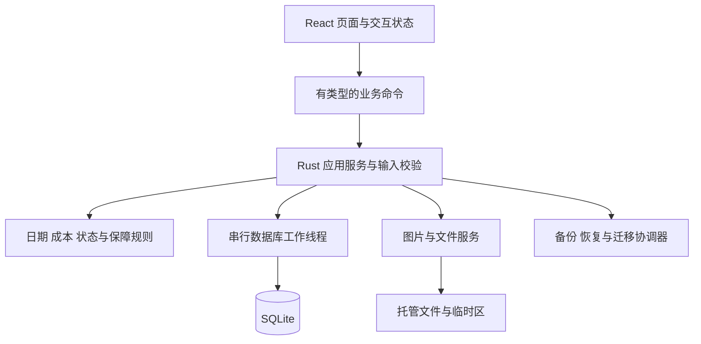

# ADR-001：Possio 本地桌面架构与风险验证计划

日期：2026-09-24 · 状态：Accepted for CP1（依用户“进行下一个阶段”采用当前架构推进基本流程；HEIC 已在 T05 实测，完整实体与 Mac 体验仍需后续验证）

本文件是技术设计的完整入口，集中记录选择、理由、接口、数据一致性和验证计划，不另维护重复架构文档。业务范围见 [产品设计](../PRODUCT_DESIGN.md)，验收编号见 [功能规格](../FUNCTIONAL_SPEC.md)，视觉基线为 A「静序」。

## 1. 约束与建议结论

首版服务个人中文 Mac 自用、单机、人民币实物档案。数据要可长期读取、误删可恢复、备份完整；无账户、服务器、同步或后台开发代理。

建议沿用产品设计的 **Tauri 2 + React/TypeScript + Rust + SQLite**，以 Vite 构建前端、npm 管理前端依赖；数据库通过 Rust 层的 rusqlite 访问。界面使用 A 的样式变量和按需组件，先不引入完整管理后台框架。图表库在统计切片前选择，暂不为尚未制作的页面装依赖。

Tauri 可以承载编译成 HTML/CSS/JS 的前端，并使用系统 WebView；这是选型依据，不是本项目性能保证。[Tauri 官方概述](https://v2.tauri.app/start/)。Vite 的开发服务和发布时打包静态资源是不同路径，发布配置应使用构建产物。[官方 Vite 集成](https://v2.tauri.app/start/frontend/vite/)。

| 候选 | 取舍 |
|---|---|
| Tauri + React + Rust（建议） | 延续原技术方向和已做的桌面交互；业务逻辑集中；代价是跨语言边界和 WebView 的原生体验需要实测 |
| SwiftUI 原生重做 | 值得在原生菜单、输入、辅助功能无法达标时重评；当前切换会改变既定工程方向，不能仅因用户喜欢 Mac 风格就推断必须采用 |
| Electron | 可保留 Web 技术；当前没有必须随应用分发完整浏览器运行时的需求，暂不选 |
| 自托管 Web 服务 | 与双击使用、退出无自建常驻服务的产品目标不符 |

不根据一般框架宣传承诺包体、启动时长或省电；第 10 节验证失败时应修订方案。

## 2. 分层与运行形态



- 首版一个主窗口、一个数据库实例。重复启动聚焦已有窗口；再用数据目录锁保护跨版本误开，不能仅靠界面判断。单实例插件可作为窗口层入口，但不能替代存储锁。[官方 Single Instance](https://v2.tauri.app/plugin/single-instance/)。
- 正常关闭窗口遵循 Mac 窗口与应用分离的习惯，Dock 可重新打开；⌘Q/菜单退出是完整退出。无托盘守护、自动启动、独立 HTTP API 或 Node sidecar。此关闭行为为技术交互建议，须在打包验证中确认用户预期。
- 写事务经过单一队列；阻塞的 SQLite 与大文件操作不在 UI 线程运行。起步不使用多连接写池，先满足数百至数千条个人资料。
- React 保存只提交业务命令，不直接运行 SQL、不把本地存储缓存当成资产真相。成功返回后更新/失效相关查询；失败保留草稿。
- 计算集中在 Rust 领域模块；前端显示后端返回的已计算结果与完整性，不复制另一套成本公式。日跨界、从休眠恢复、应用重新聚焦时刷新“今天”相关指标。

## 3. 业务接口与错误契约

以下是命令设计，不是已经注册的 API。输入由前后端共同描述，Rust 最终校验；前端校验只是即时提示。

| 命令组 | 输入要点 | 输出与一致性 |
|---|---|---|
| 查询资产/详情 | 搜索、状态/分类/保障筛选、排序、页大小/游标 | 稳定 ID、原始字段、成本完整性、摘要与修订号 |
| 新增/更正资产 | request_id、输入、编辑时的 expected_revision、已暂存附件 token | 返回对象 ID 和新 revision；请求重复返回同一结果 |
| 生命周期动作 | 资产 ID、源 revision、动作、日期/售价等 | 校验来源状态和时间顺序，同事务更新事实及当前状态 |
| 维护/保障 | 资产 ID、记录 ID（编辑时）、日期可空、费用/保障内容 | 原记录更正；统一触发成本/保障/时间轴刷新 |
| 心愿转换 | 心愿 ID、revision、实际输入、request_id | 唯一 converted_asset_id；成功才出现已实现 |
| 最近删除 | 类型筛选；对象 ID、revision、删除/恢复动作 | 支持资产、维护、保障；明确父资产是否需要先恢复 |
| 文件导入 | 用户已选择文件对应的受控来源 | 返回短期 staging token 和预览信息，不接受任意前端目标路径 |
| 导出/备份/恢复 | 用户选择的目的地或备份；恢复确认绑定检查结果 | 任务 ID、阶段、进度与验证结果；完整结束才提示成功 |

写命令带 request_id 与内容指纹。事务内同时记录操作结果；同 key 同输入复用结果，不同输入返回冲突。编辑保存带 expected_revision，旧表单不得覆盖后来更新。恢复切换数据集后增加数据集代号，拒绝旧窗口/旧请求继续写入新数据集。

统一返回 code、简短中文 message、可定位的 field_errors、retryable、correlation_id。错误类至少区分输入非法、状态冲突、对象删除、缺失对象、存储忙、空间不足、附件无法读取、备份不兼容。普通界面不显示底层堆栈；诊断日志保留错误代号和关联号，不默认记表单正文、序列号、买家信息或完整路径。

## 4. 数据模型与业务自然日

本节补足产品逻辑模型的工程约束，不把它当成已运行的 SQL migration。

| 组 | 存储与约束建议 |
|---|---|
| 资产与心愿 | 稳定 UUID；名称非空；金额为可空的整数分；currency 固定 CNY；revision；created/updated 审计时间；deleted_at |
| 生命周期事实 | 单独保存有效动作及顺序，资产行上的 status 是同事务维护的当前快照；更正保留内部关联；有效售出至多一条，保存前状态用于撤销 |
| 维护/保障 | 显式 asset_id 外键；独立 deleted_at；未知日期/金额为 NULL；金额和日期状态独立 |
| 分类/渠道 | 稳定 ID；引用可空表示未分类/未记录；改名不改变关联；删除需要明确迁移，含心愿及软删除记录 |
| 附件 | 托管文件、哈希、大小、格式、相对路径；通过显式外键关联表链接资产/维护/保障/心愿，避免无约束的多态 ID |
| 幂等与恢复 | 操作键、指纹、结果 ID 与 revision；schema 版本、数据集代号；恢复日志放在数据集切换之外 |
| 外观与列表状态 | 用户偏好与临时界面状态分开；资产草稿不自动混入正式资产查询 |

数据库业务事实是权威来源。购买、维护和心愿等系统时间轴从来源派生；生命周期从有效动作派生；保障到期由查询时计算，避免启动时重复插入。手工事件暂不加入 P0。内部纠错记录不进入消费统计。

日期用不带时间的 YYYY-MM-DD 业务值，审计时间为 UTC 时间戳；“今天”取 Mac 当前本地自然日。切换时区不改已保存日期，动态指标按当前本地日重算。负日期间隔先校验报错，不靠 max(1, …) 掩盖非法出售日期。

金额存整数分，所有加减作溢出检查；日均使用精确比值/十进制舍入，边界统一保留两位。IPC 中金额建议使用十进制分的字符串，避免 JavaScript 大整数精度损失；后端负责范围限制。数值上限、文本长度和附件上限将在首个工程切片前给出统一配置和验收，原型正则不作为产品上限。

SQLite 建议使用 rusqlite 的 bundled 与 backup 能力，以锁定所带数据库版本并调用快照备份；仓库说明支持这些 feature。[rusqlite 官方仓库](https://github.com/rusqlite/rusqlite)。锁定时核对实际 SQLite 版本而非只看 Rust 包版本。SQLite 官方披露 WAL-reset 问题在 3.51.3 修复，部分旧分支有回补；采用 WAL 时必须使用含修复版本，并验证本项目配置。[SQLite WAL 说明](https://www.sqlite.org/wal.html)。

连接建议开启外键和明确的繁忙等待；起步采用单工作连接，WAL 与同步级别作为 R02 实验项，不先凭默认值宣布耐久性合格。

## 5. 统一最近删除

用户已选择：资产、维护、保障放在同一最近删除页面。列表具有“全部/资产/维护/保障”筛选，显示记录名、类型、所属资产、原状态（适用时）和删除时间。

采用**独立删除标记 + 父对象可见性**：删除资产只设置资产自身标记；其维护、保障和文件通过父资产一起隐藏，不批量覆盖每个子记录原本的删除状态。

- 删除单条维护/保障，设置该记录标记；从普通详情、有效时间轴、费用/保障摘要中排除。恢复后重新参与对应计算。
- 删除资产时，最近删除新增一条资产项；因父对象隐藏的子记录不冒充“用户独立删除”的项目，不制造大量重复条目。
- 先独立删除维护，再删除资产：最近删除保留两个真实删除项，子项显示父资产也已删除。恢复资产仅恢复原本有效的关联记录；那条维护仍待单独恢复。
- 父资产未恢复时，单独恢复子记录按钮说明“先恢复所属资产”，提供定位入口；不悄悄连带恢复父资产。
- 所有恢复保留原 ID，不新建事实或重复图片；恢复 Sold 保持 Sold。P0 没有永久清空和后台清理，托管原文件仍受软删除记录引用。

图片替换后的旧文件与无引用暂存残留不能立即按常规“清理缓存”删掉。只有在恢复检查完成且确认不属于有效、软删除或正在提交的引用后，才进入单独的清理机制；首版宁可保留可诊断的残留，也不误删档案。

## 6. 图片导入与提交协议

### U01 内置素材接入约束（2026-09-25，实现已交回）

素材选择复用下述托管/暂存/原子保存协议。前端提交受控素材 ID 和 generation，Rust 从随 App 编译/打包的白名单 PNG 取字节，经 worker 调用既有 `Store::stage_photo`，返回既有 Photo；最终图片关联与封面仍由 `save_asset` 一次提交。不得接收任意素材路径/URL，不以浏览器 data URL 或类别兜底冒充持久选择。

2026-09-25 用户中途调整后新增自定义素材库：schema 9 增加 `materials` 表（id、名称、哈希、大小、创建时间），字节存入既有内容寻址 `files/<sha256>` 仓；上传经原生选择器与 worker 校验（格式、20 MiB、可生成预览）后先落盘再入库；备份打包 attachments 与 materials 引用的全部文件，恢复沿用既有校验。表单提交仍只引用素材 ID，不改变 request_id、revision、generation、草稿和回执协议。

上传 review 修复：打开选择器前，前端持久保存上传操作 UUID + generation；素材行 ID 采用该 UUID，后端先检查已有结果，再读取源文件。响应异常时经串行 worker 核对该 ID，未确认前禁止新的上传/删除；资料切换后不得对新库重放旧操作。不新增 schema，上传核对不承担永久删除后的历史审计。

素材清单独立于 Demo 资产资料，稳定 ID 对应显示名和原图；图本体与生产清单可进入正式包，虚构价格/名称/维护等 Demo 数据仍不进入正式产物。复用现有 SVG 与已转换 PNG，明确唯一原图来源并同步转换工具、Demo 导入示例路径，不复制多套人工维护的清单。用户保存后拥有托管的原图副本，后续素材目录变化不替换已有档案图片。表单新增逻辑不得改变原有 request_id、revision、generation、草稿和备份契约。发现必须改变这些协议的情况，交回 Codex 审查原因，不临时另造协议。

### 既有文件导入协议

目标：崩溃前后不能出现“数据库已成功保存但指定图片从未落盘”，也不能由失败重试删除别的对象引用的图片。以下为设计协议，须通过 R03 故障注入验证。

1. 读取用户选中的文件到应用 staging，检查可读性、大小、真实格式，生成哈希及预览；不修改源文件。用户取消保留安全清理路径。
2. 提交前把文件搬到同一数据集内的最终托管位置，文件名用内部稳定 ID；完成持久化所需步骤后再开启业务事务。路径不能使用未经处理的用户文件名。
3. 同一事务写业务资料、附件引用和幂等结果；成功后才回报保存完成。提交前文件已存在，不把跨文件系统移动假装成数据库回滚。
4. 数据库失败，文件可能成为暂时无引用文件；保留操作清单供恢复/清理。崩溃后先核对请求结果与引用，再重试或清理；不能盲目重复插入。
5. 缩略图是可重建缓存，托管原图是用户档案。HEIC 等若暂不能生成预览，要明确告诉用户，不声称通过支持验收；不未经用户确认转换并丢弃原文件。

前端只收到受控图片地址或 token。封面从有效附件引用选取；显示缺图占位时保留资料，提供重新选择入口。不允许任意 HTML/SVG 附件进入应用脚本执行上下文。

### T05 已落地的实现约定

- 原生 `NSOpenPanel` 在 AppKit 主线程选择文件，受控 worker 读取并校验；前端仅得到图片 ID，不暴露任意文件读取接口。选图时即把原始字节持久化到 `files/<SHA-256>` 并写暂存凭据，取消不产生资产或附件数据库记录。
- schema 4 增加 `asset_photos` 当前图片集合和 `asset_media.cover_id` 显式封面。选中图片、封面、文字资料、revision 和回执在同一事务提交。未指定图片字段的旧保存请求继续保留现有图片，旧回执指纹保持兼容。
- JPEG/PNG/WebP/HEIC 均可导入；每张 20 MiB、最长边 12000、总像素 4000 万，每件物品当前最多 20 张。ImageIO 生成方向正确、最长边 960 的 PNG 预览，原图不转码替换。Rust 解码器有 192 MiB 分配限制；该数字不是 ImageIO 解码器的硬内存保证。
- 缓存每次读取前仍验证原图哈希。缺图不改变文字档案，重新选择相同哈希原文件可修复；不同图需在编辑中新增/替换，不冒充修复。改封面、移除当前图片和软删除资产均不立即删除原始字节，后续清理须遵循第 5 节。
- 完整备份包含数据库与所有附件原图，包括已移出当前集合但仍保留的历史引用；不包含缓存和未提交草稿。旧 schema 1/2/3 可迁移到 4，备份校验新增图片/封面归属检查。CP0 的备份容量限制仍待 T18 调整和验收。

## 7. 一致备份、迁移与恢复

### 7.1 完整备份

首版偏向简单、可验证：备份期间暂停写入（读取仍可用），等待已受理的业务/文件提交结束，再取得 SQLite 快照及同一状态下的附件清单。界面说明“正在备份，暂不能保存修改”，草稿保留。

用 SQLite Backup API 制作独立数据库快照；它提供数据库快照能力，但**不会自动覆盖本项目附件**，附件一致性由上述协调过程保证。[SQLite 官方备份说明](https://www.sqlite.org/backup.html)。备份不直接复制运行中的主库文件。

将快照、包括最近删除引用的全部原图、manifest 打包到用户目标目录内的临时文件；校验数据库、外键、引用和文件哈希，完成后再成为最终备份。错误或磁盘不足不留下名为成功备份的半成品。记录应用/schema/备份格式版本及创建时间；缓存不属于完整性必需项。暂停窗口的实际时长须实测，不预设不可兑现的“瞬时备份”。

### 7.2 恢复协议

恢复到新的数据集目录，然后切换一个小的 active 指针，避免分别覆盖当前数据库和图片时产生混合版本。建议数据目录包含 active、datasets/<id>/、restore-journal、staging、backups、cache；CP0 已在临时验证目录建立这些路径，未建立正式资产库。

1. 检查格式、版本、归档路径、解压限额、链接类型、条目冲突；拒绝路径穿越、绝对路径和越界链接。对 schema、引用与数据约束做验证，不仅检查 ZIP 能否打开。
2. 展示时间、数量与完整替换影响。用户确认绑定检查时的备份指纹，文件变化则重新检查。
3. 暂停读写命令并等待在途操作结束；制作可验证的当前数据保护副本。失败则不切换。
4. 在隔离目录还原并再次验证，必要迁移仅作用于副本；关闭旧连接后，记录切换日志并原子替换 active 指针。
5. 打开新数据集、验证可读，递增数据集代号，清除旧查询缓存；成功后才向用户报告。旧数据集和保护副本保留到后续明确的清理策略。
6. 任意阶段被终止，下次启动根据持久化日志与指针选择一套完整、可验证的数据集。指针不明、验证失败时进入恢复入口，不能自动创建空库造成“资料丢失”。

文件刷盘、目录更新与断电可靠性需要实际验证，不能把“rename 通常原子”写成所有崩溃场景已证明安全。首版不合并恢复，不支持将更高版本备份强行降级。

### 7.3 迁移与 CSV

schema 版本独立于 App 版本和备份格式版本。迁移前保护数据；按顺序运行版本迁移并检查失败回滚。失败保持原版本可恢复，不使用删库重建修复。

CSV 是可读资产表，默认全部未删除资产，包括 Sold；未知留空，人民币及单位写清。首版默认提供电子表格安全输出：对可能被解释为公式的文本加安全前缀，并在导出说明中注明；完整无损恢复依赖完整备份。引号、换行、逗号、中文及公式样式样例列入 R06，不以人工打开“看起来正常”作为唯一验证。

## 8. 界面与权限边界

组件按 assets、wishlist、maintenance、warranty、timeline、insights、data-management 分组；共享表单错误、金额、自然日、空状态、摘要和焦点管理。维护/保障恢复位于统一最近删除，不为其创建另一套管理站点。

静态资源随 App 打包；不加载远程网页作为应用主界面。外部购买链接只在用户点击后交给系统浏览器，并限定合法协议；不自动获取其内容。前端只暴露需要的业务命令、文件选择、受限图片读取和窗口能力，不启用任意 SQL/任意 shell/全盘文件权限。

Tauri 区分 WebView 与 Rust 核心的信任边界；配置权限不能代替命令内部对输入和文件范围的校验。[官方安全模型](https://v2.tauri.app/security/)。本应用的边界设计仍需自行验证，不能把使用框架视为自动获得全部安全性。

## 9. 工程目录、工具链与检查安排

以下是拟建结构，本轮不创建空源码目录：

```text
src/app/                 应用外壳、主题、导航与查询协调
src/features/            按业务组织页面、表单和查询
src/shared/              共享 UI、DTO 与调用边界
src-tauri/src/domain/    纯业务规则
src-tauri/src/services/  完整用例、幂等、恢复与备份协调
src-tauri/src/storage/   数据库、文件与迁移
src-tauri/src/commands/  对外命令及错误转换
src-tauri/migrations/    有序数据库迁移
src-tauri/tests/         临时目录集成与故障恢复验收
src/**/tests/            前端组件与用户交互验证
```

命名：业务命令表达意图，避免泛化成任意 update_table；Rust 字段 snake_case，前端 DTO 按单一明确映射生成/核对，禁止混合。数据库/文件写入不出现在页面组件中。领域测试固定 Clock，业务金额与日期由专用类型保护。正式格式化工具与代表性代码示例在首次工程验证后建立，不将原型压缩脚本当作编码规范。

当前机器只读观察（2026-09-24）：macOS 27.0、arm64；Node v26.9.0、npm 11.19.1、rustc/cargo 1.96.0；xcode-select 指向 CommandLineTools。路径/版本存在不代表 SDK、签名或打包已验证。官方 macOS 开发前置条件见 [Tauri Prerequisites](https://v2.tauri.app/start/prerequisites/)。

初始验收目标建议为当前自用的 Apple Silicon Mac；旧系统和 Intel 不先作兼容承诺。打包目标的最低版本在 R01 记录，不能单凭当前主机版本推断最低要求。

依赖锁文件、工具版本、实际构建/测试命令在 R01 创建并执行成功后登记 README。现已建立最小验证工程，锁文件与实际命令见 README。不从其他 Agent 的私有运行环境借用项目包管理器，不主动修改全局配置。

## 10. 风险验证计划

以下是风险验证要求。用户已授权并执行首批 V00–V05，实际通过范围和缺口以 验证报告 为准；完整 R01–R07 尚未全部验收。

| 编号 | 风险及对应 AC | 获准后的验证方法 | 通过所需证据 |
|---|---|---|---|
| R01 | 本机可打包、原生入口与退出；AC39/40 | 最小 A 风格窗口；离线启动、⌘Q、再次启动、主题/文件对话框/键盘 | 记录实际工具和依赖锁版本、构建命令、App 运行和退出行为；最低系统目标明确 |
| R02 | 日期金额、事务与幂等；AC01/04/07/11/22–26 | 固定 Clock、边界数据、同 key 重试、旧 revision 和故障注入 | 同一事实只有一次，金额不漂移，无半事务；实际 SQLite 版本包含必需修复 |
| R03 | 文件提交与崩溃；AC03/18/40 | 在复制后、入库前、提交后逐处终止；缺权限/无空间/损坏图片 | 重启恢复一致；共享和软删除引用不被误清理；验证支持的图片格式 |
| R04 | 三类删除交互；AC13/27–29/41–44 | 独立删子项、删父项、父子逆序恢复、故障重试 | 原 ID、原状态保持；旧独立删除不被父恢复撤销；附件可用 |
| R05 | 备份恢复与迁移；AC30–34 | 编辑与备份同时请求、缺附件/损坏/路径异常/不兼容备份、切换阶段终止 | 一致的备份可在空目录恢复；失败不损害原数据；重启能选择完整数据集 |
| R06 | CSV/统计完整性；AC35–38 | 未知/零/负净成本、闰日月末、特殊文字与导出范围 | 与 Spec 边界表一致；无隐含的重复金额；文本可读且不触发公式 |
| R07 | Mac UI 可用性；AC06/09/40 | 实际窗口宽度/缩放/长名称/键盘/VoiceOver/深浅色 | A 的列表、摘要与表单不遮挡关键动作；取得正常截图路径或人工观察记录 |

纯业务与存储集成优先使用 Rust 测试；前端组件验证在工程阶段选定轻量工具。真实 Mac 端到端验证须分清“浏览器模拟前端”和“实际 App”。截至核验日，Tauri 文档已介绍 WebdriverIO Tauri service 的 embedded 路径支持 macOS，而直接 tauri-driver 仍不支持 Mac；可评估只用于测试构建的嵌入驱动，不能把测试服务器带入发布 App。[官方 WebDriver 文档](https://v2.tauri.app/develop/tests/webdriver/)。

本轮未安装测试驱动、未执行截图绕行。此前原型截图问题记录仍在 UI 文档中；需要正常可用路径或用户实际观察补足，不把 DOM 检查当视觉通过。

性能先给建议预算以便评估：当前自用机、发布构建、1,000 条资产/5,000 条关联记录、分页缩略图下，普通查询 p95 目标 200 ms，交互保存 p95 目标 500 ms（不含大文件），冷启动目标 2 s。它们是待测目标，不是已达成承诺；备份另按数据量报告时长、暂停写入时长和最大内存。

## 11. 阶段出口与后续工作

具体实施顺序、风险对应任务和阶段出口统一见 [实施任务与开工检查](../IMPLEMENTATION_PLAN.md)。首批 V00–V05 聚焦 R01/R02/R03/R05 的底层验证，在 CP0 报告实际结果；R04 随三类实体实现后完整验证。首批工程验证已执行，基础原生检查已补验；当前按后续授权推进基本资产流程，实际证据与未验项见验证报告。

根据实验结果冻结最低系统、依赖版本、文件协议和测试方式。失败时修订本 ADR，保留原因；基础备份/恢复协议先验证，完整 P0 关系加入后在 T18 再做全面恢复验收。任务表不把早期局部通过当作完整功能通过。

当前仍由 Codex 主线保持文档和决策连续性；无新增 Spec CLI、无人值守开发或 Hermes 并发。后续只有边界独立、验收明确的任务才考虑委派，不以省 token 为由拆散同一事务逻辑。

本轮工具发现未提供可调用的 Context7 resolver/query，已改查上文官方资料；核验日期为 2026-09-24。外部资料证明框架能力和限制，本文件中的项目方案及预算是设计建议，不是实测事实。

## 12. T06b 实施补充（2026-09-24）

- schema 5 新增分类、渠道、全局修订号与命令回执表，资产外键可空。v4 升级在一个 SQLite 事务中完成；旧资产不猜测分类/渠道，初始化选项 ID 只生成一次。schema 1–4 备份可恢复并迁移至 5，现行备份写 schema 5 并校验名称和引用。
- 名称按 ECMAScript trim 空白集去首尾、NFC 归一化，再检查 1–80 个 Unicode 标量、无控制字符。同类 ASCII 大小写不敏感去重，跨分类/渠道可重名；未分类/未记录为对应空值显示保留词。每类最多 500 项是当前技术边界。Rust 锁定 `unicode-normalization 0.1.25`，使用官方 [NFC 接口](https://docs.rs/unicode-normalization/0.1.25/unicode_normalization/trait.UnicodeNormalization.html)；前端采用相同口径。
- 管理命令携带 request_id、generation、expected_revision。回执与业务更新同事务；重复请求不重放，不同内容复用 ID 拒绝。引用新增/变化、删除/恢复推进全局修订号，过时的引用确认必须重新读取。
- 移除分类/渠道必须显式提供同类目标 ID 或 null；同一事务迁移正常及最近删除资产、推进其 revision，再移除选项，失败全部回滚。旧资产草稿不能覆盖已迁移关系；改名和排序保留 ID。
- 新资产编辑提交两个外键；旧请求未携带 classification 时保留现有关系，旧回执指纹兼容。详情和搜索按 ID 解析最新名称；删除后的旧筛选保留并提示不可用，不静默改成全部。
- 设置复用 T06a 受控组件，持久状态统一由 IPC 快照提供。发命令前暂存原请求；回执未知时暂停写入并读取结果，不生成新请求盲目重试。离开设置不卸载草稿；原生关闭时提示处理未保存或未确认操作。
- 当前仅资产引用，心愿引用在 T12 接入后补充同一事务和 AC37 验收。完整原生错误恢复及已有图片/删除流程归 T06c/T20，不能由本轮存储测试替代。

## 13. T07 实施补充（2026-09-25）

- schema 6 为资产增加 `lifecycle_state`，建立 `lifecycle_events`（稳定 ID、资产外键、严格递增序号、动作类型、自然日、备注、建档/更新时间）。旧资产迁移为 Active，不生成虚构历史；升级失败整笔回滚。
- `change_lifecycle` 使用现有串行命令、generation、revision 和请求指纹/回执。状态事实、当前状态、revision 和回执同事务提交；已完成请求先核对回执，迟到重试不会重演动作。
- 退役/启用日期必填，不晚于本机今天，不早于已知购入日期或上一次动作。同日依序号排列。更正只改原动作日期，限制在相邻日期之间，保留 ID、顺序、备注和当前状态。购入日期更正需列出冲突的历史动作。
- schema 6 备份验证包含生命周期顺序、日期和状态一致性；旧 schema 1–5 继续恢复迁移。退役仍属于持有，软删除/恢复不改状态历史。Sold 仅拒绝非法来源状态，真实售出流程留 T08。
- 表单复用现有关闭保护和本地草稿；未确认回执时锁定输入，查询完成后才允许继续。完整备份界面、全局时间轴和完整 Mac 验收仍按后续任务推进。实测见 [T07 记录](../verification/T07_LIFECYCLE_RESULT.md)。


## 14. T08 实施补充（2026-09-25）

- schema 7 建立 `sales` 和 `sale_audit`；每资产最多一条有效售出。售出保存来源 Active/Retired；更正保留 sale ID；撤销标记该记录失效并恢复来源状态，原始记录及请求审计仍保留。schema 6 升级不生成售出事实，失败整笔回滚。
- `change_sale` 复用串行 Worker、generation、revision、请求指纹及回执。同事务写售出、审计、资产状态、revision、更新时间和回执；重复请求返回当前档案，不重演旧动作。售价以整数分规范化，前导零不会造成审计与备份不一致。
- 售出日期必填、不晚于今天、不早于已知购入和前置状态日期；售价必填、非负、允许零。Sold 的历史状态日期更正不得越过有效售出日期；购入日期更正同样受售出约束。未知购入资料允许售出，净成本/净日均不伪造；已知成本以售出日固定天数并允许负值。
- schema 7 备份验证售出、纠错链、回执与当前状态一致，继续支持 schema 1–6 迁移。售出及撤销审计不混入退役/启用表；T14 全局时间轴需组合有效事实，T18 再验完整实体备份。T09 接入维护后补全结算口径。
- 售出表单暂存原请求，结果未知时禁止重写，通过回执查询恢复；冲突先读取最新档案再明确保存。实际证据和剩余验收见 [T08 记录](../verification/T08_SALES_RESULT.md)。

## 15. T09 实施补充（2026-09-25）

- schema 8 建立 `maintenances`、`maintenance_photos` 和 `maintenance_audit`。当前事实、图片关联、资产 revision、更新时间、审计快照与请求回执在同一事务提交；更正保留 maintenance ID，重复请求不重演事实。
- 维护日期允许未知；已知日期不得晚于本机今天、早于已知购入日期或晚于有效售出日期。更正购入／售出日期时反向检查已有维护并指出冲突记录，避免只在一个入口维持时间关系。
- 维护费用以整数分保存，`NULL` 表示未知，`0` 表示免费。已知维护费用始终求和；购入价或任一维护费用未知时总投入、净成本和日均成本保持未知。售出收益只在后端汇总扣除，前端不复制公式。
- 维护图片复用托管附件和选择器，校验附件属于同一资产。schema 8 白名单、数据集校验和备份恢复覆盖三张维护表、触发器及原图；schema 1–7 恢复后迁移到 8。
- T09 不增加维护独立删除；统一子实体删除／恢复仍归 T11。实际证据与未覆盖的原生边界见 [T09 记录](../verification/T09_MAINTENANCE_RESULT.md)。

## 16. T10 实施补充（2026-09-25）

- schema 10 建立 `warranties`、`warranty_photos` 和 `warranty_audit`。保障事实、图片关联、资产 revision、更新时间、审计快照与请求回执同事务提交；更正保留 warranty ID，重复请求不重演。`warranties.deleted_at` 列随本版建立但 T10 不写入，为 T11 独立删除语义预留，无需再迁移。
- 保障类型为厂家保修、延保、AppleCare、商店保修、其他保障；提供方、起止日期、备注可空。已知起止日期要求结束不早于开始（领域校验加 schema 触发器双层），起止同日合法；**不设今天、购入或售出钳制**，保障可以未来开始或到期，保障与资产生命周期、成本完全独立。
- 到期状态查询时派生，不落库、无常驻任务。完整日期且 `start <= today <= end` 才算当前有效；剩余自然日 0–30（含两端）为即将到期，31 及以上为保障中；任一日期缺失为待补全，不推断有效。Rust `warranty::derive_status`/`summarize` 与 SQL 筛选条件同口径，前端只展示后端派生结果（浏览器预览的内存适配器使用经同一用例固定的 TS 镜像）。
- 资产保障筛选 `covered`（有有效保障，含临期）、`expiring`（即将到期）、`lapsed`（有记录但当前无有效）、`none`（无记录）与搜索、分类、生命周期取交集，排除已删除资产；混合状态匹配语义由 `tests/warranty.rs` 与 `tests/warranty.test.mjs` 用同一组固定用例锁定。
- schema 10 白名单、数据集校验和备份恢复覆盖三张保障表、触发器及原图（保障图片复用托管附件并校验同资产归属）；schema 1–9 恢复后迁移到 10。父资产删除／恢复沿用既有隐藏语义，保障与附件随父资产恢复可读。
- 前端复用维护表单协议：原生 dialog、焦点/ESC、localStorage 草稿（`possio.warranty-draft.v1`）、pending 完整 payload、同请求回执核对、generation/revision 冲突与关闭保护。跨日刷新沿用 `refreshCostsForNewDay` 同一路径（列表、当前详情、保障摘要随重读更新）。
- T10 不做保障独立删除、通知、PDF、CSV、AI、同步或全局时间轴；统一最近删除归 T11，完整备份界面归 T18。实际证据与未验项见 [T10 记录](../verification/T10_WARRANTY_RESULT.md)。

## 17. A · 财富盘点技术设计（2026-09-28，W01 已实现）

依据[产品设计第 17 节](../PRODUCT_DESIGN.md#17-统一资产扩展需求草案2026-09-28)与已确认的 X-D01–X-D04。只覆盖 A 首版：账户/负债、集中盘点、净资产趋势、删除恢复与完整备份。可读导出、盘点提醒、时间轴事件、总览卡片、外币、修订日志不在本版。实现沿用本 ADR 第 2–7 节协议，不另造第二套回执、删除或备份机制。

### 17.1 schema 15

一次迁移（`src-tauri/src/x01.sql`，与 `u02.sql` 同方式），单事务，失败整笔回滚。旧库升级后新表为空，不推算历史余额。

```sql
CREATE TABLE fin_accounts(
  id TEXT PRIMARY KEY, name TEXT NOT NULL, institution TEXT NOT NULL,
  side TEXT NOT NULL CHECK(side IN ('asset','liability')),
  kind TEXT NOT NULL CHECK(kind IN ('cash','investment','mixed','fund','bond','housing_fund','other_asset','credit_card','loan','other_liability')),
  counted INTEGER NOT NULL CHECK(counted IN (0,1)),
  opened_on TEXT NOT NULL, closed_on TEXT, notes TEXT NOT NULL,
  position INTEGER NOT NULL CHECK(position>=0), revision INTEGER NOT NULL CHECK(revision>0),
  created_at TEXT NOT NULL, updated_at TEXT NOT NULL, deleted_at TEXT,
  CHECK((side='asset') = (kind IN ('cash','investment','mixed','fund','bond','housing_fund','other_asset'))),
  CHECK(closed_on IS NULL OR closed_on > opened_on));
CREATE TABLE fin_snapshots(
  id TEXT PRIMARY KEY, date TEXT NOT NULL, notes TEXT NOT NULL,
  revision INTEGER NOT NULL CHECK(revision>0),
  created_at TEXT NOT NULL, updated_at TEXT NOT NULL, deleted_at TEXT);
CREATE UNIQUE INDEX fin_snapshots_live_date ON fin_snapshots(date) WHERE deleted_at IS NULL;
CREATE TABLE fin_snapshot_entries(
  snapshot_id TEXT NOT NULL REFERENCES fin_snapshots(id),
  account_id TEXT NOT NULL REFERENCES fin_accounts(id),
  state TEXT NOT NULL CHECK(state IN ('entered','unchanged','missing')),
  amount_cents INTEGER CHECK(amount_cents BETWEEN 0 AND 99999999999),
  side TEXT NOT NULL, kind TEXT NOT NULL, counted INTEGER NOT NULL CHECK(counted IN (0,1)),
  PRIMARY KEY(snapshot_id, account_id),
  CHECK((state='missing') = (amount_cents IS NULL)));
```

- 金额一律非负整数分，由 `side` 决定加减；负债为“尚欠金额”。IPC 用十进制分字符串，复用 `domain::cents` 与 `MAX_CENTS`。
- `side` 在账户建立后不可改（首次盘点前也不改，误建请删除重建）；`kind`、`counted`、名称可改。条目复制保存当时的 `side/kind/counted`，此后账户修改不重写旧盘点（X-D01）。名称取当前值，改名不改变数字。
- 盘点只有一个 `date`（X-D03），同一日期至多一份有效盘点（部分唯一索引）。完整与否**不落库**，查询时派生，避免后补账户后状态失真。
- `unchanged` 与 `entered` 都带金额；`unchanged` 取该账户在本盘点日期之前**最近一个已知金额**（跳过 `missing`），前端可不传金额，传了必须相等。之前从无已知金额时不能选 `unchanged`。该校验只在保存时进行；日后更正更早的盘点不连带改写后续 `unchanged` 条目，它们保存的金额本身就是当日确认的事实。

### 17.2 纳入范围、完整性与可比性

- 账户在日期 D 应盘点：未删除，`opened_on <= D`，且 `closed_on IS NULL OR D < closed_on`。保存盘点时必须恰好覆盖该集合，每个账户一行（可为 `missing`）；不在范围的账户拒绝，缺行拒绝。
- 盘点完整 = 当前应盘点集合每个账户都有非 `missing` 条目。事后新建一个 `opened_on` 较早的账户，旧盘点自动变为不完整并列出缺漏账户，不补零（17.4 第 4 条）；再编辑那份盘点即可补录。
- 两份盘点可比 = 两份都完整，且两份共有的账户里没有 `counted` 在两期之间变化。新开、销户属于真实变化，不影响可比。
- 停用：`closed_on` 之前最后一份有效盘点中该账户金额必须为 0，或该账户从无条目；否则拒绝并提示“先在盘点中记录余额为 0”。之后不再出现在新盘点。重新启用即清空 `closed_on`。
- 删除账户：仅限无任何条目（含已删除盘点中的条目）的误建账户，走软删除和最近删除；有历史的只能停用。
- 更正账户的启用/停用日期时，有效盘点中已记录的日期必须仍在范围内；已删除盘点不参与此检查，所以 W03 恢复盘点时须重新校验日期唯一、账户范围与应盘点集合。

### 17.3 计算（Rust `wealth.rs`，前端不复算）

- 金融资产 = `side='asset' AND counted=1` 的已知金额和；负债同理；净资产 = 资产 − 负债，可负。求和用 `checked_add`。
- 不完整盘点：只返回已知小计和缺漏数，净资产标为不完整；曲线上以区别样式标出，比较与变化率跳过它。
- 变化 = 本次 − 上一份**可比**盘点；变化率仅在上期净资产 > 0 时给出，按整数分做精确除法、两位舍入（样例 X-AC02 = 3.03%）。只有一个点时不给趋势。跨月显示实际起止日期，不称“本月增长”。
- 结构：最近一份完整盘点里计入的资产按 `kind` 汇总，分母为金融资产；资产合计为 0 不给比例。负债另列。

### 17.4 命令

均走串行 worker，写命令带 `request_id`、`generation`，编辑带 `expected_revision`；回执复用 `feature_requests(id,fingerprint,result)`，同 key 同指纹返回原结果，不同指纹 `REQUEST_CONFLICT`。不新建审计表（X-D01 不做修订日志）。

| 命令 | 作用 |
|---|---|
| `wealth_accounts` | 账户列表（含停用），附最近一次条目金额与所属盘点日期 |
| `wealth_account_save` | 新建/更正/停用/重新启用账户，校验 17.2 停用规则 |
| `wealth_snapshot_draft(date)` | 返回 D 日应盘点账户、各自前一份有效金额与日期；已有同日盘点则返回其 ID 以转为更正 |
| `wealth_snapshot_save` | 整份盘点一次提交；日期不晚于本机今天；校验覆盖集合、`unchanged` 值、唯一日期 |
| `wealth_summary` | 曲线点（日期、资产、负债、净资产、完整、缺漏数、与上一可比期变化/变化率）与最近完整期结构 |
| `wealth_request_result(request_id)` | 回执未知时核对原请求结果，不生成新请求 |
| `trash_change` 扩展 | 盘点、账户的软删除/恢复；恢复同 ID，同日已有有效盘点则拒绝并说明 |

更正历史盘点前的“影响预览”由前端用已有 `wealth_summary` 数据对比新旧净资产及前后两次变化，不另设命令。

### 17.5 备份、恢复与版本

- 新表同在 `data.sqlite`，自动进入完整备份；数据集校验新增：条目的 `side/kind` 与 CHECK 一致、同日有效盘点唯一、外键完整。
- 现有代码在 `storage.rs`、`backup.rs` 共 7 处写死 14。先合并为一个 `SCHEMA_VERSION` 常量再升到 15，避免遗漏。
- 旧备份（schema 1–14）恢复后迁移到 15，新表为空。已安装的 1.1.6 对 schema 15 的库和备份都会拒绝（`migrate_to` 与 `unpack` 的 `1..=14` 检查），满足“新版备份交旧版明确拒绝”；实现后用 1.1.6 同源构建在隔离身份实测一次。
- 恢复切换 generation 后旧盘点窗口的提交以 `STALE_DATASET` 拒绝，沿用现有逻辑。

### 17.6 界面

- 入口：侧栏在“记录与回顾”之后新增一组“财富”，一个入口；页内三个分段：概览（最近完整盘点、净资产曲线、结构、缺漏提示）、账户、盘点记录。**侧栏属于已确认基线，入口位置须用户同意并附同尺寸对照后才实现。**
- 盘点编辑为整页表格：账户逐行，列为前次金额/日期、本次金额、差额、状态；回车到下一行，“确认未变”为每行按钮与快捷键，错误就地显示。表单关闭即丢弃，不存草稿；提交中及结果未知时锁定并按回执核对（沿用 U03 规则）。
- 曲线复用 `Stats.tsx` 的手写 SVG 趋势图，不引入图表库；配色、图标沿用 tokens 与现有 SVG。
- 浏览器预览 `visual-preview.html` 增加财富虚构数据，覆盖正常、空白（无账户/仅一次盘点）、不完整、读取失败四种状态。

### 17.7 验证

- Rust：X-AC01–05、07、10 作为单元/集成测试；迁移 14→15 在 `migration.before_commit` 注入失败后回滚且可重试；schema 14 备份恢复后迁移；伪造 schema 16 清单被拒；重复/冲突请求；停用与删除规则；同日恢复冲突。
- 原生：只在开发预览或隔离身份的虚构库，按既有 AX 方法走盘点录入、更正、删除恢复、备份恢复。**不打开正式库。**

### 17.8 W01 实现记录（2026-09-28）

- 落地 `src-tauri/src/x01.sql`（schema 15）、`src-tauri/src/wealth.rs` 及 7 个命令（`wealth_accounts`、`wealth_account_save`、`wealth_snapshot`、`wealth_snapshot_draft`、`wealth_snapshot_save`、`wealth_request_result`、`wealth_summary`）。`storage.rs`/`backup.rs` 的版本号收拢为 `SCHEMA_VERSION`，备份校验在 schema ≥ 15 时调用 `wealth::validate_dataset`。
- 变化率以万分之一的整数返回（`change_rate_hundredths`，303 即 3.03%），四舍五入远离零；结构占比同口径。金额字段均为十进制分字符串，净资产可为负。
- `tests/wealth.rs` 11 项覆盖 X-AC01–05、X-AC10、X-D01/X-D04、停用与日期范围、补建账户致旧盘点不完整、14→15 注入失败回滚与重试、新备份往返、schema 14 旧备份恢复为空财富、schema 16 备份拒绝。旧迁移测试的降级夹具同步删除三张新表。`npm test` 全部通过，`npm run check` 无警告。
- 未包含：软删除/最近删除（W03）、界面（W02）、1.1.6 实机拒绝新备份的原生核验（W03）。

### 17.9 W02 实现记录（2026-09-28）

- 侧栏在“记录与回顾”后新增“财富”分组与“账户与盘点”入口（用户已同意）；新增 `wallet` 图标沿用既有 20×20、1.25 描边规格。同尺寸对照（1280×820，浅/深色，改前 `main` 与改后）见 w02/sidebar-compare.png，其余导航与分区未变。
- `src/WealthPage.tsx`：概览（最近完整盘点的净资产/资产/负债/变化、净资产曲线、资产结构与负债）、账户、盘点记录三个分段；账户编辑为原生 dialog；盘点为整页表格，回车到下一行、“未变”“未知”逐行按钮、底部实时小计、“其余标为未知”。页面布局复用 `stats-section`、`stats-kpis`、`stats-category-bars`、`distribution-table` 与 `trend-chart`。
- 曲线只连接完整盘点，坐标按数据范围取整而不固定从 0 起；不完整盘点只画虚线标记日期，不画已知部分小计。历史表中不完整盘点的净资产显示“—”，资产/负债标“已知”。
- 保存沿用“只保留已提交请求”的规则：提交前把请求写入 `possio.wealth-pending.v1`，回包丢失时用 `wealth_request_result` 核对；已提交则以同一请求重发取回原结果，未提交则清除并保留表单输入，无法确认时保留请求并在财富页提示核对。表单关闭即丢弃，不存草稿。
- `wealth_snapshot_draft`/`wealth_summary` 增加 `generation` 字段。浏览器预览 `src/wealth-preview.ts` 为内存假数据，`?wealth=empty|first|error` 覆盖空白、首次盘点与读取失败，`?state=save-error` 覆盖保存失败。
- 已验证：浏览器预览中录入、回车跳行、未变/未知、未处理行拦截、保存后回到记录、账户编辑、深色模式；`npm run build`、`npm run test:ui`（90 项）、`npm run check` 通过。未验证：原生 App 中的实际读写与回执核对（W03 隔离身份验收）；样例模式下财富记录会写入样例库，沿用样例横幅说明，不另做处理。

### 17.10 W03 实现记录（2026-09-28）

- 新增 `wealth_trash` 命令及最近删除“财富”筛选；删除/恢复规则按 17.2 实现，恢复盘点时重新校验同日唯一与账户期间。`list_trash` 的财富行复用既有 Entry 结构（`date` 为盘点日，`asset_revision` 为行 revision）。
- 备份 Summary 增加 `accounts`、`snapshots`。盘点表切换日期不再带入已保存盘点的金额。`wealth_snapshot_save` 增加 `after_commit` 故障注入点。
- 隔离原生验收、schema 14 构建拒绝新版备份、回包丢失核对等结果见 [W03 验证](../verification/W03_WEALTH_RESULT.md)。

## 18. B · 重要支出技术设计（2026-09-28，E01 已实现）

依据产品设计 17.6 与已确认的 X-D05–X-D08。沿用本 ADR 的回执、软删除、只读投影与备份协议；A 的 17.4 回执表和 17.5 版本常量直接复用。

### 18.1 schema 16

```sql
CREATE TABLE expenses(
  id TEXT PRIMARY KEY, title TEXT NOT NULL, date TEXT NOT NULL,
  amount_cents INTEGER NOT NULL CHECK(amount_cents BETWEEN 1 AND 99999999999),
  category TEXT NOT NULL CHECK(category IN ('travel','education','health','home','digital','gift','other')),
  notes TEXT NOT NULL,
  refund_cents INTEGER CHECK(refund_cents BETWEEN 1 AND 99999999999), refund_date TEXT,
  asset_id TEXT REFERENCES assets(id),
  revision INTEGER NOT NULL CHECK(revision>0),
  created_at TEXT NOT NULL, updated_at TEXT NOT NULL, deleted_at TEXT,
  CHECK((refund_cents IS NULL)=(refund_date IS NULL)),
  CHECK(refund_cents IS NULL OR (refund_cents<=amount_cents AND refund_date>=date)));
CREATE INDEX expenses_asset ON expenses(asset_id);
```

- 独立支出日期与金额必填（金额 > 0），日期不晚于本机今天；退款日期不晚于今天。已知物品购入、维护金额不复制到本表（X-D05），只在投影中读取源记录。
- `asset_id` 非空即已关联（X-D08）：该笔不再计入支出合计，但它的退款仍按退款日期计入“退款”，物品购入价按原价理解。关联对象被软删除时仍保留关联并提示，不自动恢复单独计入；用户可解除关联。

### 18.2 投影与汇总（Rust `expenses.rs`，只读）

支出行来自四个有效来源，与时间轴同样不落库：

| 来源 | 条件 | 日期 / 金额 |
|---|---|---|
| 物品购入 | 未删除，未设“不计入统计页”，购入价已知 | 购入日期（未知入“日期待补”）/ 购入价 |
| 维护费用 | 维护与所属物品未删除，物品未排除，费用已知 | 维护日期（未知入“日期待补”）/ 费用 |
| 独立支出 | 未删除且未关联 | 日期 / 金额 |
| 退款 | 独立支出未删除且有退款（关联与否都计） | 退款日期 / 退款额 |

- 另列“售出回收”：有效售出且物品未删除、未排除，按售出日期；与退款分开显示，都不从支出中抵扣，不称为收益。
- `expense_view(year?)`：返回该年（或全部）的支出行、按月合计、支出合计、退款合计、售出回收合计、“日期待补”已知金额与条数、金额未知条数（购入价或维护费用为空）。净支出 = 支出 − 退款，只在同一期间内计算。
- 按 X-AC06，改物品购入价后投影随之变化；快照余额不受影响。

### 18.3 命令、删除与时间轴

- `expense_save`（新建/更正，含退款与关联）、`expense_view`、`expense_request_result` 复用 `feature_requests` 回执；`expense_trash` 走最近删除，新增“支出”行并进入“财富”筛选。
- 时间轴增加 `expense`（独立未关联支出）与 `refund` 两个分支；关联的支出不单独成事件，避免与购入重复（17.6）。
- 备份：新表进入 `data.sqlite`；`validate_dataset` 检查字段与关联物品存在；Summary 增加 `expenses`；schema 1–15 旧备份迁移后本表为空，1.2.0 拒绝 schema 16 备份（沿用 17.5 常量机制）。

### 18.4 界面

- 入口：侧栏“财富”分组在“账户与盘点”下新增“重要支出”（须用户确认并附同尺寸对照）。
- 页面：年份切换（全部／各年）；KPI 为支出合计、退款、净支出、售出回收；按月柱状图复用 `trend-chart`；明细表按日期倒序，来源标注“物品购入／维护／支出／退款”，物品行点击进入物品详情，独立支出点击打开编辑框。
- 支出编辑框：名称、日期、金额、分类、备注、“记录退款”开关（金额与日期）、“关联到物品”（从未删除物品中搜索选择，可解除）。关闭即丢弃；提交沿用 `possio.wealth-pending.v1` 同一回执核对。

### 18.5 任务与验证

- E01：schema 16、`expenses.rs` 保存/投影/回执、备份校验与测试（X-AC06、X-AC12，关联去重，排除开关，日期待补，退款边界，迁移与新旧备份）。
- E02：页面、编辑框、侧栏入口与同尺寸对照、浏览器预览假数据。
- E03：最近删除、时间轴分支、恢复确认计数、隔离身份原生验收与打包。

### 18.6 E01 实现记录（2026-09-28）

- 落地 `src-tauri/src/x02.sql`（schema 16，`SCHEMA_VERSION` 升至 16）与 `src-tauri/src/expenses.rs`；命令 `expense`、`expense_save`、`expense_view`。回执沿用 `feature_requests`，前端可直接复用 `wealth_request_result` 核对，不另设命令。
- `expense_view(year)` 的投影与汇总按 18.2 实现：关联支出以 `linked` 行出现但不计入；退款按退款日期计入（含已关联支出）；售出单列；日期未知行进入 `undated` 并单独小计；有日期但金额未知的购入/维护只计条数。
- 备份：schema ≥ 16 时调用 `expenses::validate_dataset`；Summary 增加 `expenses`。
- `tests/expenses.rs` 6 项覆盖 X-AC06（改价联动、排除开关、日期待补、金额未知）、X-AC12、X-D08 关联与解除、售出不抵扣、输入校验、故障注入回滚、重复与冲突请求、备份往返及 schema 15 备份迁移。旧迁移夹具同步删除 `expenses` 表，版本断言升至 16，新版拒绝测试改用 schema 17。全部 Rust 测试与 clippy 通过。
- 未包含：界面（E02）、最近删除与时间轴（E03）。

### 18.7 E02 实现记录（2026-09-28）

- 侧栏“财富”分组新增“重要支出”（`receipt` 图标沿用 20×20、1.25 描边规格）；同尺寸对照（1280×820，浅/深色，改前为 1.2.0 的 `main`）见 e02/sidebar-compare.png。
- `src/ExpensesPage.tsx`：年份切换（全部与各年，当前年默认）、KPI（支出、退款、净支出、售出回收）、日期待补与金额未知提示、各月柱状图、明细表（不计入的已关联、退款、售出行以弱色显示；物品行进入物品详情，支出与退款行打开编辑框）。编辑框含退款开关与“关联到物品”搜索（复用 `list_assets`），校验不通过时焦点移到对应字段。
- 回执核对从财富页抽出为共享 `usePendingReceipt`，两页共用 `possio.wealth-pending.v1`；`expense_save` 结果核对直接用 `wealth_request_result`。
- 修复：通用 `.segmented button` 的 26px 固定宽度让财富页分段和年份按钮挤在一起，财富工具栏改为自适应宽度。
- 预览：`src/wealth-preview.ts` 用 Demo 物品生成购入/维护/售出行，另含三笔独立支出（含退款与已关联）；`?expenses=empty|error`。已验证新建、退款缺金额拦截、关联物品、合计变化、空白与错误状态；未做原生验收（E03）。

### 18.8 E03 实现记录（2026-09-28）

- `wealth_trash` 增加 `expense`；`list_trash` 财富筛选含支出行；时间轴增加 `expense`/`refund` 分支与 `expense` 筛选；备份 Summary 的 `expenses` 显示在恢复确认中。
- 原生验收（含 schema 15 → 16 真实升级）见 [E03 验证](../verification/E03_EXPENSES_RESULT.md)。B 首版闭环完成。

## 19. C1 · 周期费用技术设计（2026-09-28，R01 已实现）

依据产品设计 17.7 与 X-D09–X-D12。沿用回执、软删除、只读投影与备份协议。

### 19.1 schema 17

```sql
CREATE TABLE recurring_plans(
  id TEXT PRIMARY KEY, name TEXT NOT NULL,
  category TEXT NOT NULL CHECK(category IN ('rent','subscription','utilities','insurance','membership','other')),
  amount_cents INTEGER NOT NULL CHECK(amount_cents BETWEEN 1 AND 99999999999),
  interval_months INTEGER NOT NULL CHECK(interval_months IN (1,3,6,12)),
  first_due TEXT NOT NULL, end_date TEXT, paused INTEGER NOT NULL CHECK(paused IN (0,1)),
  notes TEXT NOT NULL, revision INTEGER NOT NULL CHECK(revision>0),
  created_at TEXT NOT NULL, updated_at TEXT NOT NULL, deleted_at TEXT,
  CHECK(end_date IS NULL OR end_date>=first_due));
CREATE TABLE plan_payments(
  id TEXT PRIMARY KEY, plan_id TEXT NOT NULL REFERENCES recurring_plans(id),
  due_date TEXT NOT NULL, state TEXT NOT NULL CHECK(state IN ('paid','skipped')),
  paid_date TEXT, amount_cents INTEGER CHECK(amount_cents BETWEEN 1 AND 99999999999),
  notes TEXT NOT NULL, revision INTEGER NOT NULL CHECK(revision>0),
  created_at TEXT NOT NULL, updated_at TEXT NOT NULL, deleted_at TEXT,
  CHECK((state='paid')=(paid_date IS NOT NULL AND amount_cents IS NOT NULL)));
CREATE UNIQUE INDEX plan_payments_period ON plan_payments(plan_id,due_date) WHERE deleted_at IS NULL;
```

- 周期仅月/季/半年/年（每 1/3/6/12 个月）；按量、按时长、不规则扣费不在首版。
- 到期表由 `first_due` 按月历推算，锚定原日：1-31 → 2 月末 → 3-31，不逐月漂移（17.7）。`end_date` 之后不再到期；暂停中的计划不产生“待确认”，恢复后从下一次到期继续（暂停期间的到期不补）。
- 每期至多一条有效记录（部分唯一索引）：`paid` 保存实付日期与金额，可与计划金额不同；`skipped` 表示本期不付（免单、服务中断），不计入任何金额。重复确认同一期返回已有记录（X-AC10）。
- 计划只描述以后（X-D12）：改金额/周期/首付日只影响尚未有记录的期；已记录的期不回写。改动使已有记录落在新到期表之外时仍保留并显示为“计划外付款”，不删除。

### 19.2 计算（Rust `recurring.rs`，只读）

| 数字 | 口径 |
|---|---|
| 待确认 | 未暂停、未删除计划中，到期日 ≤ 今天且无有效记录的期 |
| 即将到期 | 到期日在今天之后 7 天内（含第 7 天）且无记录（X-D11） |
| 当前年化负担 | 未暂停、未结束（无 `end_date` 或 `end_date` ≥ 今天）计划的 `amount × 12 / interval` 之和；月均 = 年化 ÷ 12，最后四舍五入到分（X-AC08：37,560 / 3,130） |
| 未来 12 个月预计 | 今天之后 12 个月内实际到期表之和，受 `end_date` 与暂停影响，与年化分开显示 |
| 已付 | 有效 `paid` 记录之和，按实付日期归期 |

### 19.3 与重要支出、时间轴、删除、备份

- 重要支出投影新增来源 `payment`：计划与付款均未删除的 `paid` 记录，按实付日期，分类取计划分类（X-D10）。
- 时间轴新增 `payment` 事件，归入“支出”筛选。
- 最近删除：计划（`plan`）与付款（`payment`）走 `wealth_trash`。删除计划时其付款随父对象隐藏，不逐条改写删除标记；恢复计划即恢复可见（同第 5 节父子语义）。
- 备份：`validate_dataset` 校验字段、到期日格式与付款归属；Summary 增加 `plans`、`payments`。

### 19.4 界面与任务

- 入口：侧栏“财富”分组新增“周期费用”（须用户确认并附同尺寸对照）。页面顶部为待确认与 7 天内将到期列表（每行“确认已付”可改金额与日期、“本期不付”），其下为年化负担、月均、未来 12 个月预计，再下为计划列表与付款历史。
- R01：schema 17、`recurring.rs` 到期表/保存/确认/汇总、重要支出 `payment` 来源、测试（X-AC08/09/10、月末锚定、暂停与结束、改计划不回写）。
- R02：页面、计划与付款编辑框、侧栏同尺寸对照、预览假数据。
- R03：最近删除、时间轴、恢复确认计数、隔离原生验收与 1.4.0 打包。

### 19.5 R01 实现记录（2026-09-28）

- 落地 `src-tauri/src/x03.sql`（schema 17）与 `src-tauri/src/recurring.rs`；命令 `recurring_overview`、`recurring_plan_save`、`recurring_payment_save`，回执沿用 `feature_requests`。
- 相比 19.1 增加 `recurring_plans.active_from`：新建时等于首次付款日，从暂停恢复时设为当天，“待确认”只从此日起算，实现“暂停期间的到期不补”。另加 CHECK 保证 `skipped` 记录不带金额和日期。
- 到期表始终从锚点按 `checked_add_months` 计算，不逐期累加，月末锚定不漂移。提前记录的未来期不再计入“未来 12 个月预计”。
- 重要支出投影新增 `payment` 来源（计划与付款未删除的已付记录，按实付日期）；前端 `expenses.ts` 同步来源标签与周期分类。
- 备份：schema ≥ 17 时调用 `recurring::validate_dataset`；Summary 增加 `plans`、`payments`。
- `tests/recurring.rs` 5 项与单元测试 1 项覆盖 X-AC08、X-AC09、X-AC10、月末锚定、跳过、更正不可换期、输入校验、提前付款、暂停与恢复、改价/改锚点不回写（计划外付款标记）、结束日期、备份往返及 schema 16 备份迁移。旧迁移夹具删除两张新表，版本断言升至 17，新版拒绝测试改用 schema 18。全部 Rust 测试、clippy 与 92 项界面测试通过。

### 19.6 R02 实现记录（2026-09-28）

- 侧栏“财富”分组新增“周期费用”（`repeat` 图标沿用既有规格）；同尺寸对照（1280×820，浅/深色，改前为 1.3.0 的 `main`）见 r02/sidebar-compare.png。
- 发现并修复侧栏溢出：财富分组增至三项后侧栏内容约 851px，默认 1080×760 窗口需滚动才能看到外观切换与“本地档案”（1.3.0 的两项已约 802px，已溢出；此前对照图取 820 高度未发现）。既有紧凑间距断点由 `max-height:700px` 提高到 900px，默认窗口内完整显示；760 高度改前/改后。此项改动了已确认侧栏在 700–900px 高度下的间距，单独提交，已获用户同意。
- `src/RecurringPage.tsx`：待确认/即将到期表（“确认已付”打开付款框，可改日期金额；“本期不付”两步确认）、年化负担/月均/未来 12 个月/待确认计数、计划表（暂停与结束弱化）、付款记录（计划外标记，点期次更正）。计划编辑框含周期分段、首次付款日提示、结束日期、暂停（仅编辑时）。重要支出中的“周期付款”行不可点击。
- 预览：`src/wealth-preview.ts` 增加随当前日期生成的四个计划与两条付款，`?recurring=empty|error`。已在预览验证：计数与金额、确认已付（改金额）、本期不付、付款记录、计划编辑框；未做原生验收（R03）。

### 19.7 R03 实现记录（2026-09-28）

- 删除/恢复、最近删除行、时间轴 `payment` 事件与恢复确认计数按 19.3 实现；侧栏间距调整已获用户同意。原生验收（含 schema 16 → 17 真实升级）见 [R03 验证](../verification/R03_RECURRING_RESULT.md)。C1 首版闭环完成。


## 20. U09 · 全功能独立样例（2026-09-28）

业务依据 PRODUCT_DESIGN D14；本节只维护实现契约。

### 20.1 资料模式与首次使用

- 复用 Worker 串行持有的真实/样例 Store，不改业务 schema。`demo_status` 返回 `active`、`available`（长期入口）及 `started`（曾开始记录）。
- 真实资料根下 `personal-started` 为单向本机标记，不随备份恢复回退。启动及每次真实操作后检查物品、心愿、账户、快照、独立支出、周期计划/付款，含软删除行；首次发现记录后原子持久化标记。失败未写入不标记；提交成功但响应失败仍识别已写入事实。标记写入失败保持已提交业务结果，内存保留状态并后续重试，启动仍能从资料检测。
- 已开始使用时启动默认真实库；手动查看样例只影响当前进程。不持久化“正在看样例”偏好。样例加载失败不阻止真实资料使用。
- 通知快照始终从真实 Store 获取；样例不申请权限。真实提醒不会因进入样例被替换或撤销。

### 20.2 样例生成与重置

- 复用原始八件 Demo 及图片，并通过现有业务保存方法补充心愿、保障、财富、支出、周期记录；各投影仍由业务查询计算。扩展使用固定请求标识和固定生成日期，重复进入不覆盖样例编辑。
- 样例根指针限定为应用目录内的样例目录名，旧版 `demo-library` 可继续使用。重置先在新的唯一样例目录生成并校验，再原子发布指针；失败保留旧指针与旧样例。真实根从不作为重置目标。样例生成和重置不改正式资料、版本或迁移。
- 近半年观测展示完整与缺失盘点、资产/负债变化；独立支出含退款和关联物品，付款来自周期事实。到期日期以生成日锚定，重复启动不重写。

### 20.3 界面与请求边界

- 移除首件实物的自动切库/取消返回特例，新增按钮始终写当前模式。顶部标识模式与切换动作；设置增加查看/重置样例，重置使用内联确认。
- 切换通过整页重新加载刷新各模块，保留模块名；不携带另一库的详情 ID。正在编辑、文件操作及未知提交回执期间拒绝切换/重置；已有 generation 校验继续防止旧请求写入不同资料。
- 普通编辑关闭即丢弃。切库保护使用独立 `LibraryGuard`，不借用原生窗口关闭拦截，避免普通账户/费用表单无法正常关闭。样例模式备份/恢复/导出继续由界面与后端双层拒绝。
- 启动挂载界面前读取持久化回执的 generation，必要时选择原样例或个人 Store，再由原模块核对；不先清除另一库的回执。重置请求使用固定 request_id，可核对已经发布但响应丢失的同一次重置。
- 重置后保留旧样例目录作为故障保留，不自动清理；候选生成失败则由临时目录清理。旧八件样例升级时，已删除物品保持删除，也不新增脱离该物品的重复支出。
- 验收记录集中在 `docs/verification/U09_UNIFIED_DEMO_RESULT.md`，真实库禁止打开。自动测试覆盖跨模块首次使用、样例隔离、重置与同源数字；隔离原生补验切换、重开、编辑/重置和界面证据。

## 21. C2 · 虚拟资产技术设计（2026-09-28）

依据产品设计 17.8 与 X-D13–X-D16。沿用回执、软删除（`wealth_trash`）、只读投影与备份协议。

### 21.1 schema 19

```sql
CREATE TABLE virtual_assets(
  id TEXT PRIMARY KEY, name TEXT NOT NULL,
  kind TEXT NOT NULL CHECK(kind IN ('license','domain','subscription')),
  provider TEXT NOT NULL, purchase_date TEXT,
  price_cents INTEGER CHECK(price_cents BETWEEN 0 AND 99999999999),
  expires TEXT, plan_id TEXT REFERENCES recurring_plans(id),
  url TEXT NOT NULL, notes TEXT NOT NULL, stopped_on TEXT,
  revision INTEGER NOT NULL CHECK(revision>0),
  created_at TEXT NOT NULL, updated_at TEXT NOT NULL, deleted_at TEXT,
  CHECK(plan_id IS NULL OR (kind!='license' AND price_cents IS NULL AND expires IS NULL)));
CREATE UNIQUE INDEX virtual_assets_plan ON virtual_assets(plan_id) WHERE plan_id IS NOT NULL AND deleted_at IS NULL;
```

- 关联计划（X-D15）时不存价格和有效期，二者只由计划推算；一份计划最多关联一件未删除的虚拟资产。买断软件不能关联。
- 停用是一个日期字段 `stopped_on`，在编辑表单中开关，清空即撤回（X-D14），不引入状态表。

### 21.2 推算（Rust `virtual_assets.rs`，只读）

| 数字 | 口径 |
|---|---|
| 有效至 | 关联且计划未删除：最近一次 `paid` 期的到期日 + 一个周期 − 1 天（按 `checked_add_months`，月末锚定同 19.1）；无已付期为空。未关联：`expires` |
| 状态 | 停用 > 有效至为空（买断且未关联 = 永久有效，否则有效期待补充）> 已到期（有效至 < 今天）> 即将到期 > 有效。即将到期：手填有效期为 ≤ 今天 + 30；关联计划为 ≤ 今天 + 7（同 X-D11，否则月付订阅永远显示即将到期） |
| 已花费 | 关联：该计划全部已付记录之和；未关联：`price_cents`（为空即未知） |

概览返回列表及“使用中”（未停用）、30 天内到期、已到期计数与已花费合计；未知价格单独计数，不当作 0。

### 21.3 与重要支出、时间轴、删除、备份

- 重要支出投影新增来源 `virtual`：未删除、未关联计划且有价格的虚拟资产，按购买日期（未知日期进入“日期未知”小计），分类 `digital`。关联计划的费用已由 `payment` 来源计入，不再重复。
- 时间轴新增 `virtual` 事件（购买日期已知时），归入“支出”筛选。
- 最近删除：`wealth_trash` 增加 `virtual`；恢复时若其计划已被另一件虚拟资产关联则拒绝。永久删除计划时先解除所有虚拟资产对它的关联。
- 备份：schema ≥ 19 时校验字段、日期与关联；Summary 增加 `virtual_assets`。

### 21.4 界面与任务

- 入口：侧栏“财富”分组、周期费用下方“虚拟资产”（X-D16，附同尺寸对照）。页面顶部四个数字，下方按状态筛选的列表；编辑框按类型显示字段：关联计划时隐藏价格与有效期并说明来源。
- G01：schema 19、`virtual_assets.rs`、命令、投影、删除/永久删除、备份与测试。
- G02：页面、编辑框、侧栏对照、样例与预览数据、最近删除/时间轴/重要支出标签。
- G03：隔离原生验收（含 schema 18 → 19 真实升级）与打包。

### 21.5 G01 实现记录（2026-09-28）

- 落地 `src-tauri/src/x05.sql`（schema 19）与 `src-tauri/src/virtual_assets.rs`；命令 `virtual_overview`、`virtual_save`，回执沿用 `feature_requests`。重要支出 `virtual` 来源、时间轴 `virtual` 事件、`wealth_trash`/最近删除/永久删除（永久删除计划先解除关联）、备份校验与 Summary `virtual_assets`、首次使用判断均已接入。
- 实现中发现：月付订阅按 30 天窗口会永远显示“即将到期”，关联计划的项改用 7 天窗口（见 21.2）。
- 样例：`src/demo-finance.json` 新增 4 件（买断、域名将到期、关联“虚构创作服务”的订阅、已停用字体授权）；独立标记 `unified-demo-virtual-v1.complete`，C2 之前建立的样例库升级后也会补入；样例计划已删除时不关联。
- `tests/virtual_assets.rs` 3 项覆盖状态推算、停用、30/7 天边界、月末锚定有效至、关联约束、恢复冲突、永久删除计划解除关联、重要支出/时间轴/备份往返；样例测试同步新数字。旧版本迁移夹具删除新表，版本断言升至 19。全部 Rust 测试、fmt 与 clippy 通过；`worker::tests::pending_receipt_resumes_its_library_after_restart` 在全量并行时偶发失败，`main` 上同样出现，与本次无关。

## 22. D · 综合回顾技术契约（Q01–Q03，2026-09-28）

范围依据产品设计 17.13；Q01 获准制作同尺寸对照并核对技术路径。Q02 已实现综合读取和双视图，见 22.5；Q03 已实现来源定位与返回，见 22.6。

### 22.1 已核对的复用点与缺口

| 来源 | 当前代码 | D 的使用与缺口 |
|---|---|---|
| 实物总览 | `src/Overview.tsx`、`src-tauri/src/insights.rs` 的 `overview(scope, today)` | 复用 held 指标；统计排除由后端 `exclude.total` 决定。现有页面只能打开物品/心愿，不负责综合来源路由 |
| 财富 | `src/wealth.ts` 的 Summary/Point；`wealth.rs::wealth_summary` | points 有 complete、compared_to、scope_changed、change_cents 与 change_rate_hundredths，可直接挑最近完整点；不能把末点的已知小计当净资产 |
| 支出 | `src/expenses.ts` 的 ExpenseView；`expenses.rs::expense_view` | 直接使用 spent/refund/net/sale/undated/unknown；years 和 year 可驱动视图。不要重加付款或虚拟资产总花费 |
| 周期费用 | `src/recurring.ts`；`recurring.rs::recurring_overview` | due/upcoming、计划与付款、月均/年化可复用；关联关系由虚拟资产的 plan_id 提供 |
| 虚拟资产 | `src/virtual.ts`、`virtual_assets.rs::virtual_overview` | 状态和计数来自同一后端推算；EXPIRING_DAYS=30、LINKED_EXPIRING_DAYS=7；VirtualPage 已正确说明两种窗口，无需另改口径 |
| 时间轴 | `src/Timeline.tsx` | 只有物品/心愿跳转；没有盘点类型、年份查询或通用 source target；付款/虚拟资产虽已显示事件，未提供来源定位 |
| 页面状态 | `src/main.tsx` | section 状态与各模块各自管理编辑；需要以 ID 传入目标并保存返回位置，不能按名称搜索作为精确定位 |
| 读取一致性 | `commands.rs`、`worker.rs::Worker::call`、`storage.rs::generation` | 各命令分别排入存储 worker；generation 是资料集身份，不是每笔写入递增的全局版本。并行调用后仅比较 generation 无法排除中间写入 |

以上来自本地只读代码核对；代码图索引在此前被自动审批拒绝，未重试上传。浏览器 `visual-preview.ts` 尚未支持 `overview`；Q01 用 `docs/ui/comprehensive/mock.js` 补只读适配，未修改生产入口。浏览器模拟返回与原生后端结果仍须 Q04 分别验证。

### 22.2 综合读取契约（Q02 已实现）

已增加一个只读 `review_overview(year?)` 命令，在**一次 Worker::call** 内固定当前 Store 与 today，复用五个现有领域汇总和近期事件投影。相比前端并行调用，可避免应用内其他写任务插入不同模块之间；不复制金额计算，不建“综合余额”表，无需 schema 迁移。

- 返回 envelope：资料集 generation、today、year、分模块成功值或结构化错误、近期事件。generation 用于识别资料集，不宣传为业务快照版本。
- 已核对全部复用查询借用同一连接，外层只读事务固定 SQLite 快照；跨连接并发更正的定向测试通过，未复制 SQL 或引入新金额算法。
- 各模块读取错误只影响所属卡片及其派生内容；全局库错误则显示整页重试。不能把旧值留作新请求的成功结果，也不能把失败变成零。重试可以重新获取整个 envelope；成功模块继续可读，明确更新状态。
- UI 为每轮请求附本地序号，并捕获当前资料库身份；改变年份、切库、恢复备份或离开视图时使旧序号失效。仅最新序号且身份匹配时应用响应。切库先清空全部摘要与来源目标，避免短暂显示前一资料库金额。
- 所有成功业务更正、删除恢复、付款确认与备份恢复都使综合查询失效；回到总览重新读取。today 在回到视图/窗口再次激活时更新，避免跨日后仍显示昨日到期状态。
- 视图偏好只保存枚举（实物/综合）；按 X-D17 无有效偏好时默认综合，有有效偏好时恢复上次选择；年份、来源目标和滚动位置是页面导航状态，不保存业务草稿。金额继续使用十进制分字符串。

### 22.3 来源定位与返回契约（Q03 提案）

2026-09-28 曾以后端与前端接口初稿开始，随后用户要求交给 zcode 按交接接续；同日按本契约完成实现（见 22.6 与 [Q03 记录](../verification/Q03_SOURCE_NAVIGATION_RESULT.md)），交接文件保留为历史材料。

为综合入口和时间轴定义显式 target 联合类型：asset(id)、wish(id)、snapshot(id)、expense(id)、payment(id, plan_id)、virtual(id)、plan(id)。领域选择、年份和事件类型作为独立筛选字段，不从中文标签或名称反推对象。

现有事件 id 保留稳定性；可以在投影返回值增加 target 字段，不通过解析展示标题判断来源。盘点事件以 snapshot ID 为来源，每份有效盘点只投影一次，日期用盘点日期，更正不新增事件。空 ID 或已删除来源返回可理解提示并刷新，不误定位同名记录。

App 维护 returnContext（页面、视图、筛选、滚动位置、资料库身份）；跳转后由目标模块加载 ID 并定位对应记录。返回只恢复同一资料库的上下文；跨库丢弃。付款从周期页面定位到历史实付记录，虚拟资产打开对应档案，盘点打开指定历史盘点。资产/维护事件沿用已有物品详情，心愿也应改为稳定 ID 定位。

### 22.4 必要实现验证

Q02 定向覆盖一次读取内写入不插入、部分失败、同 generation 下业务更正、快速年份切换晚响应、样例/个人库切换及跨日更新；Q03 覆盖跨年退款、同一付款被虚拟资产引用时不重复、盘点更正/删除恢复唯一事件、失效 ID 与返回状态。通过自动测试后再按产品 D-AC01–10 完成隔离原生验证；Q01 只提供设计和阅读证据，不替代这些结果。

### 22.5 Q02 实现核对（2026-09-28）

用户已授权 Q02。`review.rs::review_overview` 在一次 Worker 调用中，以同一 `Store::conn()` 的只读事务顺序复用五领域查询和现有时间轴；返回 `Read<T>` tagged union（ready/error），无需 schema 变更。跨连接写入测试证明同次各摘要保持一个 SQLite 读快照，同 generation 下后续请求仍反映更正。前端请求序号、generation、资料库切换卸载、请求年份校验与现有整页切库/恢复机制一起防止旧结果误用；generation 仍不是写入版本。窗口激活、跨日、页面重进、物品刷新和撤销恢复重读。

`OverviewPage` 持久化 `possio.overview-view.v1`，无效值按综合处理；`ReviewView` 复用财富 NetChart，金额不自行汇总。待关注按显式 plan_id 分组并沿用后端状态。精确 target、跨页年份与返回滚动上下文按 22.3 于 Q03 实现。统一样例、部分失败和竞态证据及限制见 [Q02 记录](../verification/Q02_COMPREHENSIVE_RESULT.md)。

### 22.6 Q03 实现核对（2026-09-28）

用户要求把 Q03 拆分材料与启动 Prompt 交给 zcode；zcode 在未提交工作区上按交接完成 Q03a–Q03f，未重做 Q02。要点：

- `source.rs::Target`/`validate_source` 与 `timeline_view`（领域×年份×类型、事件携带 target/domain、盘点按有效盘点唯一投影、年份选项跟随领域不随当前选择消失）为只读扩展，无 schema 变更（仍 19）。`review_overview.recent` 与全局时间轴共用同一含盘点投影，ReviewView 前端盘点合并同批移除。
- 前端 `openSourceRequest`/`useSource` 以 alive 契约消费 target：页面数据就绪（generation）才消费；resolver 按 ID 重读（同 generation 更正可见），未决回执优先；请求被取代、离页或切库时不发布状态；同一 ID 以新 token 再次打开；离开目标页未消费的 focus 被丢弃。App 维护 returnContext（仅同 generation 恢复）并在数据渲染后恢复滚动。
- 盘点来源以 expectedId 打开历史盘点：删除后同日新建/替换不误当原记录；用户主动改日期即解除保护回到普通盘点。付款来源定位到该期实付记录；心愿经 `read_wishlist` 按 ID 定位。
- 时间轴仅保留 `SourceTimelinePage` 一个入口（旧 `TimelinePage` 删除）；物品详情继续用 `timeline` 原查询。
- 验证与边界见 [Q03 记录](../verification/Q03_SOURCE_NAVIGATION_RESULT.md)；原生 App 验收归 Q04。

## 23. U12 · 顶栏与页面搜索技术契约（2026-09-29，U12a 核对）

业务规则以[产品设计 3.5](../PRODUCT_DESIGN.md#35-u12--页面顶栏与搜索统一2026-09-29已确认随-1130-发布)为准。本节记录对 main（HEAD `1e41c19`）的实际核对结果与实现接线，不另立规格。

### 23.1 动作归属与快捷键现状

- 顶栏 `app-topbar` 目前固定「搜索物品＋新增资产」（心愿页整体隐藏），按钮文案「新增资产」待统一为「新增物品」；⌘N/⌘F/⌘E/⌘,/⌘Z/⌘A 由 `lib.rs` 静态菜单经 `asset-action` 事件进入 `main.tsx::menuAction`，与 ⌘A 的独立 listener 并存，一次按键只产生一条事件，无双触发。
- **穿透缺口（U12b 修复）**：`menuAction` 与 `openEditor` 均未检查 `featureEditing`（财富/支出/周期/虚拟页内编辑器、盘点 CheckIn 打开时置位）。这些模态打开时 ⌘N 会再开物品编辑器，出现两个叠加 modal。修复采用与 ⌘A 相同的 `document.querySelector('dialog[open]')` 全局守卫，并让 ⌘N/⌘F 按当前页分派。
- **作用域缺口（U12b 修复）**：⌘F 现在任何页面都切回资产列表聚焦物品搜索；⌘N 任何页面都开物品编辑器。改为经页面动作注册表分派：当前页注册了 `newRecord` 才响应 ⌘N，注册了搜索才响应 ⌘F；无注册的页面（设置、最近删除等）不动作、不切页。原生菜单项保持静态（文字已是「新增物品」），前端负责作用域，与 ⌘A/⌘Z 的既有模式一致。

### 23.2 页面动作注册

- 新增 `src/topbar.ts`：`PageBar`（primary/secondary/menu/newRecord/search）＋ Context 注册。页面经 `usePageBar(section, bar)` 挂载时注册、卸载解绑（cleanup 即解绑，带 section 身份）；注册对象显示字段（label/disabled/placeholder/菜单项）变化才重新发布，`run` 闭包经 ref 每次取最新。App 对自己渲染的 section（物品列表/详情、统计、实物概览、设置、最近删除）提供缺省 bar，页面注册可覆盖（心愿、财富、支出、周期、虚拟、素材、时间轴、综合回顾）；注销后回落缺省。
- 顶栏按钮、页面空态按钮与 ⌘N 调用同一 handler（如财富页 `setEditing('new')`），不复制保存逻辑、不模拟 DOM click。时间轴/综合页「新增记录 ▾」菜单项固定顺序（物品、心愿、账户、支出、计划、虚拟），按 `modules` 过滤；选择经 App 级 `beginNewRecord(module)` 切页并消费一次 `autoNew`，取消停留于目标模块。菜单键盘：方向键移动、Enter 确认、Esc 关闭并返回触发按钮、Tab 关闭；具备可访问名称。
- 禁用条件维持「模块自身数据决定 readiness」：财富新增只在 `pending || 账户未加载` 时禁用，不依赖物品页 `page`；账户页主次按钮依 `open.length`（全部有效账户）切换，搜索零命中不改变主次；全局保护（`modeBlocked`、未决回执、样例切换）继续经现有守卫生效。
- 各页搜索词提升为 App state（`pageSearches`），切页保留、重启清空；generation 变化（切库/恢复/重置）与模块关闭时清空对应词。物品搜索沿用既有 `query.search`。不写 localStorage/sessionStorage。

### 23.3 查询形态与搜索实现（U12c）

| 查询 | 形态 | 搜索实现 |
|---|---|---|
| `list_assets` | SQL 过滤＋`count(*)`＋LIMIT 100/OFFSET（先搜索后分页）| 已有名称/品牌/型号/序列号/备注/分类；**补标签名称**：JOIN `named_choices(kind='label')` 于 `asset_preferences.$.label_id`，纳入 instr 拼接串 |
| `list_wishlist` | 同上分页 | 已覆盖名称/链接/备注/分类（心愿无品牌型号字段，既有覆盖即产品「保留既有搜索覆盖」），不改 |
| `wealth_accounts` | 完整集合（含停用），无分页 | 前端过滤：名称、类型显示名、平台、备注 |
| `expense_view` | 完整行集合＋汇总字段，无分页 | 前端过滤行；`Line` **补 `notes`**（独立支出/关联/退款行返回支出备注），分类以显示名匹配；KPI 汇总字段不受影响 |
| `recurring_overview` | 完整集合 | 前端过滤计划列表（到期表与付款记录为待办/历史投影，不随搜索隐藏）；按名称、分类显示名、备注 |
| `virtual_overview` | 完整集合 | 前端过滤 items（与状态筛选取交集）；KPI 计数不变 |
| `timeline_view` | 完整事件集合 | 前端过滤：事件标题、类型显示名、来源对象名称、已展示说明（eventDetail）；与领域/年份/类型取交集 |
| `list_materials` | 完整集合 | 已有 `filterMaterials`（名称/别名/分类），迁入顶栏 |
| `list_trash` | 后端收集全部→排序→skip/take 100 | `TrashQuery` **补 `search`**，在排序后分页前按显示名称、类型显示名、父对象名称过滤，`total` 为过滤后计数（后端过滤，前端拿不到全量） |

- 完整集合的页面在前端过滤是允许的（接口确实返回全量）；分页页面（物品、心愿、最近删除）只在后端过滤，杜绝“当前页过滤”。搜索词与既有筛选（状态/年份/领域/类型/保障/分类/标签）取交集，排序不变；改变关键词或筛选重置 offset（`adjust` 既有行为）。关键词不改变年份/分类等选项集合。
- **汇总隔离**：物品页 `AssetOverview` 本身标注「本页/筛选结果·本页」，是列表口径小计，保持；总览、统计与各财富页 KPI 来自独立后端命令（overview/review_overview/stats_snapshot/wealth_summary/expense_view 汇总/recurring_overview/virtual_overview），搜索词不进入任何汇总查询参数，前端过滤只作用于列表组件。支出页「日期待补 N 条」等提示按过滤后列表计数，KPI 数字不动。无结果显示「当前条件下没有找到记录」＋清除搜索；有附加筛选时提供重置筛选；加载失败/空库维持原有错误与引导态。
- 异步身份：物品/心愿列表沿用 queryTicket 模式，晚响应按 ticket 丢弃（错误同样）；前端过滤为同步计算无竞态。切库后旧响应经 generation/ticket 校验天然丢弃。来源跳转按稳定 ID 打开不受搜索影响；搜索词提升到 App 后返回时仍在，returnContext 继续只管滚动/年份/时间轴筛选。`openSource` 不清除物品搜索词（心愿的 wishFocus 清除保留）。

### 23.4 界面与验证

- 顶栏顺序：面包屑、弹性空白、搜索、次按钮、主按钮；只有创建动作带加号，「开始盘点」不带；菜单按钮带下拉箭头与文字。物品详情隐藏列表搜索、保留新增物品；无搜索/新增页面保留顶栏高度与面包屑，不画占位控件。
- 窄窗口：≤980px 隐藏 ⌘ 提示；≤780px（现有断点，面包屑已隐藏）搜索缩为具名放大镜按钮，点击或 ⌘F 展开为顶栏内搜索行，不覆盖主操作、不横向溢出；有关键词时保持展开，空词失焦可收起。
- 测试：Rust 侧 catalog 标签搜索与 trash 搜索计数/分页/交集用例；前端新增页面矩阵、菜单模块过滤、注册解绑、切库清空、搜索汇总隔离、乱序请求用例；`mac-shortcuts.test.mjs` 断言随分派改造同步更新。浏览器与隔离原生证据归 U12d。

## 24. U13 · 默认自动备份技术契约（2026-09-29）

业务规则见[产品设计 D20](../PRODUCT_DESIGN.md#d20--默认自动备份2026-09-29-用户确认u13)。本节规定接线方式；实现时如发现与实际代码不符，按实际代码修正本节并在 U13 验证记录说明，不静默改变业务规则。

### 24.1 位置与文件

以 `Store.root`（`app_data_dir()/library`，正式身份即 `~/Library/Application Support/local.possio.main/library`）为基准：

| 路径 | 用途 |
|---|---|
| `<root>/auto-backups/物谱自动备份-YYYY-MM-DD.possio` | 自动备份；日期为本地自然日（`chrono::Local`） |
| `<root>/auto-backup.json` | 本机设置与状态：`enabled`（缺省 true）、`extra_dir`、`last_success_at`、`last_error {at, message}`、`extra_last_at`、`extra_last_error {at, message}`；用 `storage::atomic_write` 写 |
| `<root>/auto-backup-pending` | 有未备份改动的标记文件（内容无关）；跨进程保留，保证强退后补做 |

这些文件在 `datasets/` 之外，不进入完整备份，恢复与切换数据集不会删除它们；属于本机设置，恢复备份不改变开关和额外位置。文件名只匹配正则 `^物谱自动备份-\d{4}-\d{2}-\d{2}\.possio$` 的才视为自动备份（列表、清理、恢复都据此判断）。额外位置用同一文件名。

### 24.2 改动检测（worker 线程内）

`worker.rs` 的 `Libraries` 增加 `backup_key: Option<(String, u64)>` 与 `last_change: Option<Instant>`，以及 `track_backup_changes()`，在 `with_state` 每个任务回复后、与 `sync_reminders()` 同处调用：

- `key = (self.real.generation(), self.real.conn()?.total_changes())`，**只看 `real`**，样例库写入不影响。
- 首次观察只记录 key；之后 key 变化即 `last_change = Some(Instant::now())`，且标记文件不存在时写入。恢复会换 generation，也算改动。
- 读失败只 `eprintln!`，不影响调用者。

`total_changes()` 也会统计外观等偏好写入；多一次备份无害，不为此区分。

### 24.3 定时与执行

- `lib.rs` 在 `app.manage(Worker::start(..))` 后启动一个普通线程 `possio-auto-backup`：`loop { sleep(30s); tick(); }`。不引入新依赖、不做常驻服务；进程退出线程随之结束，不在 `ExitRequested` 中等待。
- `Worker::auto_backup_tick(policy) -> Result<TickOutcome>`，在 worker 线程执行（与其他存储任务串行，保证快照期间无写入）。`policy` 包含空闲阈值（正式 120 s）、失败退避（正式 30 min）与今日日期，测试直接传入，**测试不 sleep**。判断顺序：
  1. 读 `auto-backup.json`；`enabled == false` → 跳过。
  2. 无标记文件 → 跳过；例外：自动备份目录中没有任何自动备份且 `has_personal_records(&real)` 为真时，视为待备份（1.14.1，升级后首次备份）。
  3. `last_change` 距今不足空闲阈值 → 跳过（本次启动后尚无改动时 `last_change` 为 None，视为已空闲，因此上次运行留下的标记会在启动约 30 s 后补做）。
  4. 上次失败距今不足退避时间，且此后没有新改动 → 跳过（失败时间只存内存）。
  5. `has_personal_records(&real)` 为 false → 删除标记，跳过。
  6. 执行 24.4；成功删除标记、写 `last_success_at`、清 `last_error`、清理多余份数；失败写 `last_error`、保留标记与旧备份。
- 手动备份、恢复等仍走原命令；因同在 worker 串行，不会与自动备份并发。

### 24.4 写入与清理

新增 `src-tauri/src/auto_backup.rs`（`lib.rs` 注册模块），核心函数与 `Store` 解耦以便测试：

- `run(store: &Store, dir: &Path, date: &str) -> Result<PathBuf>`：建目录；删除目录内以 `.` 开头的残留临时文件；目标 `final = dir/物谱自动备份-{date}.possio`；`partial = dir/.物谱自动备份-{date}.partial`（存在先删）；调用现有 `store.backup(Some(&partial))`（沿用快照、逐文件校验、成品复验与故障注入点）；成功后 `fs::rename(partial, final)` 覆盖当天旧份并 `sync_dir(dir)`。失败时删除 partial，旧的 `final` 保持不变。
- `prune(dir: &Path, keep: usize) -> Result<()>`：只列出匹配正则的文件，按文件名降序保留前 7 个，其余删除；其他文件一律不碰。
- `list(dir) -> Vec<Item {name, date, size}>`：供设置页显示，按日期降序。
- `copy_extra(source: &Path, extra_dir: &Path) -> Result<()>`：目录不存在报 `EXTRA_MISSING`（“找不到额外备份位置…”，不重建目录）；用 `fs::copy`（保留 600 权限）复制到 `extra_dir/.{name}.partial` 再 rename 为同名，然后对 extra_dir `prune(7)`。**在定时线程、worker 之外执行**（只读已发布的成品文件，不阻塞界面）；失败写 `extra_last_error`，成功写 `extra_last_at`。

已知上限（`ponytail:` 注释写在 `run`）：全部备份在 worker 线程完成，资料很大时这段时间其他请求排队；每份为完整副本，占用约为资料 × 7。需要时再拆出“快照在 worker、打包在外”或照片去重池。

### 24.5 命令与原生

新增 Tauri 命令（在 `lib.rs` 的 `generate_handler!` 注册）：

| 命令 | 行为 |
|---|---|
| `auto_backup_status` | 返回 `{enabled, folder, last_success_at, last_error, items:[{name,date,size}], total_size, extra_dir, extra_last_at, extra_last_error}`；样例模式也可读（显示的是我的资料的备份） |
| `auto_backup_set_enabled(enabled)` | 写设置，返回新状态 |
| `auto_backup_choose_extra` | 主线程打开**文件夹选择面板**（`native/images.m` 仿 `possio_pick_backup_open` 新增 `possio_pick_folder`：`canChooseDirectories=YES`、`canChooseFiles=NO`、`canCreateDirectories=YES`，`native_images.rs` 加包装）；取消返回 None 不改设置；选定后写 `extra_dir` 并立即对最新一份执行一次 `copy_extra` |
| `auto_backup_clear_extra` | 清除 `extra_dir`，不删除该位置已有文件 |
| `auto_backup_open_folder` | `std::process::Command::new("/usr/bin/open").arg(folder)`；目录不存在时先创建 |
| `inspect_auto_backup(name)` | 校验 `name` 匹配正则（拒绝路径分隔符与 `..`），路径拼接于自动备份目录后调用现有 `inspect_backup`，返回与 `inspect_backup` 相同的 `Inspected`；需 `require_personal` |

恢复直接复用 `restore_backup(path, hash, generation)`，不新增恢复路径。

### 24.6 界面

`src/DataManagement.tsx` 资料管理卡片内新增“自动备份”分区（可拆 `src/AutoBackup.tsx`），复用现有 `data-action` 行、`ModuleSettings` 的开关样式、`notice`/`confirm` 与 tokens，不新增视觉体系：

- 标题行：“自动备份” + 开关；说明“有改动时自动保存在这台 Mac，保留最近 7 份”。
- 状态行：`上次自动备份：2026-09-29 14:32 · 7 份 · 共 68 MB` / “尚未自动备份” / 错误（`notice error`，含时间与原因）。按钮“打开备份文件夹”。
- 列表：每份日期、大小、“恢复”按钮 → `inspect_auto_backup` → 复用现有 candidate 确认块与 `restore()`；样例或 `blocked` 时禁用恢复，与现有按钮一致。
- “额外备份位置”：默认折叠为一行“未设置 · 选择…”；已设置显示路径、上次复制时间或错误、“更改…”“取消”。
- 说明折叠区补一句自动备份与手动备份、CSV 的区别。
- 状态在分区挂载时读取，之后每 30 秒重读，后台完成的备份或失败无需重进页面即可显示；失败原因只存 `Error.message`，不显示内部代码。
- 浏览器预览：`src/visual-preview.ts` 的命令模拟加上述命令，`?autobackup=never|ok|error|extra-error` 四种状态。

### 24.7 测试

新增 `src-tauri/tests/auto_backup.rs`（沿用现有临时目录与 fault-injection 写法），至少覆盖：写入后出现标记、样例写入不出现；空闲未到跳过、到了生成且标记清除；同日两次只一份且为新内容（检查 manifest `created_at` 或记录数）；跨日生成新文件；空库跳过并清除标记；`prune` 保留 7 份且不删不匹配的文件；`backup.before_publish` 注入失败时旧份不变、partial 被清、标记保留、错误写入状态；退避期内跳过、有新改动后重试；`inspect_auto_backup` 拒绝 `../x`、带 `/` 与不匹配名称；`copy_extra` 目标不存在时报错不影响主备份；设置文件损坏或缺失按默认开启处理。前端在 `npm run test:ui` 现有逻辑测试中加状态文案/大小格式化用例。

<a id="u17-technical"></a>

## 25. U17 · 标签投入分析技术设计（2026-09-30，zcode 已实现并自测，待独立 Review）

业务规则及 AC 由[产品设计 D23](../PRODUCT_DESIGN.md#u17-product)唯一维护；布局见[U17 界面设计](../ui/U17_TAG_INVESTMENT_DESIGN.md)。本节为实现契约；25.5 字段名已按 U17a 冻结并由 `src-tauri/src/tag_investment.rs` 落地，25.6.1 记录实际接线核对结果，验证证据见[U17 验证报告](../verification/U17_TAG_INVESTMENT_RESULT.md)。实现在未提交工作区，未发布。

### 25.1 复用依据与选择

静态核对：`maintenance::summary`（`src-tauri/src/maintenance.rs`）已有有效维护的已知金额、未知条数及成本完整性判断；完整总成本与净成本在资料不全时返回空。`Store::stats_snapshot`（`src-tauri/src/insights.rs`）已有 `exclude.statistics` 纳入规则与未撤销售出读取；`BatchPanel`/`batchSummary` 只提供选中物品购入小计。标签存储/过滤和分页接线已有记录见第 23.3 节，实际字段与最新版导航须 U17a 再核对。

采用按需只读投影，不保存“标签总投入”，不从批量面板或当前列表页求和，不从支出投影/时间轴再次取钱。计划无新业务表、无 schema 迁移、无新依赖；是否可以完全复用现有查询辅助函数与同一读取快照，留 U17a 以实际代码确认。单件成本保持原有空值语义，新增视图显式区分已知部分和完整成本，不改旧字段含义。

### 25.2 拟议读取契约

拟新增命令 `tag_investment_view`（名字待 U17a 核对注册冲突）：参数 `label_id`（稳定 ID，拒绝空或不存在）、`scope`（`all` 或 `held`）。不接受搜索、当前页、日期、分类或来源状态导航，避免不小心缩小汇总范围。通过现有 Worker 在当前资料库读取，不允许调用方传数据库路径。

返回完整纳入集合及汇总，不只第一页：

| 字段组 | 内容 |
|---|---|
| 身份 | label ID/name/停用状态、scope、当前库 generation 与请求所依据的数据版本（沿用现有机制；准确传递位置 U17a 冻结） |
| 计数 | 范围内匹配总件数、纳入件数、排除件数、各生命周期件数 |
| 金额 | 已知购入/维护/累计/回收/净投入，全部为十进制分字符串；明确完整性标记，不将未知成本填 0 |
| 缺失 | 购入未知件数、维护未知条数、成本不完整物品件数、是否有已知购入/维护金额分量（用于区分未知与真零） |
| items | stable asset ID、名称、分类、状态、图标引用、搜索所需已有字段；购入 nullable、已知维护与未知条数、已知投入、完整投入 nullable、有效回收、完整性标记与排序结果 |

响应内金额和明细必须来自同一有效数据快照。使用现有连接/事务模式实现；不分多个独立 IPC 读完再在前端拼汇总。先按标签/生命周期/排除确定集合，再分别按物品聚合有效维护、读取唯一有效销售；防止一对多 JOIN 将购入或售价乘以维护行数。发现售出状态与有效销售不一致返回结构化错误。

Rust 执行所有金额聚合、完整性判断和确定排序，采用检查溢出的整数运算（含 SQL SUM 溢出错误转换）；前端不使用浮点累加金额。占比以行投入与整体投入的精确整数比计算，格式化使用整数或 BigInt 乘除并遵循 D23 舍入，不将大额分字符串直接转 Number。纯显示比例条可以使用已安全缩放的比例，不反向影响金额。

前端仅对完整 items 搜索与分段渲染；汇总与分母始终取响应整体。数百件规模优先完整响应，无逐物品 IPC；U17a 核对既有成本函数逐件查询是否产生不必要开销，优先批量 SQL 聚合。若性能实测要求后端分页，必须先修订此契约，保留全量汇总与稳定排序，不默默改成页内小计。

### 25.3 失效、导航与资料保护

- 请求身份包含 generation、label ID、scope、资料修改版本及递增 ticket；成功与失败都须校验。换范围或刷新时旧值不得配新标题，组件卸载后忽略响应。
- 物品更正、维护、售出/撤销、标签改名/停用/归属、统计排除、删除恢复使数据失效；返回分析重新读取。切库/恢复备份/重置样例退出子视图并清空上下文。
- 分析上下文在会话内保存；沿用稳定 ID 来源跳转，不靠名字或 DOM 索引。顶栏按子视图注册，无新建动作；原生菜单及 Esc/⌘A 的旧物品监听必须按作用域守卫。
- 聚合读取不写业务资料、统计缓存、事件、自动备份脏标记或新增权限。现有备份含源资料，恢复后重算即可，无派生文件需要备份。
- 样例用同一组虚构事实驱动原生与浏览器预览；仅在新建样例或用户确认重置时加入，既有样例和真实库不自动补标签/金额。U17a 核对具体初始化入口；产品 D23 数值用于测试夹具，现有样例完整性需回归。

### 25.4 工程验证

按实施计划 U17b–d 验证，重点是多维护 JOIN 去重、全量查询、空值/零/负净值、金额溢出、同名不同 ID、停用与迁移关系、乱序成功/失败及导航上下文。真实 Rust/SQLite 聚合断言与前端状态验证分别记录；浏览器模拟结果不代替原生持久化和库隔离证据。不为本轮文档设计运行应用或访问正式库。

### 25.5 zcode 实现用返回值与不变量（U17a 已冻结字段名）

以下是 2026-09-30 U17a 冻结的语义契约，字段名与既有类型风格（snake_case、金额分字符串、`generation`）一致。未实现前不视为已有 IPC 类型；不将此契约复制成第二份独立接口文档。实现入口：`src-tauri/src/tag_investment.rs`（聚合）与命令 `tag_investment_view`（参数 `{ label_id, scope }`，scope 为 `all` 或 `held`）。

```text
TagInvestmentView
  generation: 当前响应所属资料库标识
  today: 观察日期（与现有读取一致，取本地日）
  label: { id, name, inactive }        // name 来自 named_choices；inactive = enabled=0
  scope: all | held
  counts: { matched, included, excluded, active, retired, sold }
  totals:
    known_purchase_cents, known_maintenance_cents,
    known_investment_cents, sale_proceeds_cents, known_net_cents: 分字符串
    complete_investment_cents, complete_net_cents: 分字符串 | null
    has_known_purchase, has_known_maintenance_record, has_known_investment: boolean
    missing_purchase_count, missing_maintenance_count, incomplete_asset_count: 整数
  items: 全部纳入物品，已排序
    id, name, category_name, lifecycle_state: 字符串
    brand, model, serial_number, notes: 搜索所需已有字段（沿用列表匹配习惯）
    purchase_cents: 分字符串 | null
    known_maintenance_cents: 分字符串
    known_maintenance_record_count, missing_maintenance_count: 整数
    known_investment_cents: 分字符串
    complete_investment_cents: 分字符串 | null
    has_known_investment: boolean
    sale_proceeds_cents: 分字符串（未售出为确定的零）
    incomplete: boolean（购入未知或存在未知维护记录）
```

- `matched = included + excluded`；`included = items.length = active + retired + sold`；排除物品的缺失金额不影响纳入集合完整性。`held` 中 `sold = 0` 且回收为零。
- 以 checked sum 累加 items 的已知购入/维护/有效售出得到 totals；`known_net = known_investment − sale_proceeds`。完整成本只有购入已知且无未知维护时非空；完全不完整也可以有内部已知小计零，是否显示必须结合标志，不能只看数值。
- `has_known_investment = purchase_cents != null 或 known_maintenance_record_count > 0`；没有维护时不能仅因已知维护小计为零而设 true。汇总为任意纳入行存在已知分量。纯空集合的内部 sum 可为零，UI 先匹配空态。
- `incomplete_asset_count` 是物品去重计数，不等于两个缺失计数相加。数据一致性错误、数据库失败、算术溢出返回失败，不返回半份成功结果。错误码沿用现有风格并保留可区分性：空/非法 `label_id` 与非法 scope 用 `QUERY`；`named_choices` 中不存在的标签用 `LABEL`（“标签已不可用”）；已售出但读不到有效销售（或有效销售但状态非已售出）用 `SALE`；金额溢出用 `OVERFLOW`。
- 数值层与展示层分别测试：例如购入未知且无维护时内部已知小计可为“0”、完整值 null，但 UI 必须是“待补录”；售价可展示而净投入不能显示成负售价。
- 百分比格式：完整且 T > 0 才计算。t > 0 且 `1000 × t < T` 显示 `<0.1%`；其他按 `1000 × t / T` 四舍五入为十分之一百分点。运算用足够宽且检查溢出的整数或 BigInt；比例条宽度仅是显示投影。测试 1/3、零、微小正占比和超过 JavaScript 安全整数的分字符串。
- 默认完整响应；前端每段显示 100 件、按钮“加载更多”。先搜索全部 items 再取前 n 件；搜索/范围变化 n 重置 100，从详情返回恢复 n（总数减少时取合法上限）。没有后端分页参数，不复用 `query_assets` 的单页结果聚合。
- U17a 说明：items 不携带图标引用——U17 线框表格只有文本列（物品/状态、金额、占比），图标属于物品列表与详情的封面/分类展示；此偏差不减少完整性信息。

### 25.6 请求时序与导航接线核对

本轮通过图工具读到 `Store::query_assets` 依 `matching_ids` 返回一页；`Worker::call` 在现有样例/我的资料之间选择 Store；`main.tsx::openSource` 已通过 `beginReturn` 捕获返回上下文；`src/topbar.tsx::usePageBar` 按 section 注册并用 ref 保持最新回调。它们是复用入口，不证明现有上下文已支持 U17 的二级返回。

U17a 必须记录下列接线的真实函数与字段，不能用搜索不到就新建平行机制：

| 接线 | 必须说明的结果 |
|---|---|
| 标签筛选与选项列表 | 真实标签 ID 字段、停用过滤行为、无标签哨兵值；分析入口与新增表单可选范围分别处理 |
| 主页面及返回上下文 | 列表 → 分析 → 详情 → 分析 → 列表的两层返回；不得用详情的一次 `beginReturn` 覆盖原列表上下文 |
| 命令与库身份 | Worker 当前库选择、响应 generation、现有修改版本来源；版本可在客户端请求 token 携带，不为它新建数据库计数表 |
| 顶栏/原生菜单 | 分析搜索注册、无新增、详情原有动作恢复；不能因 section 仍为 assets 而落回资产列表的默认新增 |
| 修改刷新 | 所有涉及标签/价格/维护/售出/排除/恢复的原回调如何使分析失效，不新增旁路保存 |
| 样例与预览 | 原生样例建立/重置、预览命令模拟与共享虚构事实位置；旧样例不因打开分析而自动改写 |

最低竞态检查：发出 A 范围请求 → 切 B 并返回 B → A 晚成功/晚失败均不覆盖 B；读 A 后切资料库 → 即便标签名和 ID 相同也不可显示 A；返回详情时已改价 → 旧版本响应不得覆盖刷新结果。读取期间发生更改需再次刷新，原票据作废。作用域退出后清理注册与监听，不留下 ⌘A 批量操作监听。

#### 25.6.1 U17a 核对结果（2026-09-30，实际函数与字段）

| 接线 | 实际结果 |
|---|---|
| 标签筛选与选项列表 | 标签定义在 `named_choices`（`kind='label'`，列 `id/name/name_key/position/enabled`），停用即 `enabled=0`（`src-tauri/src/choices.rs` `Store::choices`/`change_choices`）；物品归属在 `asset_preferences.payload` 的 `$.label_id`，列表过滤见 `catalog.rs` `Query.label`（`None/""`=全部、`"none"`=无标签、其余为按 ID 的白名单校验）。选项列表命令 `choice_list(kind='label')`，前端 `main.tsx` 的 `tags` 状态监听 `possio-choices-changed` 刷新；筛选下拉保留停用标签（`t.enabled || t.id === query.label`）。分析入口仅对选中具体标签 ID（非空、非 `none`）显示；新增表单的可选范围由 `preferences::write_asset_options` 校验（`LABEL` 错误），与分析入口无关。删除标签要求 `expected_references` 一致并按 `replacement` 迁移 `label_id`；改名保留 ID。 |
| 主页面及返回上下文 | 分析是 `section='assets'` 内的子视图状态（`main.tsx` 新增 `analysis` 状态），不新增侧栏项；`source.ts` 的 `ReturnContext`/`beginReturn` 保持用于跨模块来源跳转，不承担两层返回——两层返回由 `analysis`（保存标签、范围、搜索、显示条数、滚动与来源列表滚动）+ 既有 `detailId` 组合完成：列表→分析保存 `collectionRef` 滚动；分析→详情保存分析视图状态；详情返回时若 `analysis` 存在则回分析并重查，再按面包屑「物品」回列表并恢复列表滚动。 |
| 命令与库身份 | 新命令 `tag_investment_view`（`commands.rs`，`spawn_blocking` + `worker.call`，与 `list_assets` 同型）；`Worker::call`（`worker.rs`）按 `demo_mode` 选当前库，不允许调用方传路径。响应 `generation` 来自 `Store::generation()`；同库内的数据版本用客户端递增 ticket + 修改后 `refresh()` 触发的 `page` 更新使分析重查，不新建数据库计数表。 |
| 顶栏/原生菜单 | `topbarFor` 在分析激活时返回 `search: { key:'assets', placeholder:'搜索标签内物品' }` 且无 `newRecord`/`menu`；`set_page_menu` 因此禁用 ⌘N、菜单显示中性「新增」，⌘F 聚焦顶栏搜索。分析搜索词存于 `analysis.search`（不写 `query.search`，列表词不受污染）；⌘A 的 `selectAllRef` 在分析激活时直接返回，搜索输入里由既有 `undoTarget==='text'` 分支选中文本。Esc 层级：弹出层/模态（既有全局关闭）→ 详情回分析 → 分析回列表（扩展现有 `returnToList`）。 |
| 修改刷新 | 所有保存回调（`saved`、`maintenanceSaved`、`warrantySaved`、`saleSaved`、`lifecycleSaved`、`trashDone`、`recordTrashDone`、`batchDone`）已调用 `refresh()`；分析读取以 `[labelId, scope, page]` 为依赖键，`page` 对象更新即重查并保持视图状态，不新增旁路保存。标签改名/停用/删除由 `possio-choices-changed` 事件刷新 `tags`；分析响应按稳定 ID 读取，删除/改标签导致物品移出集合时按新响应展示并提示。 |
| 样例与预览 | 原生样例：`demo-assets.json` 增加 `label` 字段，`demo.rs::import_one` 在建档时经 `save_asset.options.preferences` 写入 `label_id`，标签经 `change_choices`（Create，kind=label，确定性 request）创建；`prepare()` 以 `unified-demo-details-v1.complete` 标记整体跳过老样例，因此既有样例库不被改写，新建/确认重置的样例才携带标签事实。浏览器预览：`visual-preview.ts` 的 `namedChoices.label` 增加同名虚构标签并给对应记录设置 `preferences.label_id`，`tag_investment_view` 在预览内存实现，与原生共享 `demo-assets.json` 事实。`npm run demo:import` 的隔离预览库沿用同一 `import()` 路径获得同一组事实。 |

### 25.7 虚构夹具与可复现测试组织

- D23 基准为独立夹具，每个 AC 的变更从干净基准开始（除 AC06 明确“更正后撤销”的连续动作），不得让 AC03 的未知金额污染 AC05。测试先断言初始状态再执行动作。
- 至少准备：基准四件、空标签、全排除、全零、全未知、购入未知但维护明确零、已售出购入未知、混合缺失、超 100 件、同额稳定排序、大额与小占比。用正常写入接口建资料；只有常规接口无法表达的坏状态/溢出夹具才在隔离测试库故障注入。
- 现有数据约束若禁止同名标签，不改约束；记录该分支不适用，并用不同标签 ID 的归属更改验证不按名字猜测。停用不删除的行为必须验证。
- 101 件以上夹具需设计最后一件可被搜索唯一命中且有已知金额，断言汇总含它、搜索可找到它、占比仍以全量为分母；多维护至少两笔不同费用，断言购入与回收没有倍增。
- 统一样例正常态与失败/空白等测试夹具分开：样例只增加有用的虚构摄影归组，缺失、溢出、故障等不强塞进用户正常样例。预览复用事实仍需独立期望值，不能让 UI 与测试调用同一汇总函数就宣称正确。
